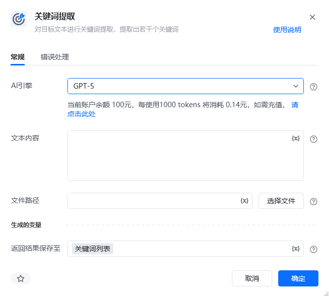

## 指令说明

**描述：** 对目标文本进行关键词提取，提取出若干个关键词

## 参数说明

<Tabs>
  <Tab title="常规">
    

    | 参数 | 说明 |
    | --- | --- |
    | **AI引擎 （不定时会更新）** | 可选AI模型见“AI引擎“下拉列表 |
    | **文本内容** | 输入需要进行关键词提取的文本内容 |
    | **文件路径** | 请输入文件路径，仅支持20M以内的文件 |
    | **返回结果保持至** | 指定一个变量名称,该变量用于保存关键词的提取结果,不填写则不输出 |
  </Tab>
  <Tab title="高级">
    本指令暂无高级参数。
  </Tab>
</Tabs>

## 使用示例

**该流程执行逻辑：**

1. 选择 AI 引擎，并输入待处理的文本或选择文件。
2. 执行【关键词提取】，将提取结果保存至指定变量。

### 效果展示

执行完成后，提取出的关键词将保存至指定变量。

<Info>
  使用指令过程中遇到问题？前往 [八爪鱼RPA 开发者社区问答板块](https://rpa.bazhuayu.com/community/questions) 提问，获取官方与社区帮助。
</Info>
