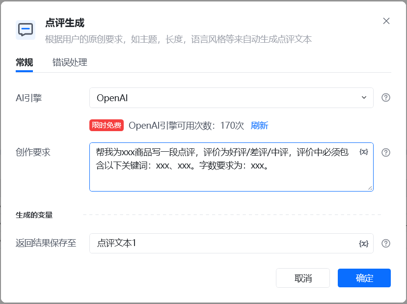
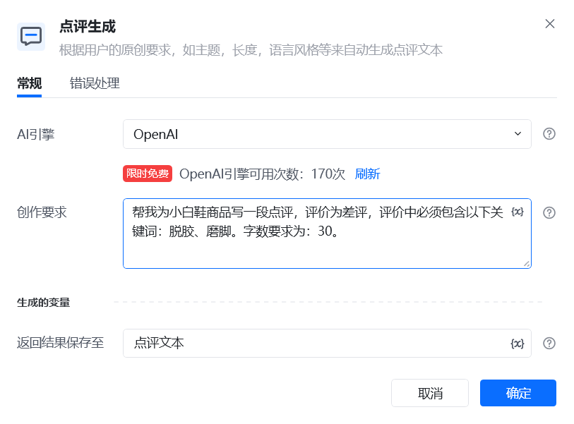
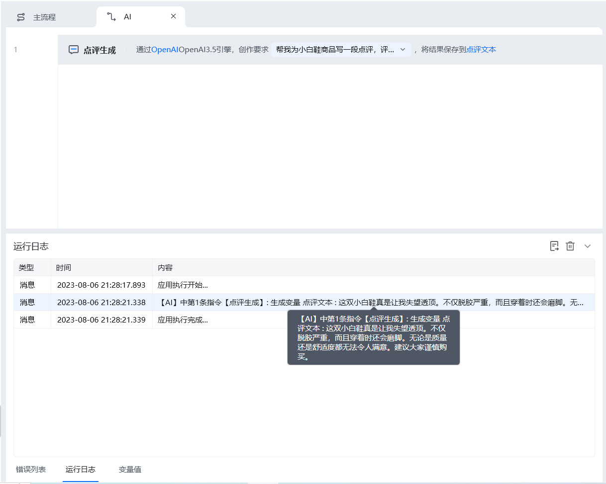

## 指令说明

**描述：** 根据用户的要求，如主题、长度、语言风格等来自动生成点评文本

## 参数说明

<Tabs>
  <Tab title="常规">
    

    | 参数 | 说明 |
    | --- | --- |
    | **AI引擎** | OpenAI |
    | **创作要求** | 填入用户的要求，如主题、长度、语言风格 |
    | **返回结果保存至** | 将生成的结果文本保存至变量 |
  </Tab>
  <Tab title="高级">
    本指令暂无高级参数。
  </Tab>
</Tabs>

## 使用示例

**该流程执行逻辑：**

### 运行结果

<Info>
  使用指令过程中遇到问题？前往 [八爪鱼RPA 开发者社区问答板块](https://rpa.bazhuayu.com/community/questions) 提问，获取官方与社区帮助。
</Info>
