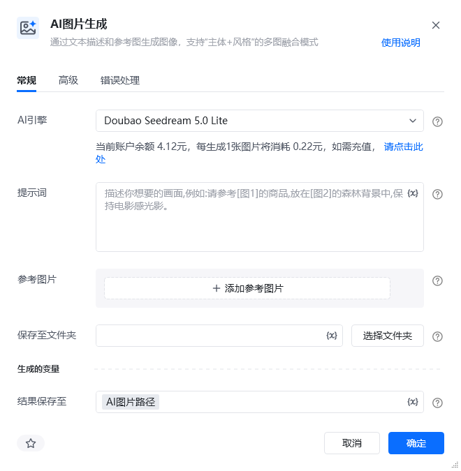
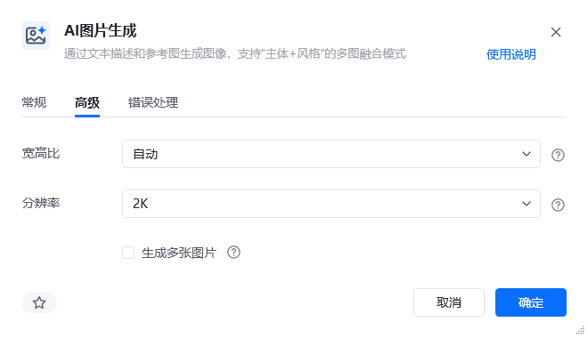

## 指令说明

**描述：** 通过文本描述和参考图生成图像，支持“主体+风格”的多图融合模式

## 参数说明

<Tabs>
  <Tab title="常规">

    

    | 参数 | 说明 |
    | --- | --- |
    | **AI引擎** | 请选择用于生成图像的模型。模型包含： Doubao Seedream 5.0 Lite（可通过联网搜索功能，融合实时网络信息，提升生图时效性） Doubao Seedream 4.5（基于已有图片，结合文字指令进行图像编辑，包括图像元素增删、风格转化、改变背景/视角/尺寸等） Gemini 3.1 Flash Image Preview（此模型是Gemini 3 Pro Image 的高效版本，针对速度和高用量开发者使用情形进行了优化） Gemini 3 Pro Image Preview（此模型专为专业资产制作而设计，利用高级推理（“思考”）功能来遵循复杂的指令并呈现高保真文本） GPT-Image-2（最先进的图像生成模型） |
    | **提示词** | 用于配置图像生成的提示词，你可以使用 [图1] 的方式引用输入参数中的变量 |
    | **参考图片** | 可选的参考图像，用于提供上下文或风格指导。支持PNG、JPEG、WebP、HEIC或HEIF格式。模型在生成新图像时会参考这些图像 |
    | **保存至文件夹** | 用于保存生成图像的文件夹，生成的图片会自动命名为 img_时间戳 |
    | **结果保存至** | 生成图片的保存路径将存储在该变量中 |
  </Tab>
  <Tab title="高级">

    

    | 参数 | 说明 |
    | --- | --- |
    | **宽高比** | 生成图像的宽高比例，包含自动、1:1、4:3、3:4等 |
    | **分辨率** | 生成图像的分辨率，包括1K、2K、3K |
    | **生成多张图片** | 如果勾选，则返回图片路径列表，默认不勾选，即仅生成一张图片，返回生成图片路径 |
  </Tab>
</Tabs>

<Info>
  使用指令过程中遇到问题？前往 [八爪鱼RPA 开发者社区问答板块](https://rpa.bazhuayu.com/community/questions) 提问，获取官方与社区帮助。
</Info>
