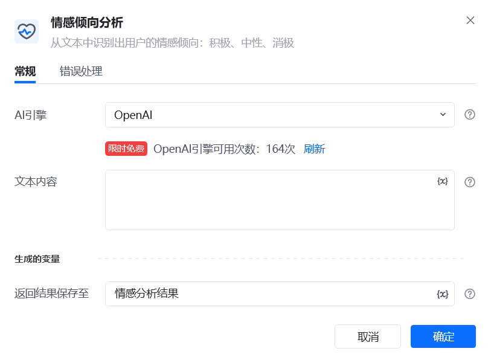

## 指令说明

**描述：** 从文本中识别出用户的情感倾向：积极、中性、消极

## 参数说明

<Tabs>
  <Tab title="常规">
    

    | 参数 | 说明 |
    | --- | --- |
    | **AI引擎** | OpenA |
    | **文本内容** | 输入要目标文本内容 |
    | **返回结果保存至** | 将提取的关键词保存到字符串变量 |
  </Tab>
  <Tab title="高级">
    本指令暂无高级参数。
  </Tab>
</Tabs>

## 使用示例

**该流程执行逻辑：**

### 运行结果

<Info>
  使用指令过程中遇到问题？前往 [八爪鱼RPA 开发者社区问答板块](https://rpa.bazhuayu.com/community/questions) 提问，获取官方与社区帮助。
</Info>
