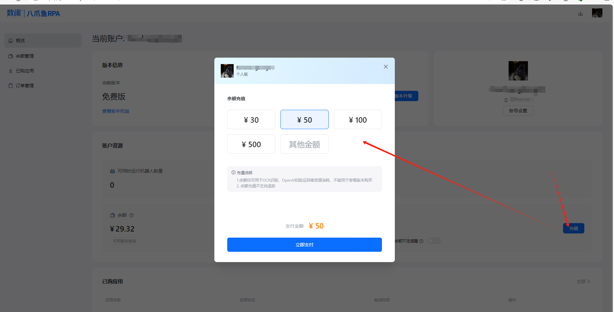
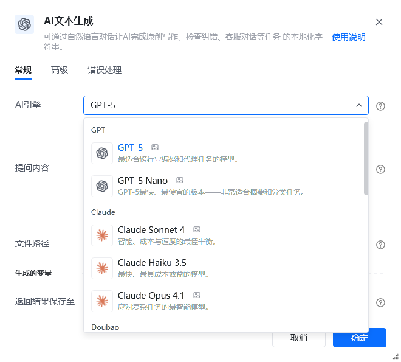
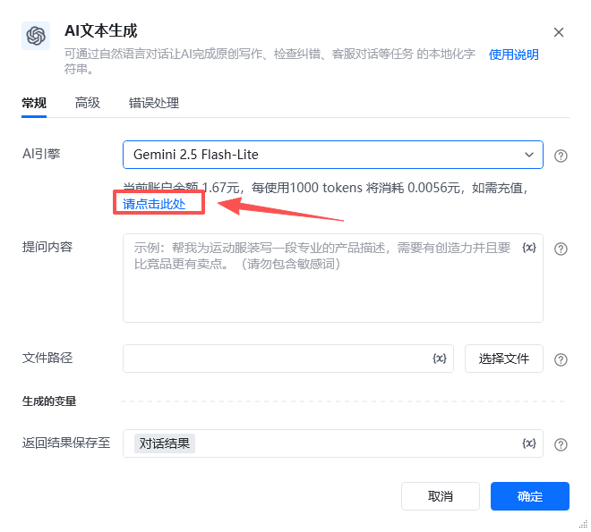
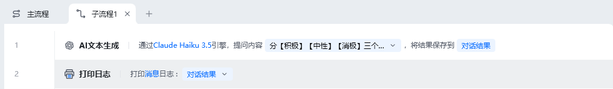
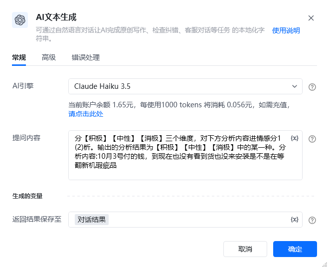
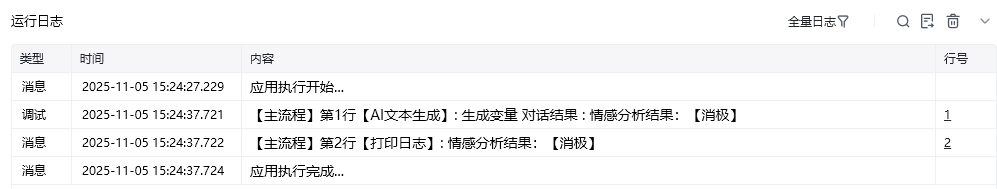
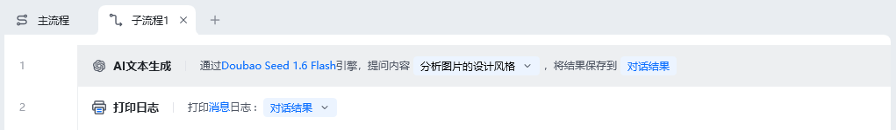
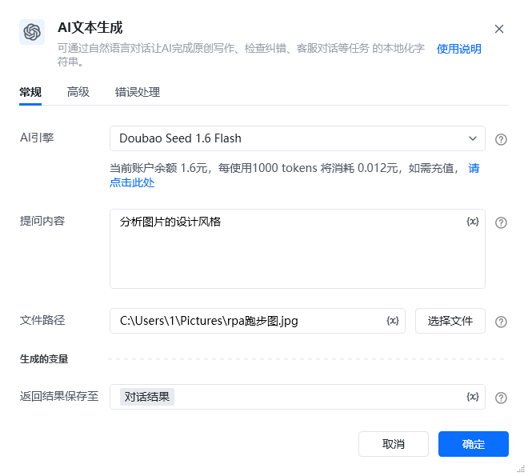
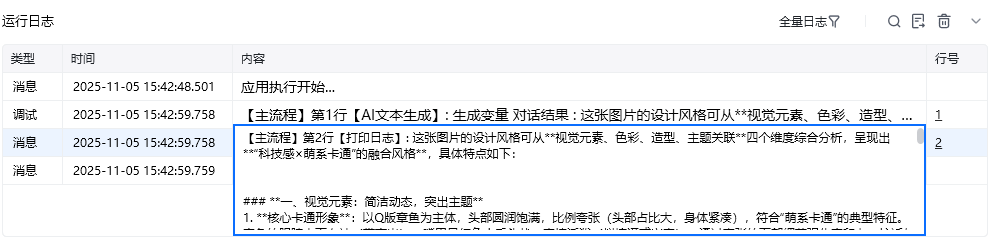

## 指令说明

**描述：** 可通过自然语言对话让AI完成原创写作、检查纠错、内容提炼、数据清洗、情感分析、客服对话等任务。

## 参数说明

<Tabs>
  <Tab title="常规">
    

    | 参数 | 说明 |
    | --- | --- |
    | **AI引擎** | 注：价格以客户端内为准；模型名称后方带有图像、音频、视频或PDF等图标时，证明该模型有相关的能力，当选择这些模型后，会出现文件路径输入框，可以选择待识别文件。 GPT GPT-5：最适合跨行业编码和代理任务的模型。可上传图片文件 (0.14元/1000 tokens) GPT-5 Nano：GPT-5最快、最便宜的版本，非常适合摘要和分类任务 。可上传图片文件 (0.0056元/1000 tokens) Claude Claude Sonnet 4：智能、成本与速度的最佳平衡。可上传图片文件 (0.14元/1000 tokens) Claude Haiku 3.5：最快、最具成本效益的模型 (0.056元/1000 tokens) Claude Opus 4.1：应对复杂任务的最智能模型。可上传图片文件 (1.05元/1000 tokens) Doubao Daobao Seed 1.6 Flash：有极致推理速度的多模态深度思考模型;同时支持文本和视觉理解。文本理解能力超过上一代 Lite 系列模型，视觉理解比肩友商 Pro 系列模型。支持图像理解 。可上传图片文件 (0.012元/1000 tokens) Daobao Seed 1.6 Thinking：在思考能力上进行了大幅强化，对比doubao 1.5 代深度理解模型，在编程、数学、逻辑推理等基础能力上进一步提升，支持视觉理解。可上传图片文件 (0.048元/1000 tokens) Gemini Gemini 2.5 Flash-Lite：Google 旗下最小巧且最具成本效益的模型，专为大规模使用而打造。可上传图片、音频、视频、PDF文件 (0.0056元/1000 tokens) Gemini 2.5 Pro：Google 旗下先进的多用途模型，擅长处理编码和复杂的推理任务。可上传图片、音频、视频、PDF文件 (0.21元/1000 tokens) DeepSeek DeepSeek-V3-0324：非复杂推理任务，建议使用新版本 V3 模型即刻享受速度更加流畅、效果全面提升的对话体验 (0.016元/1000 tokens) DeepSeek-R1-0528：0528 最新版本上线，DeepSeek-R1在后训练阶段大规模使用了强化学习技术，在仅有极少标注数据的情况下，极大提升了模型推理能力。在数学、代码、自然语言推理等任务上，性能比肩 OpenAl o1 正式版 (0.032元/1000 tokens) Kimi Kimi：Kimi latest 模型始终使用 Kimi Al Assistant产品使用的最新版本的 Kimi 大型模型。可上传图片文件 (0.0003元/1000 tokens) Grok Grok 4：最新推出的旗舰模型，在自然语言处理、数学与逻辑推理领域展现无与伦比的性能表现，堪称全能型人工智能典范。可上传图片文件 (0.21元/1000 tokens) Grok 3 Mini：轻量级模型，先思考后响应。快速、智能，非常适合处理不需要深厚领域知识的逻辑任务。原始思维痕迹易于访问 (0.007元/1000 tokens) |
    | **提问内容** | 需要 AI 处理的内容，请勿包含敏感词 |
    | **文件路径** | 请输入文件路径，如图片、视频文件的路径，仅支持20M以内的文件 |
  </Tab>
  <Tab title="高级">
    本指令暂无高级参数。
  </Tab>
</Tabs>

## 使用示例

**该流程执行逻辑：**

### 运行结果

<Info>
  使用指令过程中遇到问题？前往 [八爪鱼RPA 开发者社区问答板块](https://rpa.bazhuayu.com/community/questions) 提问，获取官方与社区帮助。
</Info>
