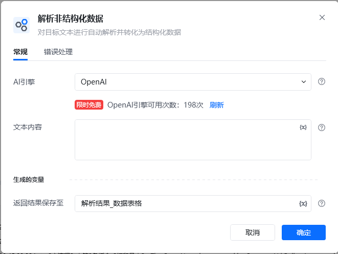
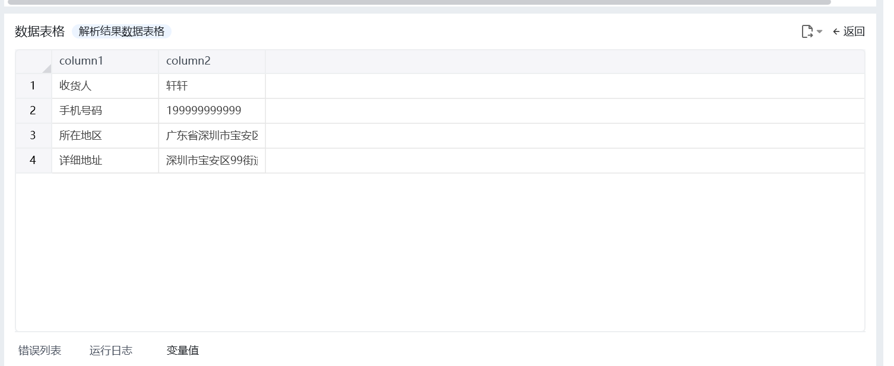
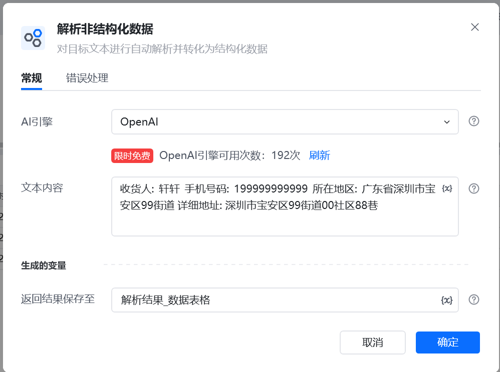
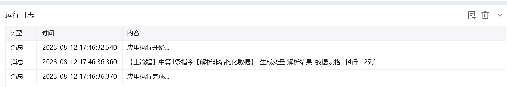

## 指令说明

**描述：** 对目标文本进行自动解析并转化为结构化数据

## 参数说明

<Tabs>
  <Tab title="常规">
    

    | 参数 | 说明 |
    | --- | --- |
    | **AI引擎** | OpenA |
    | **选择语言** | 输入要进行结构化解析的文本内容 |
    | **返回结果保存至** | 将输入的文本内容解析成结构化数据，并将结果保存到数据表格 |
  </Tab>
  <Tab title="高级">
    本指令暂无高级参数。
  </Tab>
</Tabs>

## 使用示例

**该流程执行逻辑：**

### 运行结果

<Info>
  使用指令过程中遇到问题？前往 [八爪鱼RPA 开发者社区问答板块](https://rpa.bazhuayu.com/community/questions) 提问，获取官方与社区帮助。
</Info>
