## 指令说明

**描述：**根据指定平台（云码、斐斐、图鉴）验证码类型和图片参数识别验证码。

## 参数说明

<Tabs>
  <Tab title="常规">
    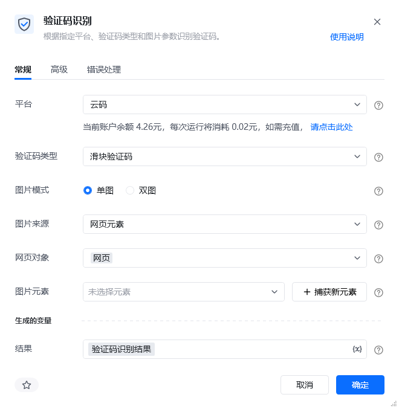

    | 参数 | 说明 |
    | --- | --- |
    | **平台** | 选择验证码识别平台，可选云码、斐斐、图鉴 |
    | **验证码类型** | 选择当前平台支持的验证码类型（价格以指令内显示为准，下方仅供参考） 云码： 滑块验证码：每次运行将消耗0.02元、 点选验证码：每次运行将消耗0.032元、 轨迹验证码：每次运行将消耗0.08元、 双图旋转验证码：每次运行将消耗0.02元、 斐斐： 文本输入验证码：每次运行将消耗0.028元、 图鉴： 滑块验证码：每次运行将消耗0.02元、 点选验证码：每次运行将消耗0.04元、 文本输入验证码：每次运行将消耗0.096元、 图片旋转验证码：每次运行将消耗0.04元、 轨迹验证码：每次运行将消耗0.06元 |
  </Tab>
  <Tab title="高级">
    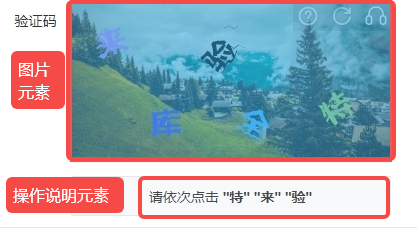
    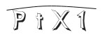
    
    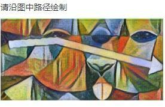
    
    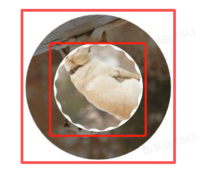
    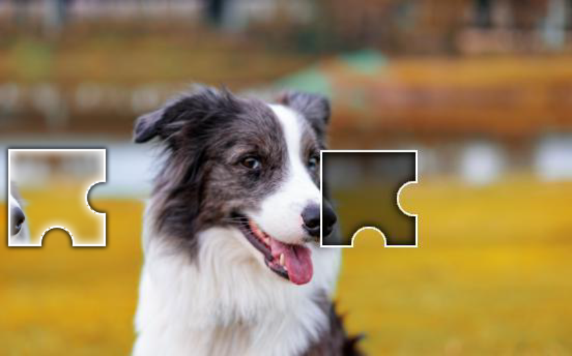
    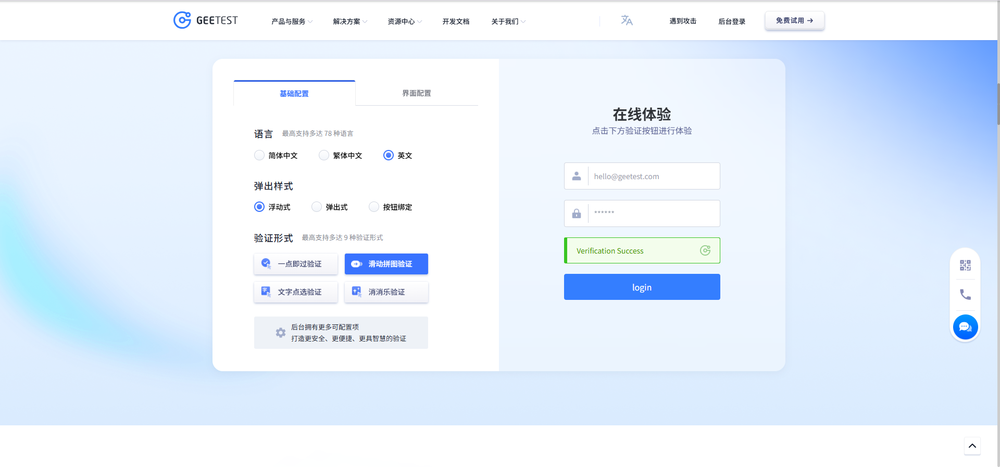
  </Tab>
</Tabs>

## 使用示例

**该流程执行逻辑：**

单图

双图

（单张图片）

内圈图元素和外圈图元素

获取谷歌浏览器已打开的网页对象 ---> 用【验证码识别】指令识别单图类型的滑块验证码 ---> 在控制台打印验证码识别结果 ---> 验证码识别结果是文本类型，无法通过索引值读取，先转为JSON类型 ---> 读取“json_验证码识别结果”中result项的值，为120（即下方的滑块按钮需横向拖动120） --->鼠标悬停在下方滑块按钮元素上 ---> 按下鼠标左键 ---> 向前拖动120 ---> 拖到指定位置后，鼠标左键松开，验证完成

RPA运行前

RPA运行后

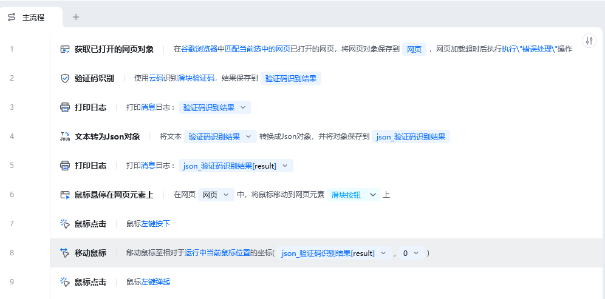

### 运行结果

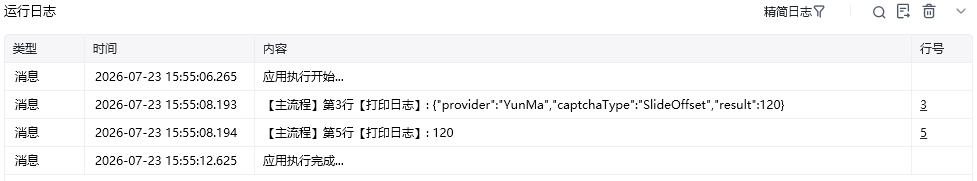

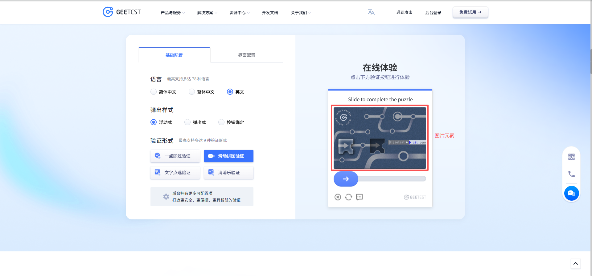

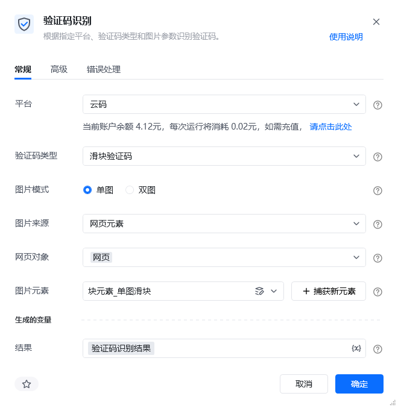

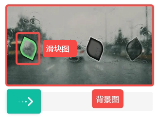

<Info>
  使用指令过程中遇到问题？前往 [八爪鱼RPA 开发者社区问答板块](https://rpa.bazhuayu.com/community/questions) 提问，获取官方与社区帮助。
</Info>
