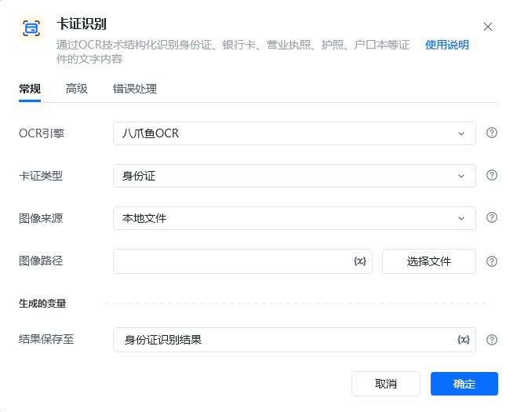
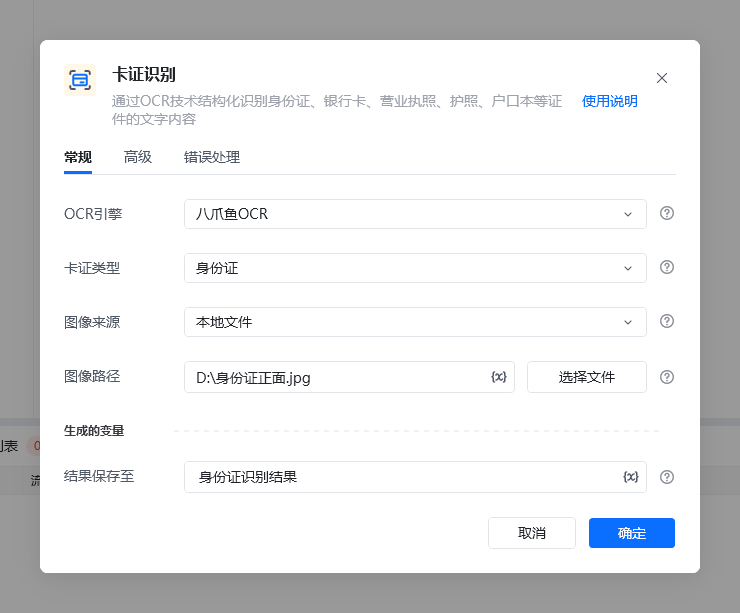
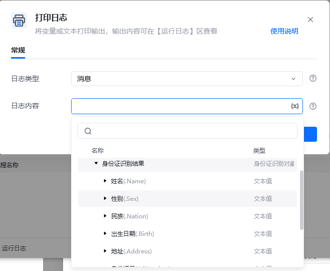
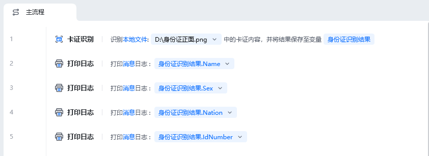
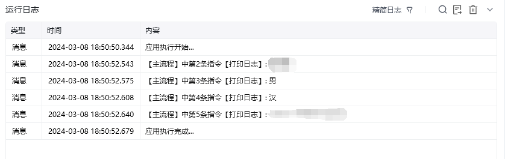

## 指令说明

**描述：** 通过OCR技术结构化识别身份证、银行卡、营业执照、护照、户口本等证件的文字内容

## 参数说明

<Tabs>
  <Tab title="常规">
    

    | 参数 | 说明 |
    | --- | --- |
    | **OCR引擎** | 默认使用八爪鱼OCR |
    | **图像类型** | 请选择需要识别的卡证类型：银行卡、营业执照、护照(大陆)护照(港澳台及海外)、户口簿、行驶证、驾驶证、港澳台通行证 |
    | **图像来源** | 请选择将要识别的图像来源：本地文件、网络图片、桌面元素、网页元素 |
    | **网页路径（本地文件）** | 请输入要识别图像的文件路径 |
    | **图像URL（网络图片）** | 请输入要识别图像的URL |
    | **桌面元素（桌面元素）** | 请选择或捕获要识别的桌面元素 |
    | **网页对象（网页元素）** | 输入一个获取到的或者通过"打开网页”创建的网页对象 |
    | **网页元素（网页元素）** | 请选择或捕获要识别的网页元素 |
    | **结果保存至** | 将识别到文字坐标保存到文本变量中。 |
  </Tab>
  <Tab title="高级">
    本指令暂无高级参数。
  </Tab>
</Tabs>

## 使用示例

**该流程执行逻辑：**

OCR引擎

默认使用八爪鱼OCR

图像类型

请选择需要识别的卡证类型：银行卡、营业执照、护照(大陆)护照(港澳台及海外)、户口簿、行驶证、驾驶证、港澳台通行证

图像来源

请选择将要识别的图像来源：本地文件、网络图片、桌面元素、网页元素

网页路径（本地文件）

请输入要识别图像的文件路径

图像URL（网络图片）

请输入要识别图像的URL

桌面元素（桌面元素）

请选择或捕获要识别的桌面元素

网页对象（网页元素）

输入一个获取到的或者通过"打开网页”创建的网页对象

网页元素（网页元素）

请选择或捕获要识别的网页元素

结果保存至

将识别到文字坐标保存到文本变量中。

【卡证识别】 识别本地文件“D:\身份证正面.png”中的卡证内容，将结果保存到身份证识别结果

【打印日志】 打印消息日志： 姓名

【打印日志】 打印消息日志： 男

【打印日志】 打印消息日志： 汉

【打印日志】 打印消息日志： 身份证号

应用示例：https://rpa.bazhuayu.com/shareableLink/65eaee2717e4827f7b487e12

### 运行结果

<Info>
  使用指令过程中遇到问题？前往 [八爪鱼RPA 开发者社区问答板块](https://rpa.bazhuayu.com/community/questions) 提问，获取官方与社区帮助。
</Info>
