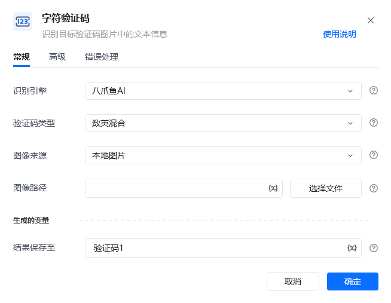
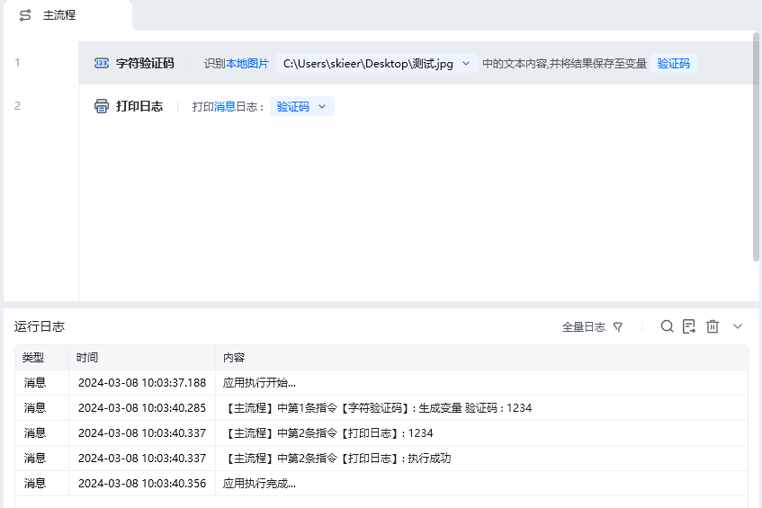
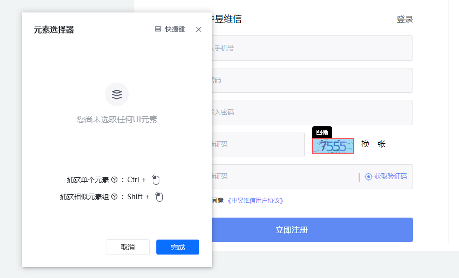
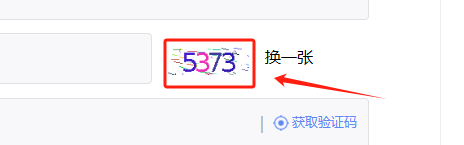
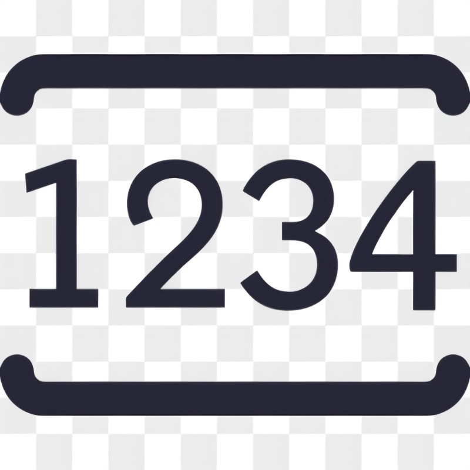

## 指令说明

**描述：**识别目标验证码图片中的文本信息，本地的图片，网页和桌面软件中的验证码都支持。

## 参数说明

<Tabs>
  <Tab title="常规">

    

    | 参数 | 说明 |
    | --- | --- |
    | **识别引擎** | 默认使用八爪鱼AI。 |
    | **验证码类型** | 选择需要识别的验证码类型。包括数英混合，纯数字，纯英文，闪动GIF，计算题，问答题，汉字 |
    | **图像来源** | 选要识别的图像是来源于本地图片，网页元素还是桌面元素。本地图片选择文件路径，Web网页类型的选网页元素，桌面端软件的选桌面元素。 |
    | **网页对象** | 图像来源是网页元素的才需要选网页对象。即选择识别哪个网页中的图像。 |
    | **选择元素** | 选择要识别的验证码图片元素，可以从元素库中选择也可以直接从网页或桌面上捕获。如下方截图中的红框内容 |
  </Tab>
  <Tab title="高级">
  </Tab>
</Tabs>

## 使用示例

**该流程执行逻辑：**

1. 准备一张包含字符验证码的测试图片，并在【字符验证码】中选择该图片的本地路径。
2. 设置“结果保存至”变量后执行指令，识别图片中的字符内容。
3. 使用【打印日志】输出识别结果，确认变量中保存的文本与验证码图片一致。

### 效果展示

<Info>
  使用指令过程中遇到问题？前往 [八爪鱼RPA 开发者社区问答板块](https://rpa.bazhuayu.com/community/questions) 提问，获取官方与社区帮助。
</Info>
