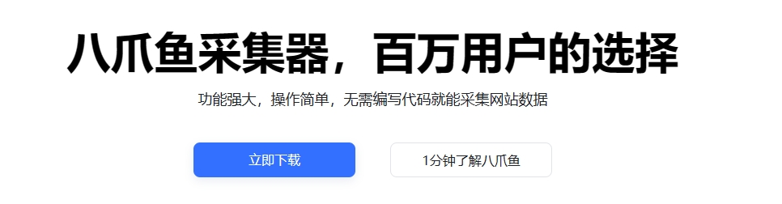
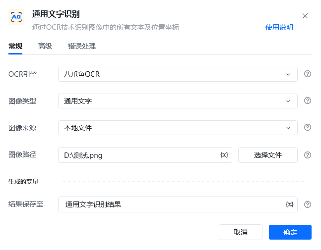
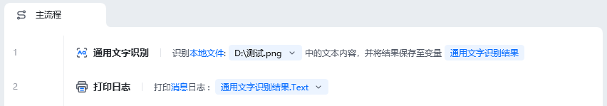
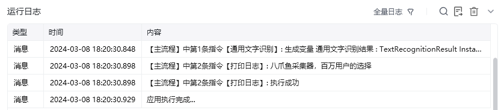
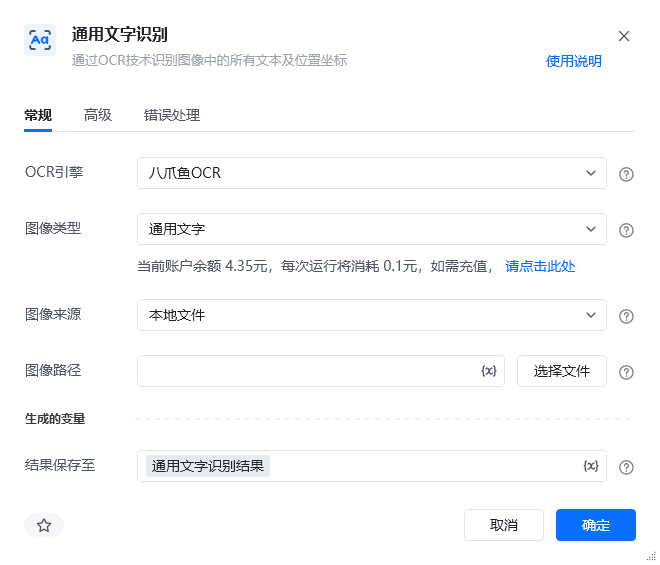
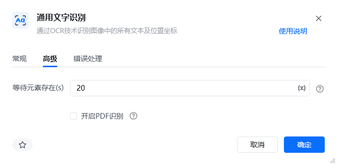

## 指令说明

**描述：**通过OCR技术识别图像中的所有文本及位置坐标

## 参数说明

<Tabs>
  <Tab title="常规">
    

    | 参数 | 说明 |
    | --- | --- |
    | **OCR引擎** | 默认使用八爪鱼OCR |
    | **图像类型** | 请选择需要识别的图像类型：通用文字、通用文字(高精度)、手写体、广告文字 类型匹配度越高，精度越高。通用文字(高精度版)相对于通用文字识别精度更高，识别耗时会稍长 |
    | **图像来源** | 请选择将要识别的图像来源：本地文件、网络图片、桌面元素、网页元素 |
    | **网页路径** | 本地文件，请输入要识别图像的文件路径 |
    | **图像URL** | 网络图片，请输入要识别图像的URL |
    | **桌面元素** | 请选择或捕获要识别的桌面元素 |
    | **网页对象** | 输入一个获取到的或者通过"打开网页”创建的网页对象 |
    | **结果保存至** | 将识别到文字坐标保存到文本变量中。 |
  </Tab>
  <Tab title="高级">
    

| 参数 | 说明 |
| --- | --- |
| **PDF页码** | 勾选”开启PDF识别“后，填写需要识别的PDF文件的对应页码。当pdf file 参数有效时，识别传入页码的对应页面内容 |
| **等待元素存在(s)** | 等待目标元素存在的超时时间 |
  </Tab>
</Tabs>

## 使用示例

**该流程执行逻辑：**

默认使用八爪鱼OCR

请选择需要识别的图像类型：通用文字、通用文字(高精度)、手写体、广告文字

类型匹配度越高，精度越高。通用文字(高精度版)相对于通用文字识别精度更高，识别耗时会稍长

高级

【通用文字识别】 识别本地文件“D:\测试.png”中的文本内容，将结果保存到通用文字识别结果

【打印日志】 打印消息日志： 八爪鱼采集器，百万用户的选择 功能强大，操作简单，无需编写代码就能采集网站数据 立即下载 1分钟了解八爪鱼

应用示例：https://rpa.bazhuayu.com/shareableLink/65eae73517e4827f7b487e08

### 运行结果

<Info>
  使用指令过程中遇到问题？前往 [八爪鱼RPA 开发者社区问答板块](https://rpa.bazhuayu.com/community/questions) 提问，获取官方与社区帮助。
</Info>
