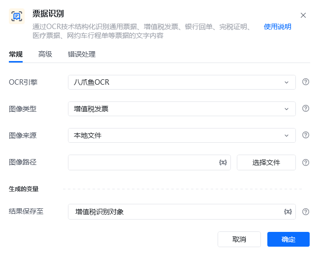
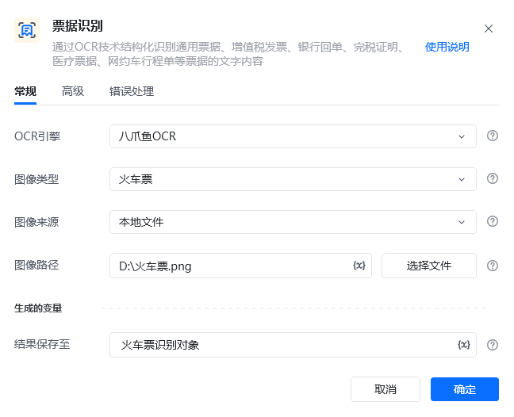
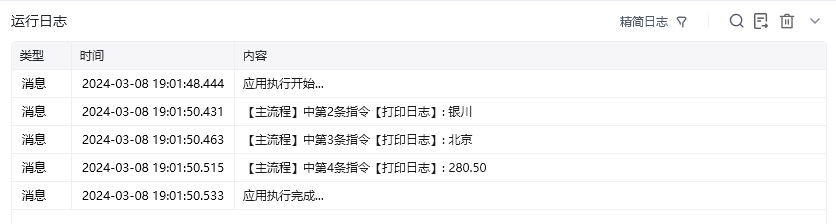

## 指令说明

**描述：** 使用 OCR 结构化识别通用票据、增值税发票、银行回单、完税证明、医疗票据和网约车行程单等票据的文字内容。

## 参数说明

<Tabs>
  <Tab title="常规">

    

    | 参数 | 说明 |
    | --- | --- |
    | **OCR引擎** | 默认使用八爪鱼OCR |
    | **图像类型** | 请选择需要识别的图像类型：増值税发票、定额发票、火车票、出租车发票、银行回单 |
    | **图像来源** | 请选择将要识别的图像来源：本地文件、网络图片、桌面元素、网页元素 |
    | **网页路径（本地文件）** | 请输入要识别图像的文件路径 |
    | **图像URL（网络图片）** | 请输入要识别图像的URL |
    | **桌面元素（桌面元素）** | 请选择或捕获要识别的桌面元素 |
    | **网页对象（网页元素）** | 输入一个获取到的或者通过"打开网页”创建的网页对象 |
    | **网页元素（网页元素）** | 请选择或捕获要识别的网页元素 |
    | **结果保存至** | 将识别到文字坐标保存到文本变量中。 |
    | **PDF页码（开启PDF识别）** | 需要识别的PDF文件的对应页码，当pdf file 参数有效时，识别传入页码的对应页面内容 |
    | **等待元素存在(s)** | 等待目标元素存在的超时时间 |
  </Tab>
  <Tab title="高级">

    

  </Tab>
</Tabs>

## 使用示例

**该流程执行逻辑：**

1. 准备火车票图片 `D:\火车票.png`，在【票据识别】中选择“火车票”和“本地文件”，并设置结果变量“火车票识别结果”。
2. 执行【票据识别】，由 OCR 提取票据中的出发地、目的地、金额等结构化信息。
3. 使用【打印日志】分别读取并输出识别结果中的“银川”“北京”和“280.50”，核对关键信息是否正确。

完整流程示例：[打开应用示例](https://rpa.bazhuayu.com/shareableLink/65eaf0900d8a9abd448d77dd)

### 效果展示

<Info>
  使用指令过程中遇到问题？前往 [八爪鱼RPA 开发者社区问答板块](https://rpa.bazhuayu.com/community/questions) 提问，获取官方与社区帮助。
</Info>
