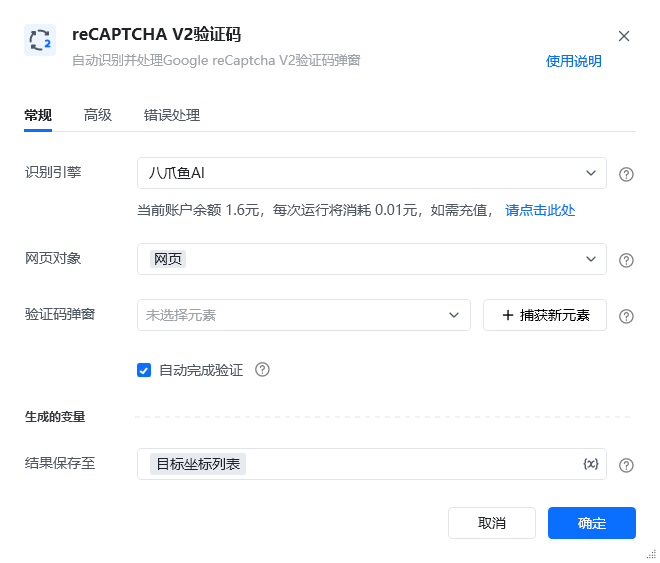
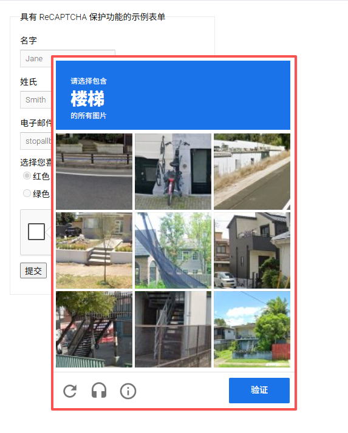
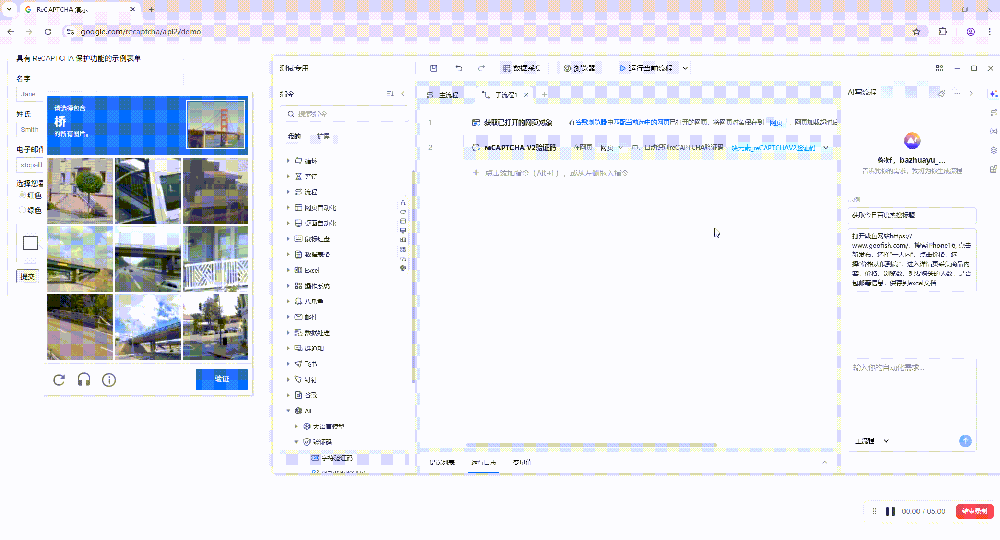
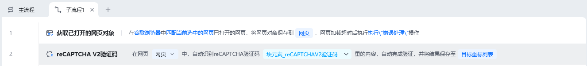
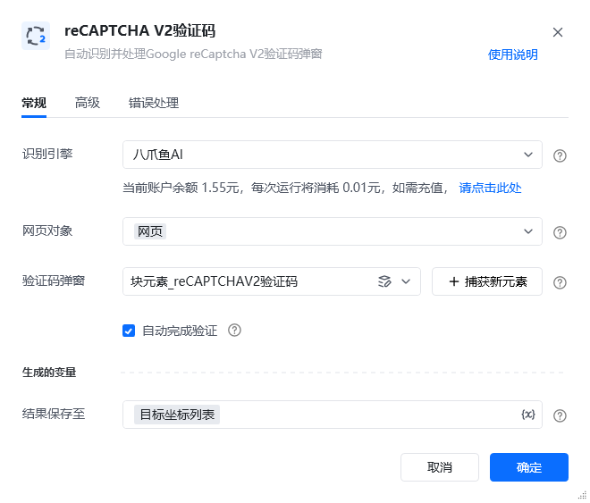
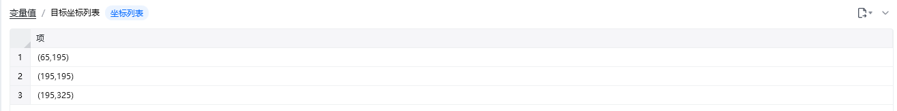

## 指令说明

**描述：** 自动识别并处理Google reCaptcha V2验证码弹窗

## 参数说明

<Tabs>
  <Tab title="常规">
    

    | 参数 | 说明 |
    | --- | --- |
    | **识别引擎** | 请选择需要使用的验证码引擎（默认八爪鱼AI） |
    | **网页对象** | 输入一个获取到的或者通过”打开网页"创建的网页对象 |
    | **验证码弹窗** | 请选择reCAPTCHA验证码弹窗，需要包含文字部分、图片部分、按钮部分（可通过捕获新元素） |
    | **自动完成验证** | 如果勾选，将自动识别验证码图片并点击完成验证，否则只进行验证码识别，返回待点选区域的坐标列表 |
  </Tab>
  <Tab title="高级">
    | 参数 | 说明 |
    | --- | --- |
    | **等待元素存在(s)** | 等待目标元素存在的最大超时时间，单位秒 |
  </Tab>
</Tabs>

## 使用示例

**该流程执行逻辑：**

获取谷歌浏览器中已打开的网页对象（https://www.google.com/recaptcha/api2/demo）--->使用【reCAPTCHA V2验证码】指令理解当前验证码需要识别的是“桥”，并返回所有与桥有关的图片位置，位置存储在变量“目标坐标列表”中。因勾选了自动完成验证，因此该指令会自动选择图片并点击“验证”按钮

效果展示：

### 运行结果

<Info>
  使用指令过程中遇到问题？前往 [八爪鱼RPA 开发者社区问答板块](https://rpa.bazhuayu.com/community/questions) 提问，获取官方与社区帮助。
</Info>
