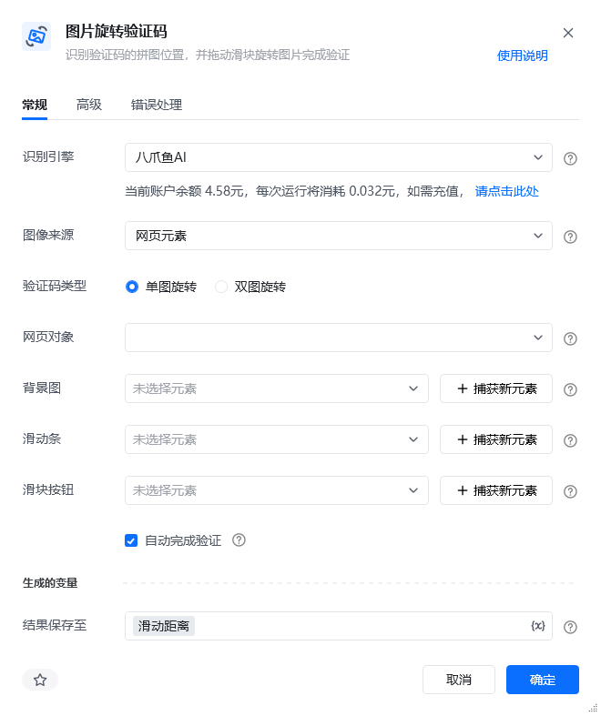
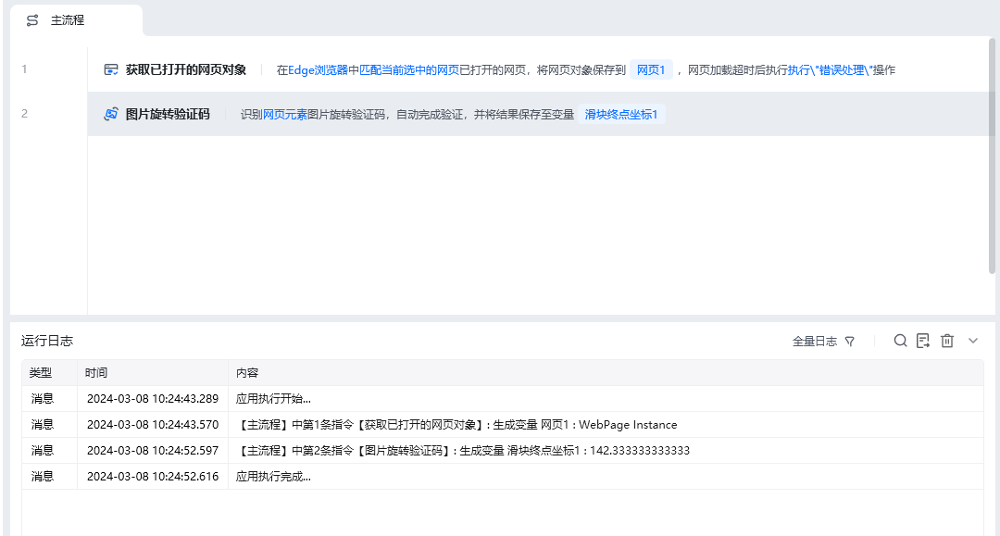
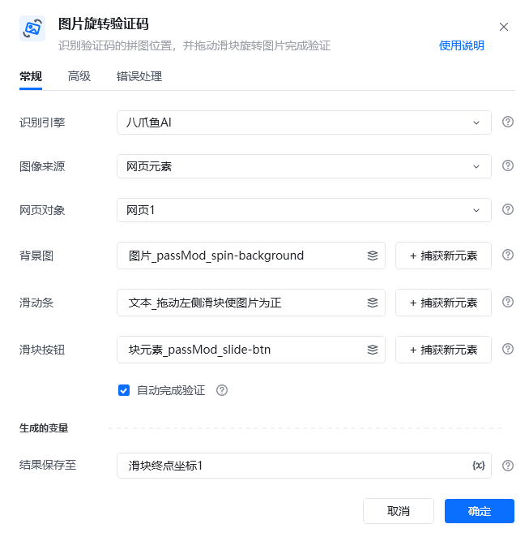
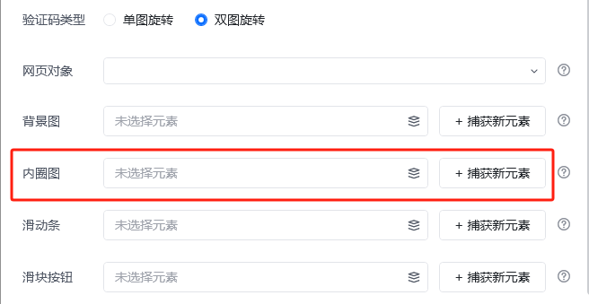
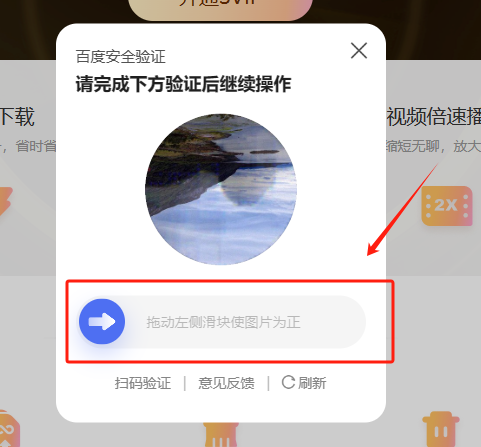
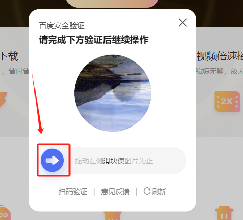
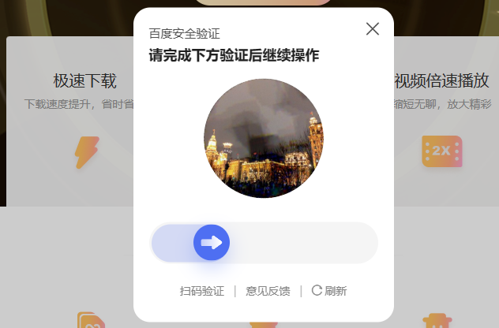
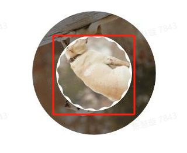

## 指令说明

**描述：** 识别验证码的拼图位置，并拖动滑块旋转图片完成验证。支持网页和桌面软件中的验证码。

## 参数说明

<Tabs>
  <Tab title="常规">

    

    | 参数 | 说明 |
    | --- | --- |
    | **识别引擎** | 默认使用八爪鱼AI。 |
    | **图像来源** | 选要识别的图像是来源于网页元素还是桌面元素。Web网页类型的选网页元素，桌面端软件的选桌面元素。 |
    | **网页对象** | 图像来源是网页元素时需要选择网页对象，即选择识别哪个网页中的图像。 |
    | **背景图** | 选择滑块旋转的背景图，可以从元素库中选择，也可以直接从网页或桌面上捕获，如下方截图中的红框内容。 |
    | **内圈图** | 验证码为双图旋转时，需选择验证码的内圈图。选择内圈图，可以从元素库中选择，也可以直接从网页或桌面上捕获，如下方截图中的红框内容。 |
    | **滑动条** | 选择滑块按钮所在的滑动条，可以从元素库中选择，也可以直接从网页或桌面上捕获，如下方截图中的红框内容。 |
    | **滑块按钮** | 选择需要拖动的滑块位置，可以从元素库中选择，也可以直接从网页或桌面上捕获，如下方截图中的红框内容。 |
  </Tab>
  <Tab title="高级">
    本指令暂无高级参数。
  </Tab>
</Tabs>

## 使用示例

**该流程执行逻辑：**

1. 打开包含旋转验证码的网页，分别选择验证码背景图、滑块条和滑块按钮元素。
2. 执行【图片旋转验证码】识别图片需要旋转的距离，并将滑块终点坐标保存到结果变量中。
3. 示例勾选“自动完成验证”，因此识别完成后会自动拖动滑块、旋转图片并提交验证；未勾选时，可读取结果变量中的坐标自行完成拖动。

### 效果展示

使用小Tips

**参数选择示例（背景图、内圈图、滑动条、滑块按钮的捕获方式）：**

**操作示例：**

<Info>
  使用指令过程中遇到问题？前往 [八爪鱼RPA 开发者社区问答板块](https://rpa.bazhuayu.com/community/questions) 提问，获取官方与社区帮助。
</Info>
