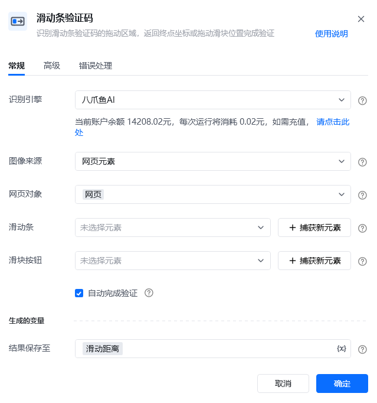
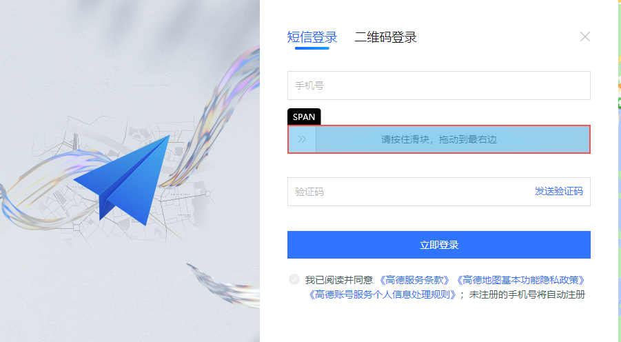
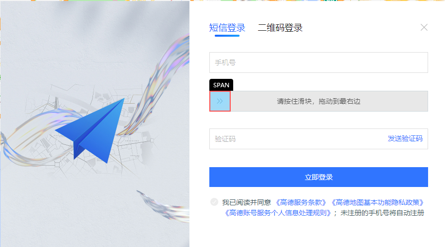
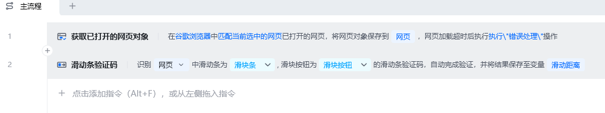
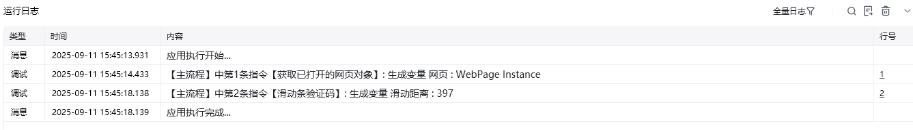
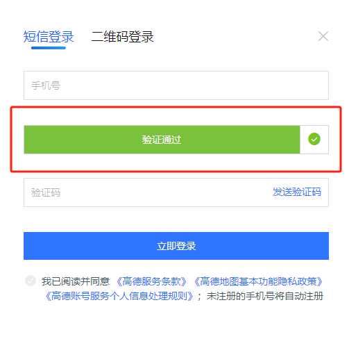

## 指令说明

**描述：**识别滑动条验证码的拖动区域，返回终点坐标或拖动滑块位置完成验证。网页和桌面软件中的验证码都支持。

## 参数说明

<Tabs>
  <Tab title="常规">
    

    | 参数 | 说明 |
    | --- | --- |
    | **识别引擎** | 请选择需要使用的验证码引擎（默认八爪鱼AI） |
    | **图像来源** | 选要识别的图像是来源于网页元素还是桌面元素。Web网页类型的选网页元素，桌面端软件的选桌面元素。 |
    | **网页对象** | 输入一个获取到的或者通过”打开网页"创建的网页对象 |
    | **滑动条** | 选择滑块按钮所在的滑动条，可以从元素库中选择也可以直接从网页或桌面上捕获。 |
    | **滑块按钮** | 选择需要拖动的滑块位置，可以从元素库中选择也可以直接从网页或桌面上捕获。 |
    | **自动完成验证** | 点击自动完成验证即可自动执行拖捷动作，否则仅返回滑块终点坐标 |
  </Tab>
  <Tab title="高级">
    
    

| 参数 | 说明 |
| --- | --- |
| **等待元素存在（s）** | 等待目标元素存在的最大超时时间，单位秒 |
  </Tab>
</Tabs>

## 使用示例

**该流程执行逻辑：**

案例的url：https://www.amap.com/，点击登录后会出现“滑块”

### 效果展示

<Info>
  使用指令过程中遇到问题？前往 [八爪鱼RPA 开发者社区问答板块](https://rpa.bazhuayu.com/community/questions) 提问，获取官方与社区帮助。
</Info>
