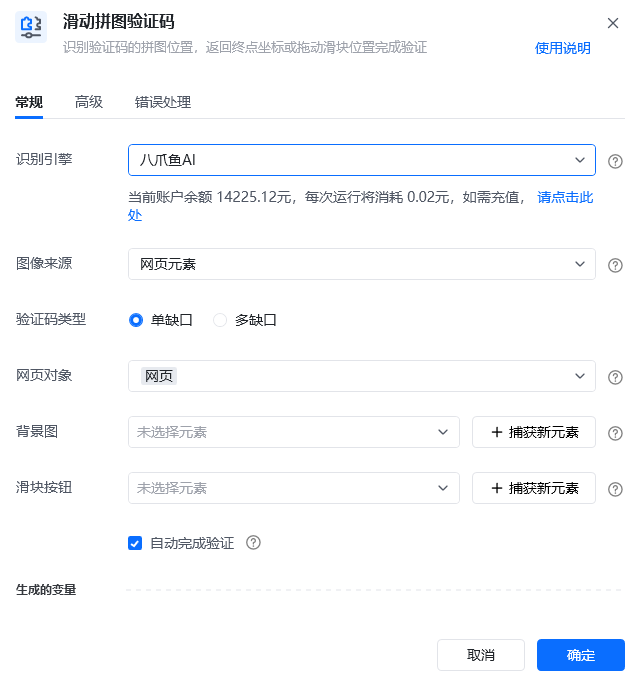
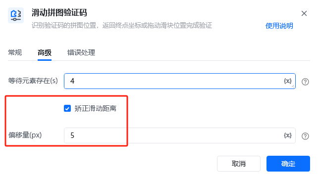
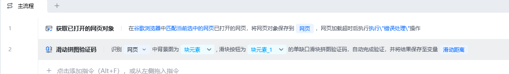
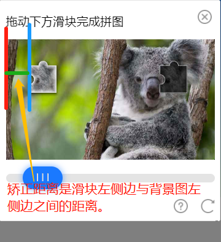
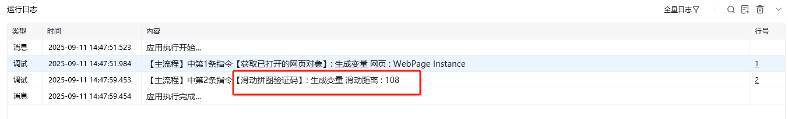

## 指令说明

**描述：** 识别验证码的拼图位置，返回终点坐标或拖动滑块位置完成验证

## 参数说明

<Tabs>
  <Tab title="常规">

    

    | 参数 | 说明 |
    | --- | --- |
    | **识别引擎** | 请选择需要使用的验证码引擎（默认八爪鱼AI） |
    | **图像来源** | 请选择将要识别的验证码来源 |
    | **验证码类型** | 单缺口、 多缺口 |
    | **网页对象** | 输入一个获取到的或者通过”打开网页"创建的网页对象 |
    | **背景图** | 请选择滑块拼图验证码的背景图（可通过捕获新元素） |
    | **滑块图** | 请选择滑块拼图验证码的滑块图（可通过捕获新元素） |
    | **滑块按钮** | 请选择需要拖动的滑块位置（可通过捕获新元素） |
    | **自动完成验证** | 点击自动完成验证即可自动执行拖拽动作，否则仅返回滑块终点坐标 |
  </Tab>
  <Tab title="高级">

    

| 参数 | 说明 |
| --- | --- |
| **等待元素存在(s)** | 等待目标元素存在的最大超时时间，单位秒 |
| **矫正滑动距离** | 当滑块按钮移动距离不能完成拼图时，可以通过偏移量进行微调，如每次滑动距离都差3px（像素），则输入3，滑动距离超过4px（像素），则输入-4 |
  </Tab>
</Tabs>

## 使用示例

**该流程执行逻辑：**

1. 打开包含滑动拼图验证码的页面，并捕获拼图背景、缺口图和滑块按钮等所需元素。
2. 执行【滑动拼图验证码】，识别拼图缺口位置并计算滑块移动距离。
3. 勾选自动完成时，指令会按识别结果拖动滑块完成验证；示例流程可通过共享链接复现：`https://rpa.bazhuayu.com/shareableLink/665998ff4beb340409db492a`。

### 效果展示

<Info>
  使用指令过程中遇到问题？前往 [八爪鱼RPA 开发者社区问答板块](https://rpa.bazhuayu.com/community/questions) 提问，获取官方与社区帮助。
</Info>
