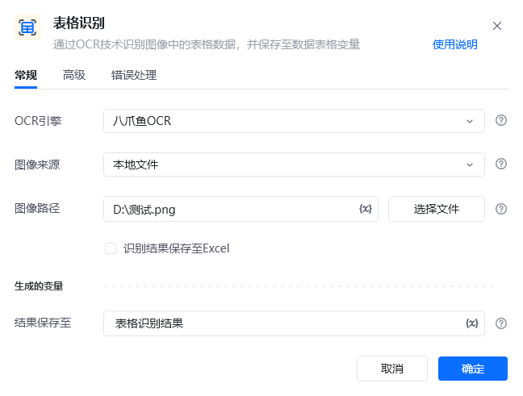
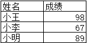
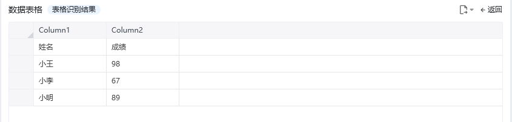
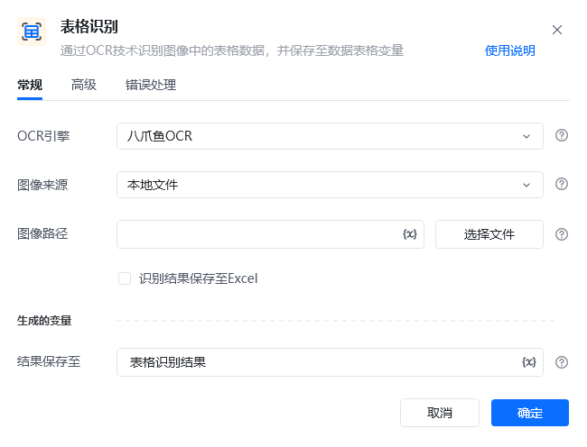
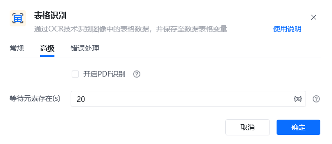

## 指令说明

**描述：**通过OCR技术识别图像中的表格数据，并保存至数据表格变量

## 参数说明

<Tabs>
  <Tab title="常规">
    

    | 参数 | 说明 |
    | --- | --- |
    | **OCR引擎** | 默认使用八爪鱼OCR |
    | **图像来源** | 请选择将要识别的图像来源：本地文件、网络图片、桌面元素、网页元素 |
    | **网页路径（本地文件）** | 请输入要识别图像的文件路径 |
    | **图像URL（网络图片）** | 请输入要识别图像的URL |
    | **桌面元素（桌面元素）** | 请选择或捕获要识别的桌面元素 |
    | **网页对象（网页元素）** | 输入一个获取到的或者通过"打开网页”创建的网页对象 |
    | **网页元素（网页元素）** | 请选择或捕获要识别的网页元素 |
    | **Excel文件路径** | 选择另存为excel(Excel)的文件路径 |
    | **结果保存至** | 将识别到文字坐标保存到文本变量中。 |
    | **PDF页码（开启PDF识别）** | 需要识别的PDF文件的对应页码，当pdf file 参数有效时，识别传入页码的对应页面内容 |
    | **等待元素存在(s)** | 等待目标元素存在的超时时间 |
  </Tab>
  <Tab title="高级">
    
  </Tab>
</Tabs>

## 使用示例

**该流程执行逻辑：**

OCR引擎

默认使用八爪鱼OCR

图像来源

请选择将要识别的图像来源：本地文件、网络图片、桌面元素、网页元素

网页路径（本地文件）

请输入要识别图像的文件路径

图像URL（网络图片）

请输入要识别图像的URL

桌面元素（桌面元素）

请选择或捕获要识别的桌面元素

网页对象（网页元素）

输入一个获取到的或者通过"打开网页”创建的网页对象

网页元素（网页元素）

请选择或捕获要识别的网页元素

Excel文件路径

选择另存为excel(Excel)的文件路径

结果保存至

将识别到文字坐标保存到文本变量中。

PDF页码（开启PDF识别）

需要识别的PDF文件的对应页码，当pdf file 参数有效时，识别传入页码的对应页面内容

等待元素存在(s)

等待目标元素存在的超时时间

识别图片：

【表格识别】 识别本地文件“D:\测试.png”中的表格内容，将结果保存到表格识别结果

应用示例：https://rpa.bazhuayu.com/shareableLink/65eae94d0d8a9abd448d77c9

### 运行结果

<Info>
  使用指令过程中遇到问题？前往 [八爪鱼RPA 开发者社区问答板块](https://rpa.bazhuayu.com/community/questions) 提问，获取官方与社区帮助。
</Info>
