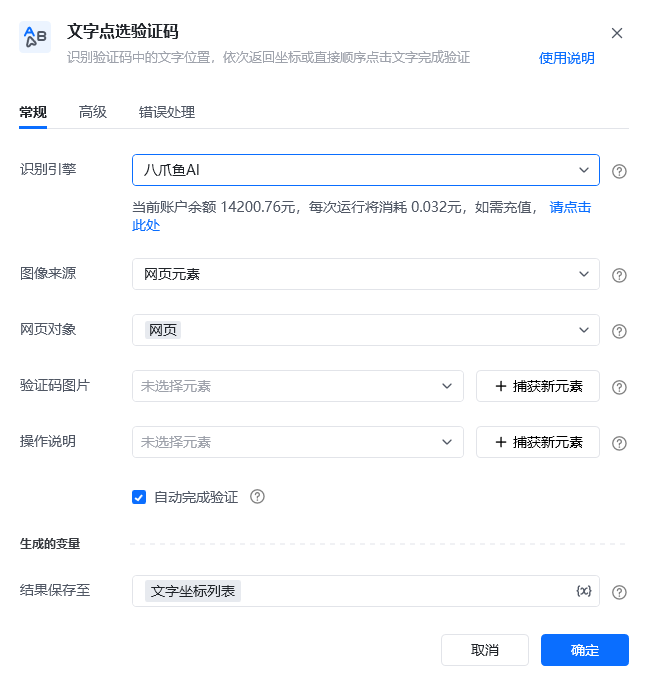
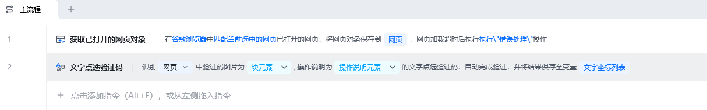
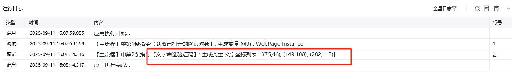
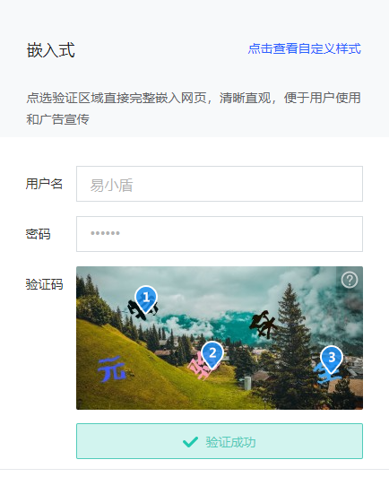
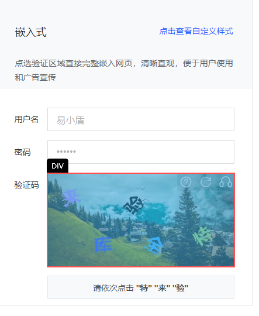
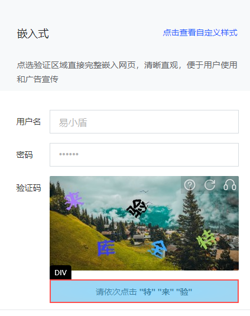

## 指令说明

**描述：**识别验证码中的文字位置，依次返回坐标或直接顺序点击文字完成验证。网页和桌面软件中的验证码都支持。

## 参数说明

<Tabs>
  <Tab title="常规">
    

    | 参数 | 说明 |
    | --- | --- |
    | **识别引擎** | 请选择需要使用的验证码引擎（默认八爪鱼AI） |
    | **图像来源** | 选要识别的图像是来源于网页元素还是桌面元素。Web网页类型的选网页元素，桌面端软件的选桌面元素。 |
    | **网页对象** | 输入一个获取到的或者通过”打开网页"创建的网页对象 |
    | **验证码图片** | 请选择点选验证码的文字图片（可通过捕获新元素） |
    | **操作说明** | 请选择文字说明所在元素，如：请依次击“山”"土”“水” |
    | **自动完成验证** | 点击自动完成验证即可自动执行拖拽动作，否则仅返回滑块终点坐标 |
  </Tab>
  <Tab title="高级">
    | 参数 | 说明 |
    | --- | --- |
    | **等待元素存在(s)** | 等待目标元素存在的最大超时时间，单位秒 |
  </Tab>
</Tabs>

## 使用示例

**该流程执行逻辑：**

案例中使用到的url：https://dun.163.com/trial/picture-click，文字点选模块

https://rpa.bazhuayu.com/shareableLink/65e9b52aa27fa391f0792744

### 效果展示

使用小Tips

**参数选择示例：**

<Info>
  使用指令过程中遇到问题？前往 [八爪鱼RPA 开发者社区问答板块](https://rpa.bazhuayu.com/community/questions) 提问，获取官方与社区帮助。
</Info>
