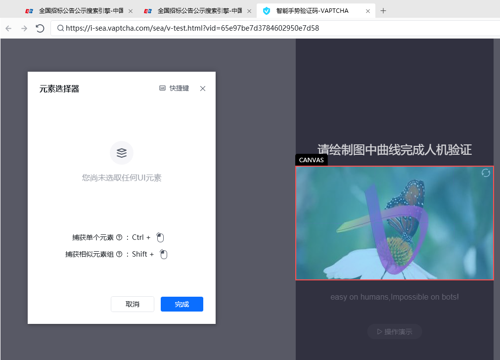
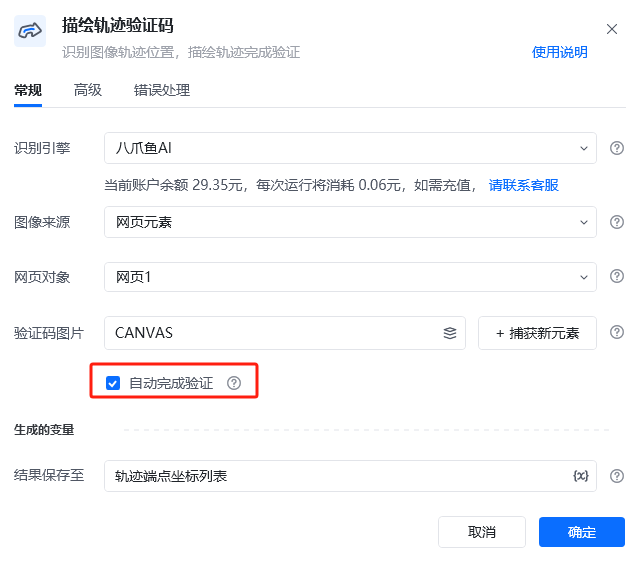
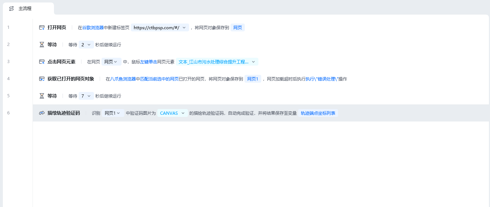

## 指令说明

**描述：**识别描绘轨迹完成验证。网页和桌面软件中的验证码都支持。

## 参数说明

<Tabs>
  <Tab title="常规">
    

    | 参数 | 说明 |
    | --- | --- |
    | **识别引擎** | 默认使用八爪鱼AI。 |
    | **图像来源** | 选要识别的图像是来源于网页元素还是桌面元素。Web网页类型的选网页元素，桌面端软件的选桌面元素。 |
    | **网页对象** | 图像来源是网页元素的才需要选网页对象。即选择识别哪个网页中的图像。 |
    | **验证码图片** | 需要进行自动验证打码的图片 |
    | **操作说明** | 选择该验证码图片。 |
    | **自动完成验证** | 默认勾选上自动完成验证，勾选后才自动的对验证码图片进行描绘轨迹，从而完成验证。 |
    | **结果保存至** | 将结果暂存为轨迹端点坐标列表变量，名称可自定义。 |
  </Tab>
  <Tab title="高级">
    
    
  </Tab>
</Tabs>

## 使用示例

**该流程执行逻辑：**

识别引擎

默认使用八爪鱼AI。

图像来源

选要识别的图像是来源于网页元素还是桌面元素。Web网页类型的选网页元素，桌面端软件的选桌面元素。

网页对象

图像来源是网页元素的才需要选网页对象。即选择识别哪个网页中的图像。

验证码图片

需要进行自动验证打码的图片

操作说明

选择该验证码图片。

自动完成验证

默认勾选上自动完成验证，勾选后才自动的对验证码图片进行描绘轨迹，从而完成验证。

结果保存至

将结果暂存为轨迹端点坐标列表变量，名称可自定义。

【获取已打开的网页对象】打开需要验证的网页

【描绘轨迹验证码】对验证码图片进行描绘轨迹，完成自动验证。

<Info>
  使用指令过程中遇到问题？前往 [八爪鱼RPA 开发者社区问答板块](https://rpa.bazhuayu.com/community/questions) 提问，获取官方与社区帮助。
</Info>
