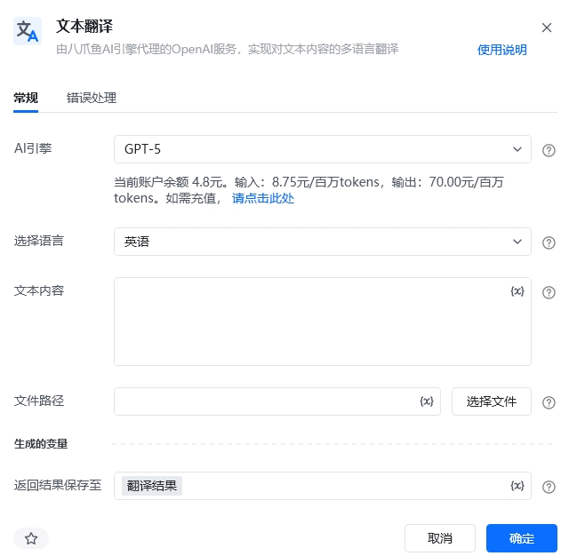
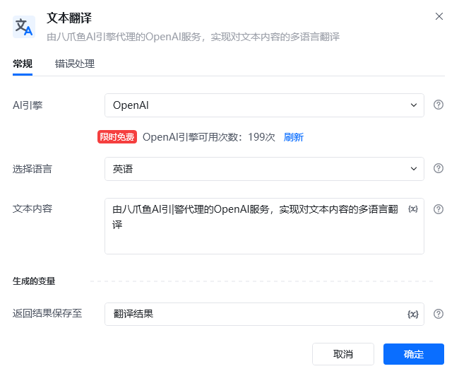
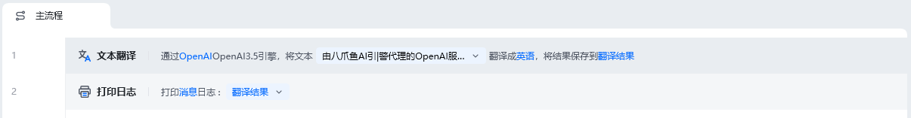
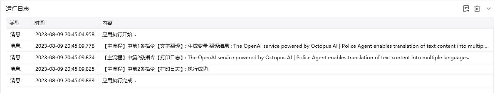

## 指令说明

**描述：** 由八爪鱼AI引|警代理的OpenAI服务，实现对文本内容的多语言翻译

## 参数说明

<Tabs>
  <Tab title="常规">

    

    | 参数 | 说明 |
    | --- | --- |
    | **AI引擎** | OpenA |
    | **选择语言** | 选择将文本内容翻译为何种语言。支持英语,日语,韩语,西班牙语,俄语,法语,德语,意大利语,葡萄牙语 |
    | **文本内容** | 输入需要进行翻译的文本内容 |
    | **返回结果保存至** | 将翻译后的内容保存到变量 |
  </Tab>
  <Tab title="高级">
    本指令暂无高级参数。
  </Tab>
</Tabs>

## 使用示例

**该流程执行逻辑：**

1. 选择 AI 引擎和目标语言，并输入待翻译文本。
2. 执行文本翻译，并将翻译结果保存到指定变量。

### 效果展示

<Info>
  使用指令过程中遇到问题？前往 [八爪鱼RPA 开发者社区问答板块](https://rpa.bazhuayu.com/community/questions) 提问，获取官方与社区帮助。
</Info>
