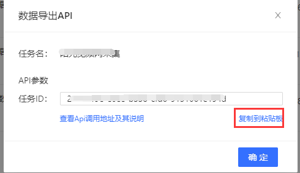
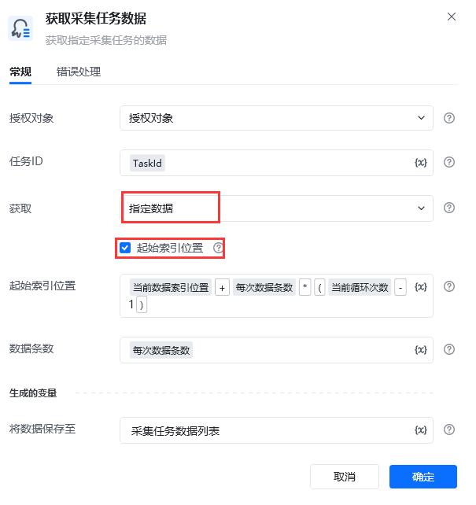
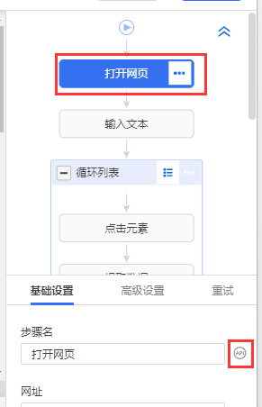
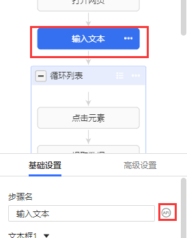
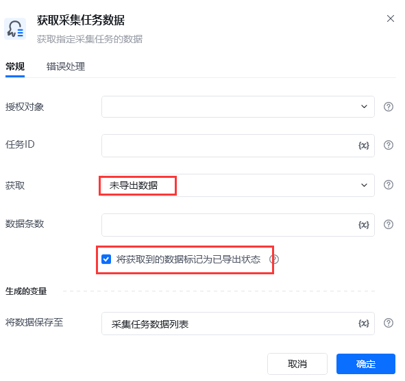
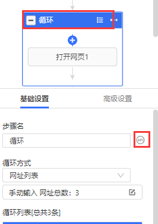
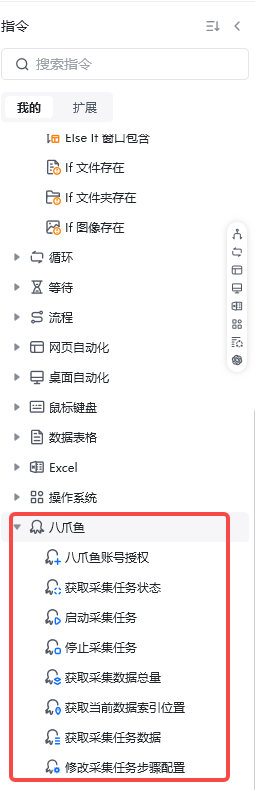

## 功能说明

八爪鱼RPA与八爪鱼采集器进行了深度的集成，可以通过八爪鱼RPA实现启动/停止八爪鱼云采集、获取任务状态、拉取八爪鱼云端数据、修改八爪鱼采集任务参数等。

使用八爪鱼采集器指令时，我们需使用“**八爪鱼账号授权**”指令，在RPA中获取到八爪鱼的账号授权，而后就可以实现对采集任务的调度，同时也可以直接拉取八爪鱼采集器云端的数据，实现采集处理全自动化操作。

**注意：所使用的八爪鱼采集器账号，必须是团队版或企业版的，否则无法调用当前指令。采集器版本套餐升级，请点击：[https://www.bazhuayu.com/plan](https://www.bazhuayu.com/plan)**

所有八爪鱼采集器集成指令在“**八爪鱼**”指令组里

## 常见问题

### 1、如何实现导出所有八爪鱼云采集数据呢？

使用获取**未导出数据**的方式，并且勾选上**将获取到的数据标记为已导出状态**，同时配合一个循环，每次循环拉取完数据后，都要判断本次拉取的数据量是否会等于指定的每次拉取的“**数据条数**”，如果不相等，说明数据已拉取完毕，退出循环即可。每次获取到数据后建议保存到一个总的数据表格里，或者是直接导出到文件里，防止数据丢失。

使用获取**指定数据**的方式，并设置**起始索引位置**，起始索引位置可以通过“**获取当前数据索引位置**”指令来获取，同样需要配合循环来使用，这时，**起始索引位置**参数应设置为：任务数据的**起始索引位置**+**每次拉取的数据条数***(**循环次数**-1)，每次循环拉取完数据后，都要判断本次拉取的数据量是否会等于指定的每次拉取的“**数据条数**”，如果不相等，说明数据已拉取完毕，退出循环即可。

### 2、如何获取到任务ID

打开八爪鱼采集器任务列表---&gt;鼠标右键点击目标任务---&gt;点击菜单里的“任务ID（API）”---&gt;弹窗“数据导出API”窗口---&gt;点击复制到粘贴板

### 3、如何获取步骤ID

打开自定义任务-&gt;选中流程里的步骤-&gt;在设置里找到有API标志的图标-&gt;点击图标即可

<Info>
  使用过程中遇到问题？前往 [八爪鱼RPA 开发者社区问答板块](https://rpa.bazhuayu.com/community/questions) 提问，获取官方与社区帮助。
</Info>
