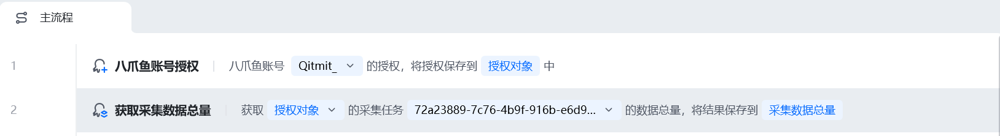
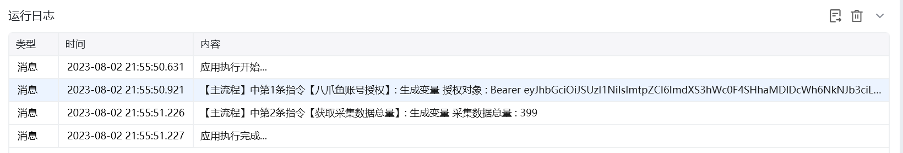
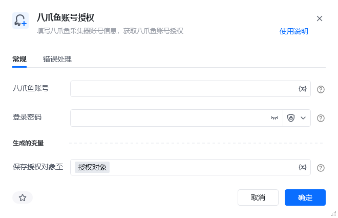

## 指令说明

**描述：** 填写八爪鱼采集器账号信息，在RPA中获取到八爪鱼的账号授权，后续就可以实现对采集任务的控制

## 参数说明

<Tabs>
  <Tab title="常规">
    

    | 参数 | 说明 |
    | --- | --- |
    | **八爪鱼账号** | 八爪鱼采集器的登录账号 |
    | **登录密码** | 八爪鱼采集器的登录账号密码 |
  </Tab>
  <Tab title="高级">
    本指令暂无高级参数。
  </Tab>
</Tabs>

## 使用示例

**该流程执行逻辑：**

使用【八爪鱼账号授权】指令在RPA中获取到八爪鱼采集器的账号授权 ---> 获取指定采集任务的数据总量

### 运行结果

<Info>
  使用指令过程中遇到问题？前往 [八爪鱼RPA 开发者社区问答板块](https://rpa.bazhuayu.com/community/questions) 提问，获取官方与社区帮助。
</Info>
