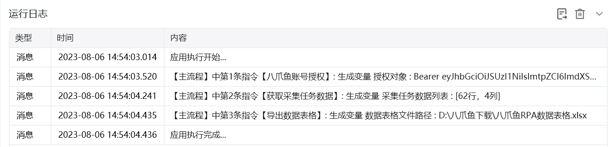
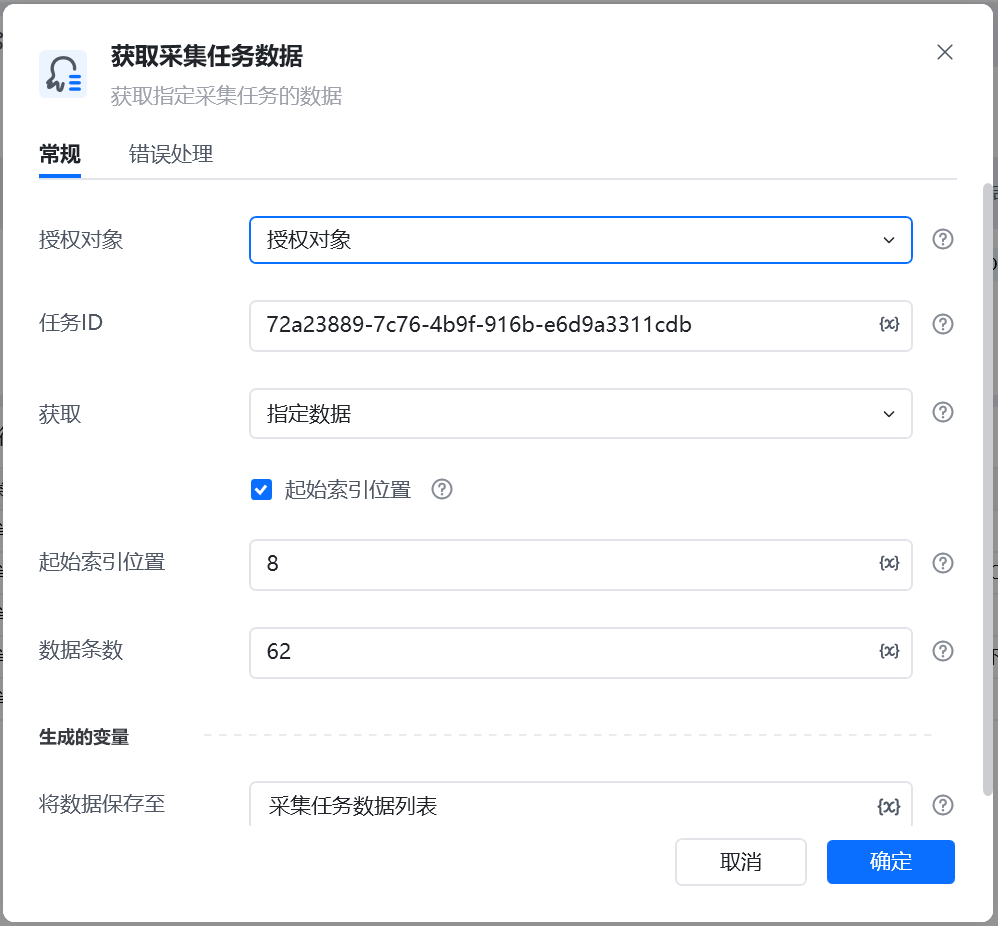
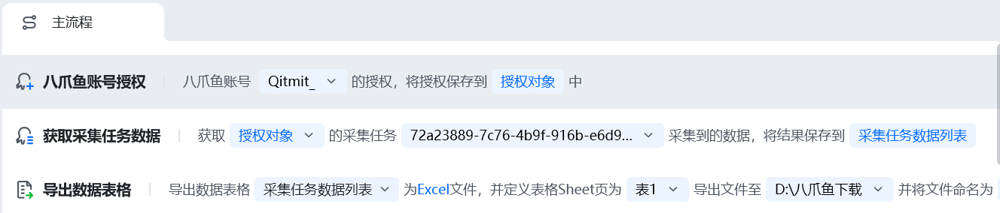
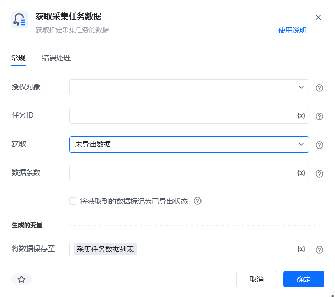

## 指令说明

**描述：** 获取指定采集任务的数据。仅限获取八爪鱼采集器云采集任务的数据，不支持本地采集。

## 参数说明

<Tabs>
  <Tab title="常规">
    

    | 参数 | 说明 |
    | --- | --- |
    | **授权对象** | 选择一个使用"八爪鱼账号授权”指令获得的授权八爪鱼对象 |
    | **任务ID** | 设置需要获取采集数据的八爪鱼任务Id。 任务Id获取方式：打开八爪鱼采集器任务列表->右键任务->点击菜单里的“任务ID（API）”->弹窗“数据导出API”窗口->点击复制到粘贴板 |
    | **获取** | 指定数据：通过填写“起始索引位置”，将指定索引之后的数据导出。、 未导出数据：将八爪鱼对应任务中所有“未导出”的数据，全部导出（或者指定导出数量量）；可将导出后的数据标记为“已导出状态”。 |
    | **起始索引位置** | 设置一个索引位置(索引值)，从这个位置(数据编号)开始读取（导出）数据。 |
    | **数据条数** | 设置要获取（导出）的数据条数 |
  </Tab>
  <Tab title="高级">
    本指令暂无高级参数。
  </Tab>
</Tabs>

## 使用示例

**该流程执行逻辑：**

### 运行结果

<Info>
  使用指令过程中遇到问题？前往 [八爪鱼RPA 开发者社区问答板块](https://rpa.bazhuayu.com/community/questions) 提问，获取官方与社区帮助。
</Info>
