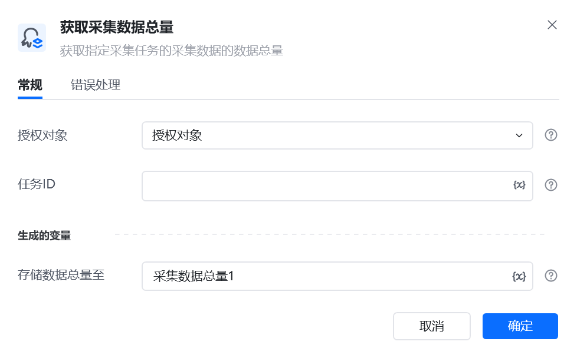

## 指令说明

**描述：** 可以获取到指定采集任务的采集数据的总数据量。仅限获取任务的云采集的数据，不支持本地采集。

## 参数说明

<Tabs>
  <Tab title="常规">
    

    | 参数 | 说明 |
    | --- | --- |
    | **授权对象：** | 选择一个使用"八爪鱼账号授权”指令获得的授权对象 |
    | **任务ID:** | 设置需要获取其云采集数据量的八爪鱼任务的Id |
  </Tab>
  <Tab title="高级">
    本指令暂无高级参数。
  </Tab>
</Tabs>

## 使用示例

**该流程执行逻辑：**

使用【八爪鱼账号授权】指令获在RPA中获取到八爪鱼的账号授权

执行【获取采集数据总量】指令获取到指定任务的采集总数量

注意：所使用的八爪鱼采集器账号，必须是团队版或企业版的，否则无法调用当前指令。账号版本升级，请点击：https://www.bazhuayu.com/plan

### 效果展示

<Info>
  使用指令过程中遇到问题？前往 [八爪鱼RPA 开发者社区问答板块](https://rpa.bazhuayu.com/community/questions) 提问，获取官方与社区帮助。
</Info>
