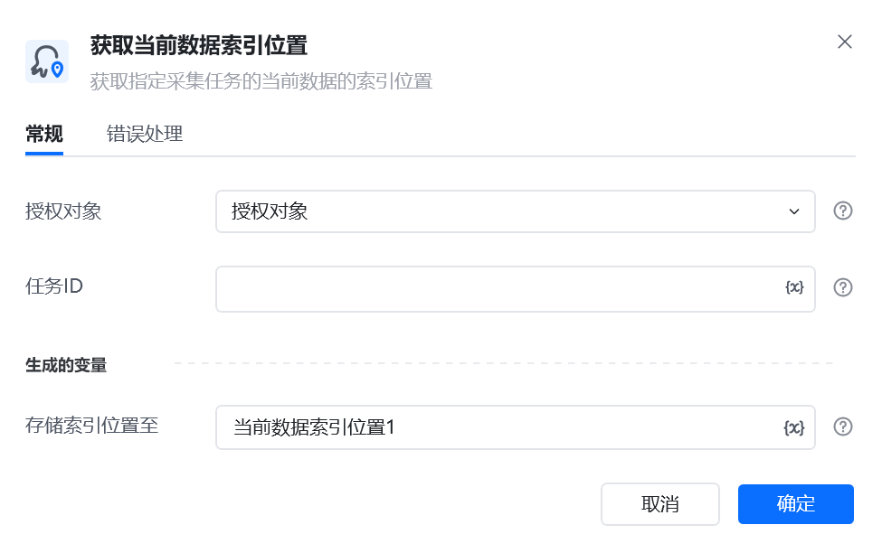
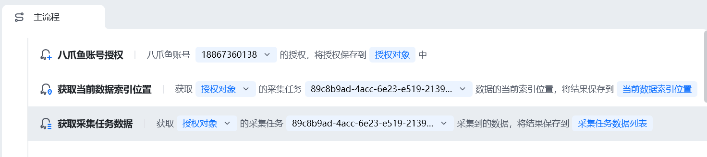
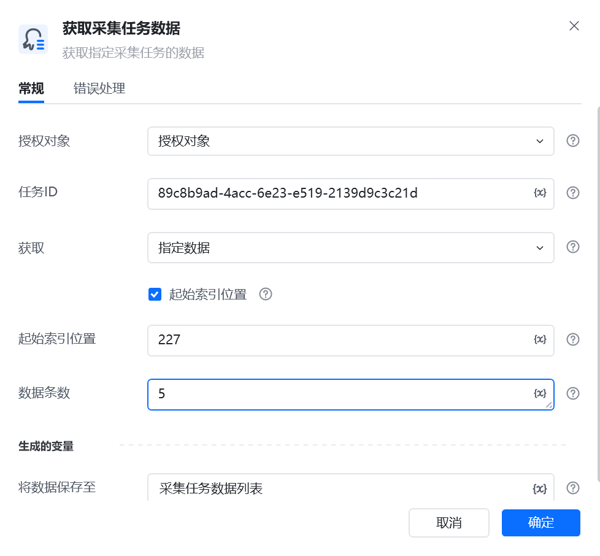
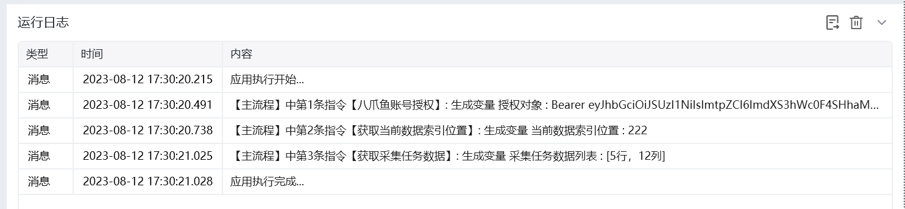

## 指令说明

**描述：** 可以获取到指定采集任务的当前数据的索引位置。仅限获取任务的云采集的数据，不支持本地采集。

## 参数说明

<Tabs>
  <Tab title="常规">
    

    | 参数 | 说明 |
    | --- | --- |
    | **授权对象：** | 选择一个使用"八爪鱼账号授权”指令获得的授权对象 |
    | **任务ID:** | 设置需要停止采集的八爪鱼任务的Id |
    | **存索引位置至** | 指定一个变量名字。 |
  </Tab>
  <Tab title="高级">
    本指令暂无高级参数。
  </Tab>
</Tabs>

## 使用示例

**该流程执行逻辑：**

1. 使用【八爪鱼账号授权】获取账号授权，并选择需要读取的采集任务。
2. 执行【获取当前数据索引位置】，本例得到当前索引位置 `222`。
3. 将索引位置用于下一次【获取采集任务数据】；例如跳过 5 条后从 `227` 开始，再读取 5 条数据。
4. 将新的索引位置保存下来，可在后续运行中继续增量获取数据，避免重复读取。

注意：该指令需要团队版或企业版账号。账号版本说明请参见：https://www.bazhuayu.com/plan

### 效果展示

<Info>
  使用指令过程中遇到问题？前往 [八爪鱼RPA 开发者社区问答板块](https://rpa.bazhuayu.com/community/questions) 提问，获取官方与社区帮助。
</Info>
