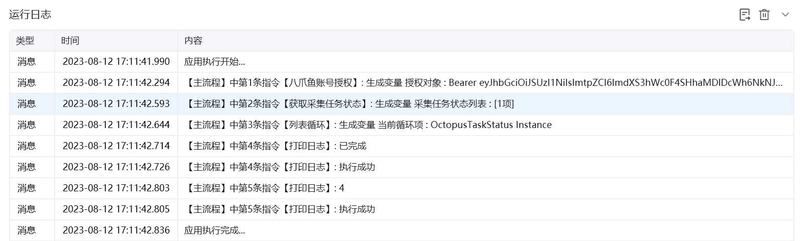
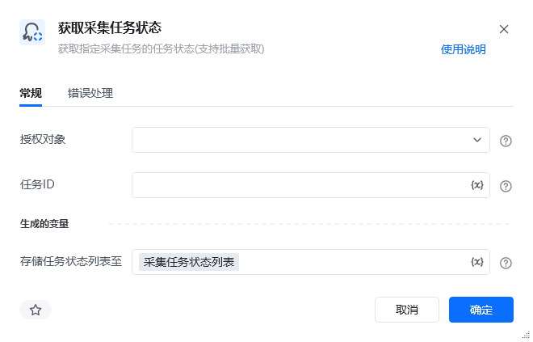
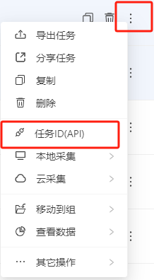

## 指令说明

**描述：** 可以获取八爪鱼采集器指定采集任务的任务状态（支持批量获取）

## 参数说明

<Tabs>
  <Tab title="常规">
    

    | 参数 | 说明 |
    | --- | --- |
    | **授权对象** | 选择一个使用【八爪鱼账号授权】指令获得的授权对象 |
    | **任务ID** | 设置需要获取状态的八爪鱼任务lD，多个任务用";"分隔 任务ID获取方式：打开八爪鱼采集器任务列表->右键任务->点击菜单里的“任务ID（API）”->弹窗“数据导出API”窗口->点击复制到粘贴板 |
    | **存储任务状态列表至** | 指定一个变量名字，该列表变量用于保存获取到的任务状态信息，该变量是一个二维列表，可以通过列表循环每一个任务，并获取到当前任务的任务ID,任务名称，状态码，状态描述 |
  </Tab>
  <Tab title="高级">
    本指令暂无高级参数。
  </Tab>
</Tabs>

## 使用示例

**该流程执行逻辑：**

1. 使用【八爪鱼账号授权】获取账号授权，并选择需要查询的采集任务。
2. 执行【获取采集任务状态】，将任务状态结果保存到列表变量中。
3. 使用【列表循环】遍历状态列表，分别打印 `StatusDescription`（状态说明）和 `StatusCode`（状态码），便于后续流程根据任务状态继续处理。

### 效果展示

<Info>
  使用指令过程中遇到问题？前往 [八爪鱼RPA 开发者社区问答板块](https://rpa.bazhuayu.com/community/questions) 提问，获取官方与社区帮助。
</Info>
