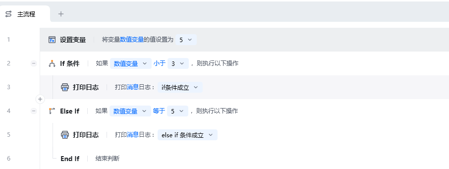
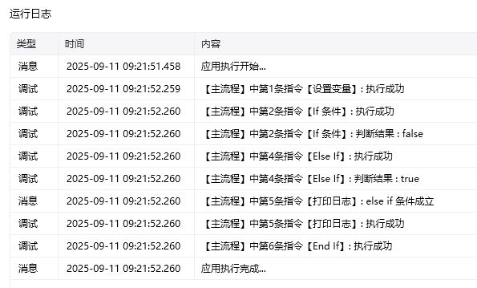

## 指令说明

**描述：** 多分支条件判断指令，必须跟在"If 条件"或另一个"Else If"之后。执行逻辑：顺序检测前置条件，若全部不成立则判断本指令条件；条件成立时执行并终止后续分支，不成立则继续传递至下一个 Else If 或 Else。

<Info>
  Else If 必须跟在 If 条件或另一个 Else If 之后，不能单独使用。
</Info>

## 参数说明

<Tabs>
  <Tab title="常规">
    

    | 参数 | 说明 |
    | --- | --- |
    | **第一个操作数** | 输入前面指令创建的变量、表达式、文本、数字或符号，与第二个操作数进行比较 |
    | **运算符** | 选择第一个操作数和第二个操作数之间的关系（等于、不等于、大于、大于等于、小于、小于等于、包含、不包含、为空、不为空、开头为、开头不为、结尾为、结尾不为） |
    | **第二个操作数** | 输入前面指令创建的变量、表达式、文本、数字或符号，与第一个操作数进行比较 |
  </Tab>
  <Tab title="高级">
    本指令暂无高级参数。
  </Tab>
</Tabs>

## 使用示例

**此流程执行逻辑：**

将数值变量赋值为 5

使用【If 条件】判断数值变量是否小于 3，若满足条件，执行【打印日志】，打印消息日志："If 条件成立"

否则，使用【Else If】，判断数值变量是否等于 5

若满足条件，执行【打印日志】："Else If 条件成立"

否则，结束判断

### 效果展示

<Info>
  使用指令过程中遇到问题？前往 [八爪鱼RPA 开发者社区问答板块](https://rpa.bazhuayu.com/community/questions) 提问，获取官方与社区帮助。
</Info>
