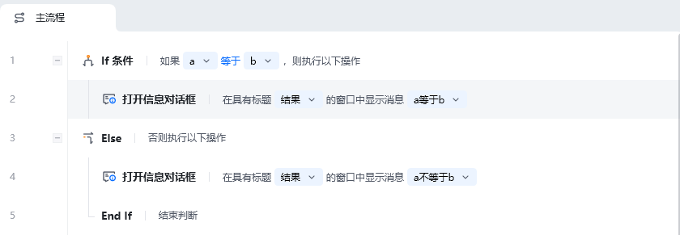

## 指令说明

**描述：** 和 If 指令配合使用，实现 If 条件不成立时，执行 Else 里面的所有指令。

<Info>
  Else 必须跟在 If 条件或 If 多条件之后，不能单独使用。If 条件成立时跳过 Else 块，不成立时执行 Else 块。
</Info>

## 参数说明

<Tabs>
  <Tab title="常规">
    

    Else 指令本身无参数，它作为 If 条件不成立时的兜底执行块。
  </Tab>
  <Tab title="高级">
    本指令暂无高级参数。
  </Tab>
</Tabs>

## 使用示例

**该流程执行逻辑：**

使用【If 条件】判断 a 变量是否等于 b 变量

若满足条件，执行【打开信息对话框】，提示结果信息 "a 等于 b"

否则执行【打开信息对话框】，提示结果信息 "a 不等于 b"

<Info>
  使用指令过程中遇到问题？前往 [八爪鱼RPA 开发者社区问答板块](https://rpa.bazhuayu.com/community/questions) 提问，获取官方与社区帮助。
</Info>
