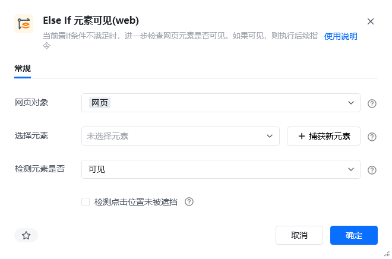
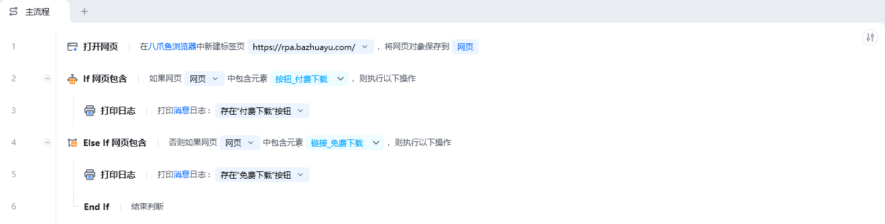
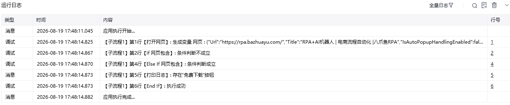

## 指令说明

**描述：** 检测元素在网页中是否可见，通常与指令【If 元素可见(web)】结合使用。当 If 元素可见(web)执行的结果为 false 的时候，再执行 Else If 元素可见(web)指令进行判断。

## 参数说明

<Tabs>
  <Tab title="常规">
    

    | 参数 | 说明 |
    | --- | --- |
    | **网页对象** | 选择一个之前通过【打开网页】或【获取已打开的网页对象】指令创建的网页对象 |
    | **检测网页是否** | 可见 / 不可见 |
    | **操作目标** | 从元素库中选择一个已捕获的元素或通过「捕获新元素」来捕获新的网页元素作为操作目标 |
  </Tab>
  <Tab title="高级">
    本指令暂无高级参数。
  </Tab>
</Tabs>

## 使用示例

**此流程执行逻辑：**

使用【打开网页】指令打开八爪鱼RPA官网

使用【If 元素可见(web)】判断网页中付费下载按钮元素是否可见

若可见则执行【打印日志】在控制台输出存在“付费下载”按钮

若不可见则执行【Else If 元素可见(web)】判断网页中免费下载按钮元素是否可见

若可见则执行【打印日志】在控制台输出存在“免费下载”按钮

### 效果展示

<Info>
  使用指令过程中遇到问题？前往 [八爪鱼RPA 开发者社区问答板块](https://rpa.bazhuayu.com/community/questions) 提问，获取官方与社区帮助。
</Info>
