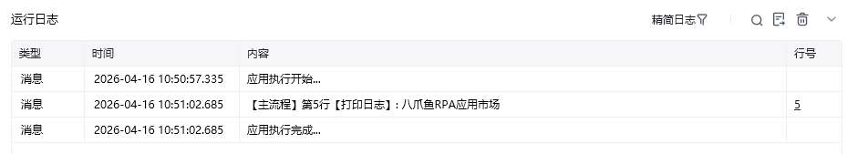

## 指令说明

**描述：** 和【If 条件/If 多条件】或者【Else If/Else If 多条件】配合使用，执行逻辑与【If 条件】一致，但是需要在前面的条件不成立时才会执行。多条件分支判断，适用于多分支且多条件判断，满足多个条件才会执行。

## 参数说明

<Tabs>
  <Tab title="常规">
    

    | 参数 | 说明 |
    | --- | --- |
    | **条件关系** | 符合以下全部条件：需要全部条件都满足才能执行 If 中的任务；符合以下任意条件：只需要任意一个条件满足就能执行 If 中的任务 |
    | **条件列表** | 可设置待比较对象以及比较方式，若需同时判断多个条件可点击「增加条件」按钮进行添加 |
  </Tab>
  <Tab title="高级">
    本指令暂无高级参数。
  </Tab>
</Tabs>

## 使用示例

**该流程执行逻辑：**

新建一个数值类型变量，赋值 8

使用【If 多条件】指令判断条件列表

若满足全部条件在控制台打印 "让自动化触手可及"

使用【Else If 多条件】指令判断条件列表

若满足全部条件则在控制台打印 "八爪鱼RPA应用市场"

### 效果展示

<Info>
  使用指令过程中遇到问题？前往 [八爪鱼RPA 开发者社区问答板块](https://rpa.bazhuayu.com/community/questions) 提问，获取官方与社区帮助。
</Info>
