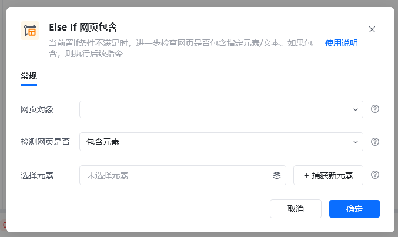
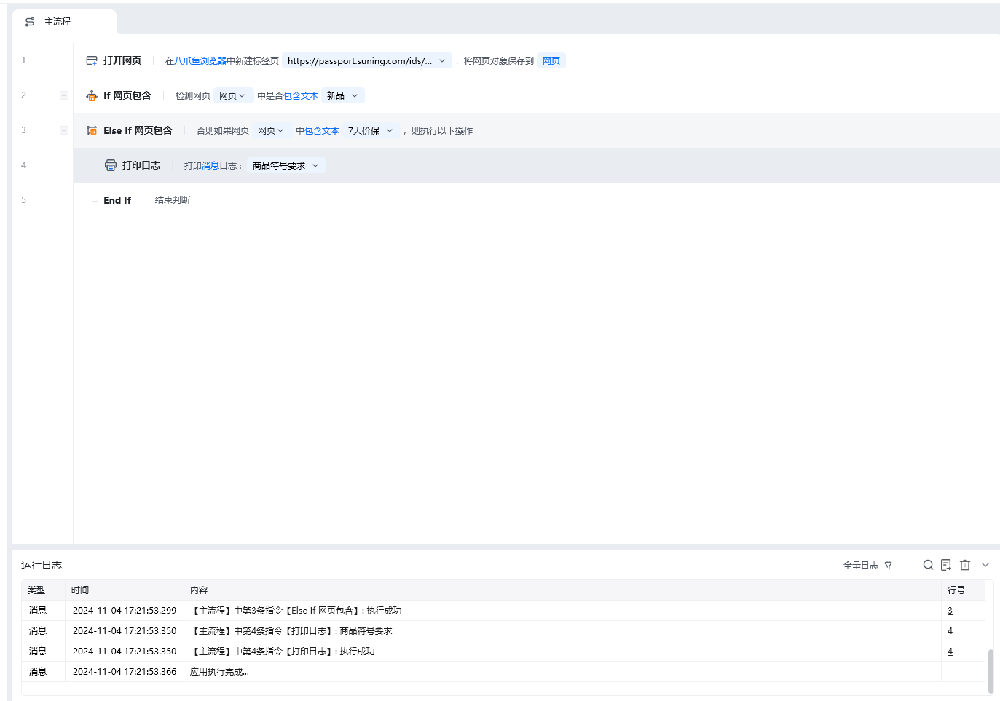

## 指令说明

**描述：** 检测指定的文本或元素是否出现在指定的网页中，满足条件则执行当前条件下的所有指令。一般与 If 网页包含指令使用，当 If 包含指令不成立时，执行 Else If 网页包含判断。

## 参数说明

<Tabs>
  <Tab title="常规">
    

    | 参数 | 说明 |
    | --- | --- |
    | **网页对象** | 输入一个【获取到的】或者【通过"打开网页"创建的网页对象】 |
    | **检测网页是否包含** | 包含元素/不包含元素：检测网页是否包含/不包含某个网页元素。当需要判断网页是否包含多个文本或元素，可以通过包含元素，用 \| 或者 or 连接多个不同的元素或文本。包含文本/不包含文本：检测网页是否包含某个文本内容 |
    | **选择元素** | 检测文本：输入待检查的文本内容；检测元素：从「元素库」中选择一个已捕获的元素或通过「捕获新元素」来捕获新的网页元素作为操作目标 |
  </Tab>
  <Tab title="高级">
    本指令暂无高级参数。
  </Tab>
</Tabs>

## 使用示例

**该流程执行逻辑：**

使用【打开网页】打开苏宁易购商品链接

使用【If 网页包含】判断指定网页中是否包含文本【新品】

如果不包含文本【新品】则执行 Else If 网页包含文本【7天价保】判断

若包含则执行【打开信息对话框】提示：商品符合要求

<Info>
  使用指令过程中遇到问题？前往 [八爪鱼RPA 开发者社区问答板块](https://rpa.bazhuayu.com/community/questions) 提问，获取官方与社区帮助。
</Info>
