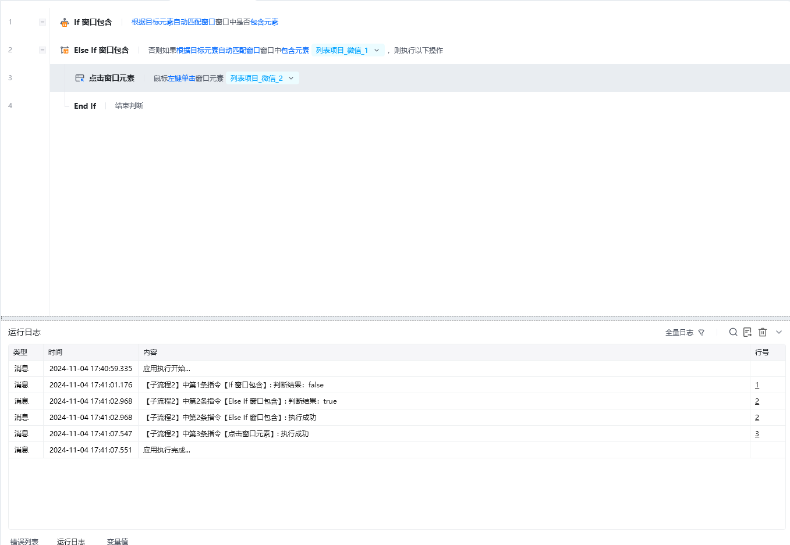

## 指令说明

**描述：** 检测指定的元素是否包含在指定窗口中，通常需要与【If 窗口包含】结合使用。

## 参数说明

<Tabs>
  <Tab title="常规">
    

    | 参数 | 说明 |
    | --- | --- |
    | **窗口对象** | 根据操作目标自动匹配或选择一个之前通过【获取窗口对象】指令创建的窗口对象，根据目标元素自动匹配窗口 |
    | **检测指定窗口是否** | 包含 / 不包含元素 |
    | **选择元素** | 从元素库中选择一个已捕获的元素或通过「捕获新元素」来捕获新的窗口元素作为操作目标 |
  </Tab>
  <Tab title="高级">
    本指令暂无高级参数。
  </Tab>
</Tabs>

## 使用示例

**此流程执行逻辑：**

获取标题为微信的窗口对象

判断窗口对象中是否包含指定窗口元素

若桌面不包含则为 false，执行 Else If 窗口包含执行判断

执行 Else If 窗口包含如果为 true，则执行里面的指令【点击窗口元素】

<Info>
  使用指令过程中遇到问题？前往 [八爪鱼RPA 开发者社区问答板块](https://rpa.bazhuayu.com/community/questions) 提问，获取官方与社区帮助。
</Info>
