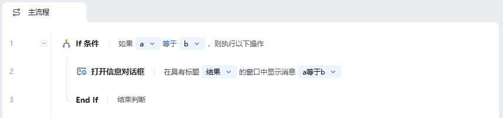

## 指令说明

**描述：** 必须和 If 或 Else 或 Else If 指令配合使用，不能单独使用，表示判断的结束。

<Info>
  End If 是条件判断块的必备结束标记。每一个 If 条件都必须有一个对应的 End If 来闭合。
</Info>

## 参数说明

<Tabs>
  <Tab title="常规">
    End If 指令本身无参数，仅作为标记指令使用。
  </Tab>
  <Tab title="高级">
    本指令暂无高级参数。
  </Tab>
</Tabs>

## 使用示例

**该流程执行逻辑：**

使用【If 条件】判断 a 变量是否等于 b 变量

若满足条件，执行【打开信息对话框】，提示结果信息 "a 等于 b"

使用【End If】指令标记条件判断结束

### 效果展示

<Info>
  使用指令过程中遇到问题？前往 [八爪鱼RPA 开发者社区问答板块](https://rpa.bazhuayu.com/community/questions) 提问，获取官方与社区帮助。
</Info>
