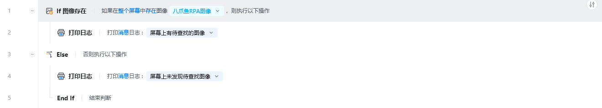
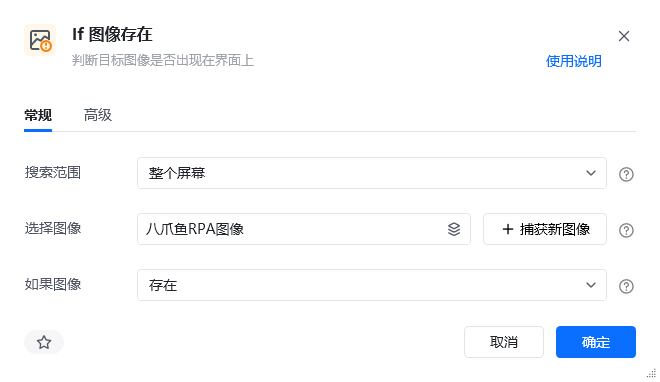
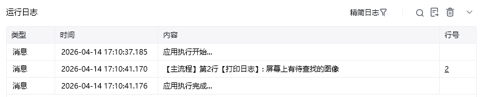

## 指令说明

**描述：** 判断目标图像是否出现在界面上（可以是整个屏幕、指定窗口或当前激活窗口）。

## 参数说明

<Tabs>
  <Tab title="常规">
    

    | 参数 | 说明 |
    | --- | --- |
    | **搜索范围** | 查找目标图像的范围，可选整个屏幕、指定窗口对象或当前激活窗口 |
    | **窗口对象** | 当"搜索目标"选择"指定窗口对象"时，需要输入一个通过【获取窗口对象】指令获取的窗口对象 |
    | **选择图像** | 可选择已存在的图像，或捕获新图像 |
    | **如果图像** | 选择判断条件，选项：存在 / 不存在 |
  </Tab>
  <Tab title="高级">
    | 参数 | 说明 |
    | --- | --- |
    | **匹配模式** | 可选项，选项为：彩色匹配、灰度匹配。彩色匹配为原色匹配，彩色匹配相对灰度匹配更加精确；灰度匹配是将图片转为灰度图后再进行匹配，灰度匹配速度会更快 |
    | **相似度(%)** | 指定目标图像与原始图像的相似程度，推荐相似度为 80% |
  </Tab>
</Tabs>

## 使用示例

**此流程执行逻辑：**

先点击捕获对应图像，捕获桌面八爪鱼 RPA 图标

使用【If 图像存在】，选择刚才捕获的图标，判断方式为"存在"

如果在屏幕上识别到了指定图像，在控制台打印 "屏幕上有待查找的图像"

否则在控制台打印 "屏幕上未发现待查找图像"

### 效果展示

<Info>
  **使用小 Tips：** v2.2.1185.825 及以上版本优化了"图像匹配抗分辨率"，即【点击图像】、【鼠标悬浮在图像上】、【等待图像】和【If 图像存在】指令的运行不会受桌面分辨率的影响。
</Info>

<Info>
  使用指令过程中遇到问题？前往 [八爪鱼RPA 开发者社区问答板块](https://rpa.bazhuayu.com/community/questions) 提问，获取官方与社区帮助。
</Info>
