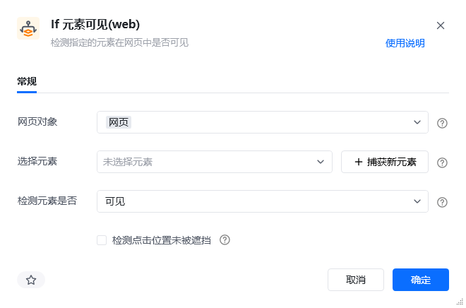
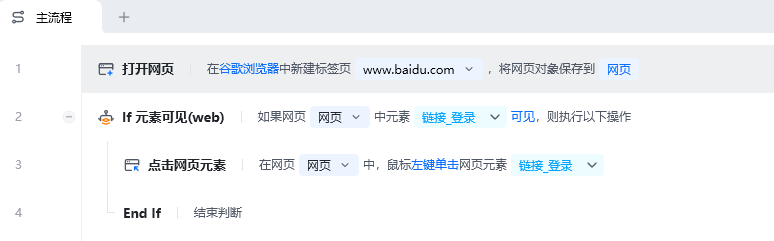
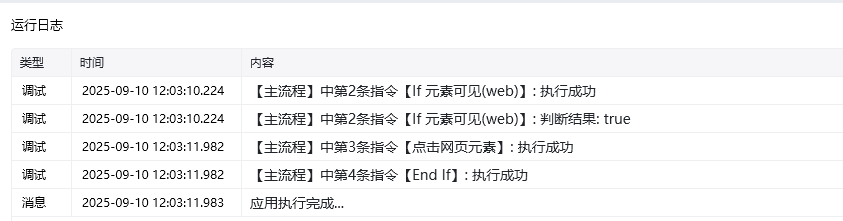
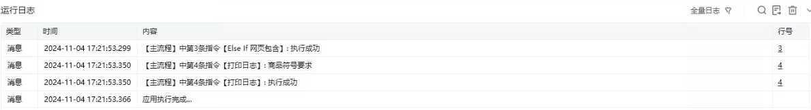
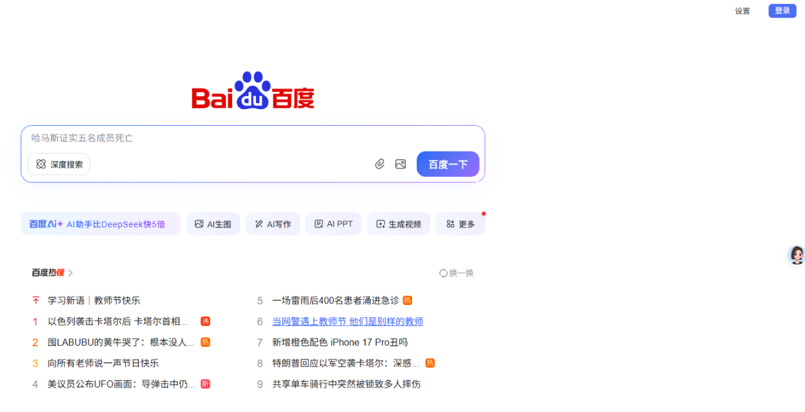
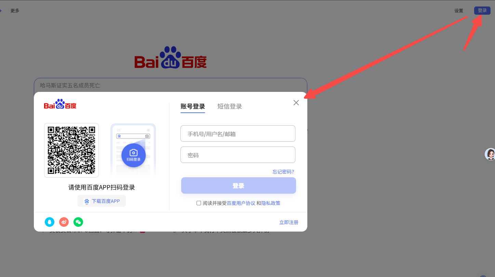

## 指令说明

**描述：** 检测指定的元素在网页中是否可见。

## 参数说明

<Tabs>
  <Tab title="常规">
    

    | 参数 | 说明 |
    | --- | --- |
    | **网页对象** | 选择一个之前通过【打开网页】或【获取已打开的网页对象】指令创建的网页对象 |
    | **选择元素** | 从元素库中选择一个已捕获的元素或通过「捕获新元素」来捕获新的网页元素作为操作目标 |
    | **检测元素是否** | 指定要检测的元素的可见性状态，可以选择"可见"或"不可见" |
    | **检测点击位置未被遮挡** | 是否要附加检测目标元素点击位置未被其他元素遮挡。若勾选，则执行遮挡检测，以确保后期点击操作能够直接作用于目标元素；否则，仅判断元素是否可见 |
  </Tab>
  <Tab title="高级">
    本指令暂无高级参数。
  </Tab>
</Tabs>

## 使用示例

**此流程执行逻辑：**

使用【打开网页】指令打开百度官网

使用【If 元素可见(web)】判断网页中登录按钮元素是否可见

若可见则执行【点击网页元素】点击登录按钮元素

### 效果展示

RPA 运行前：

RPA 运行后：

【If 网页包含】与【If 元素可见(web)】对比

| 场景 | If 网页包含 | If 元素可见(web) |
| --- | --- | --- |
| 元素可见 | True | True |
| 元素隐藏 | True | False |
| 相似元素组 | True | True |
| 元素被遮挡 | True | False |
| 网页文本内容 | True | False |

<Info>
  使用指令过程中遇到问题？前往 [八爪鱼RPA 开发者社区问答板块](https://rpa.bazhuayu.com/community/questions) 提问，获取官方与社区帮助。
</Info>
