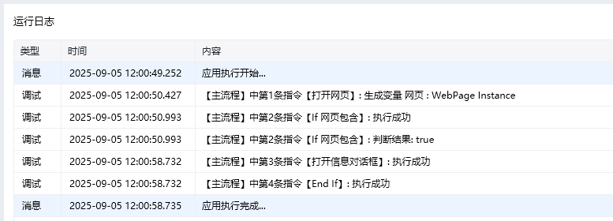

## 指令说明

**描述：** 检测指定的文本或元素是否出现在指定的网页中，满足条件则执行当前条件下的所有指令，一般会配合 Else 一起使用。

## 参数说明

<Tabs>
  <Tab title="常规">
    

    | 参数 | 说明 |
    | --- | --- |
    | **网页对象** | 选择一个之前通过【打开网页】或【获取已打开的网页对象】指令创建的网页对象 |
    | **检测网页是否** | 包含元素（检测包含某个网页元素）； 不包含元素（检测不包含某个网页元素）； 包含文本（检测网页包含某个文本内容）； 不包含文本（检测网页不包含某个文本内容）。当需要判断网页是否包含多个文本或元素，可以通过包含元素，用 \| 或者 or 连接多个不同的元素或文本 |
    | **选择元素** | 检测文本：输入待检查的文本内容； 检测元素：从「元素库」中选择一个已捕获的元素或通过「捕获新元素」来捕获新的网页元素作为操作目标 |
  </Tab>
  <Tab title="高级">
    本指令暂无高级参数。
  </Tab>
</Tabs>

## 使用示例

**此流程执行逻辑：**

使用【打开网页】指令在谷歌浏览器中打开百度首页网址

使用【If 网页包含】判断指定网页中是否包含输入框元素

若包含则执行【打开信息对话框】提示：打开网页成功

<Info>
  使用指令过程中遇到问题？前往 [八爪鱼RPA 开发者社区问答板块](https://rpa.bazhuayu.com/community/questions) 提问，获取官方与社区帮助。
</Info>
