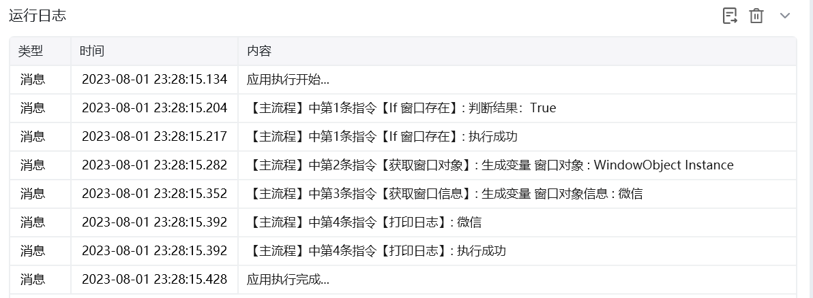

## 指令说明

**描述：** 在电脑桌面判断某个目标窗口是否存在，比如判断微信窗口。

## 参数说明

<Tabs>
  <Tab title="常规">
    

    | 参数 | 说明 |
    | --- | --- |
    | **获取窗口方式** | 单选，选项为窗口对象 / 窗口标题或类型名 / 捕获窗口元素 |
    | **窗口对象** | "获取窗口方式"选择"窗口对象"时需要填写，选择一个之前通过【获取窗口对象】指令创建的窗口对象 |
    | **窗口标题** | "获取窗口方式"选择"窗口标题或类型名"时需要填写，选择一个当前可获取的窗口标题 |
    | **添加窗口类型** | "获取窗口方式"选择"窗口标题或类型名"时可选择勾选，一般在存在多个相同标题的窗口的情况下使用 |
    | **窗口类型** | "添加窗口类型"勾选时需要填写，输入窗口类型 |
    | **根据正则匹配** | "获取窗口方式"选择"窗口标题或类型名"时可选择填写，根据通配符匹配，比如"*记事本"表示以记事本结尾的任意 |
    | **选择元素** | "获取窗口方式"选择"捕获窗口元素"时需要填写，从元素库中选择一个已捕获的元素或通过「捕获新元素」作为操作目标 |
    | **窗口是否存在** | 单选，选项含存在 / 不存在 |
  </Tab>
  <Tab title="高级">
    本指令暂无高级参数。
  </Tab>
</Tabs>

## 使用示例

**该流程执行逻辑：**

判断是否存在以微信为标题的窗口

若存在则执行【获取窗口信息】指令获取标题并执行【打印日志】指令打印标题

若不存在则执行【打印日志】指令打印 "窗口不存在"

### 效果展示

<Info>
  使用指令过程中遇到问题？前往 [八爪鱼RPA 开发者社区问答板块](https://rpa.bazhuayu.com/community/questions) 提问，获取官方与社区帮助。
</Info>
