## 一、什么是自定义指令

### 1. 功能价值

#### 1.1 拓展RPA能力

开发者可以自行封装一些八爪鱼RPA官方未支持的指令，将自己常用的功能模块封装成一个指令，例某网站的数据获取

#### 1.2 降低维护成本

开发者可以封装需要经常复用的流程片段，方便后期维护。假设A、B、C三个应用都需要用到登录淘宝功能，淘宝前端迭代时可能会影响这部分流程，如果不使用自定义指令，就得逐个修改应用，耗时耗力。但如果封装成指令进行引用，改动一处，剩余部分都会自动同步。

### 2. 使用场景

#### 2.1 开发者通用角度

小八是一名有RPA搭建能力的自媒体创作者，之前搭建了很多某社媒平台相关的RPA应用，如笔记采集、图文批量发布、评论采集。每个应用初始步骤都是登录模块，为了提升开发效率，他将某社媒平台登录模块封装成指令库，然后在开发其他应用时就可以直接进行调用。后期登录逻辑有改动的话，他就可以只优化该指令库，其他用到这个指令块的RPA应用会直接更新。

#### 2.2 企业开发者角度

小八是一名企业开发者，他经常会封装一些已有场景的自定义指令库，这些指令库都可以被企业内的成员使用

#### 2.3 共享角度

小八将使用了自定义指令库的应用分享给其他人使用时，指令库可以自动加载，无需使用者额外操作

### 3. 常用定义

#### 3.1 自定义指令

实现某个功能的可执行模块，如登录判断等。如下图所示，红框内均为自定义指令

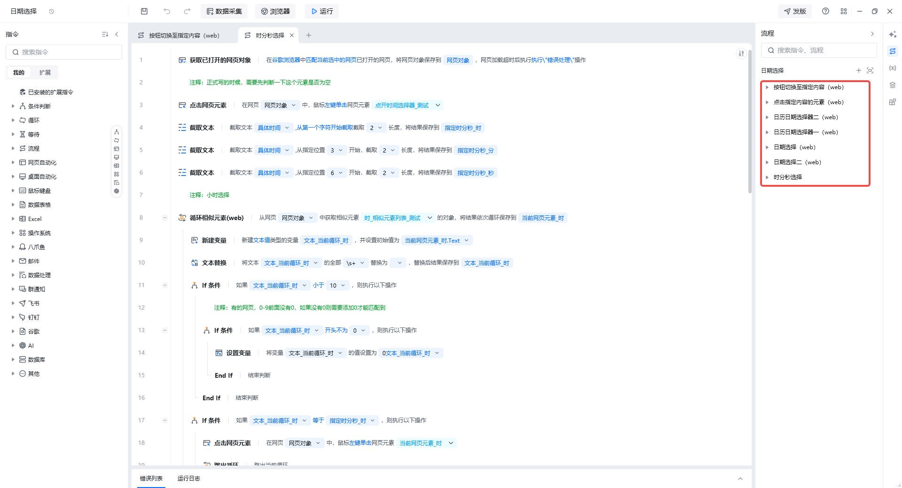

#### 3.2 指令库

多个功能类似的指令合集，可进行统一发布和版本管理。如下图所示，紫鸟控制台操作和亚马逊卖家后台都是指令库

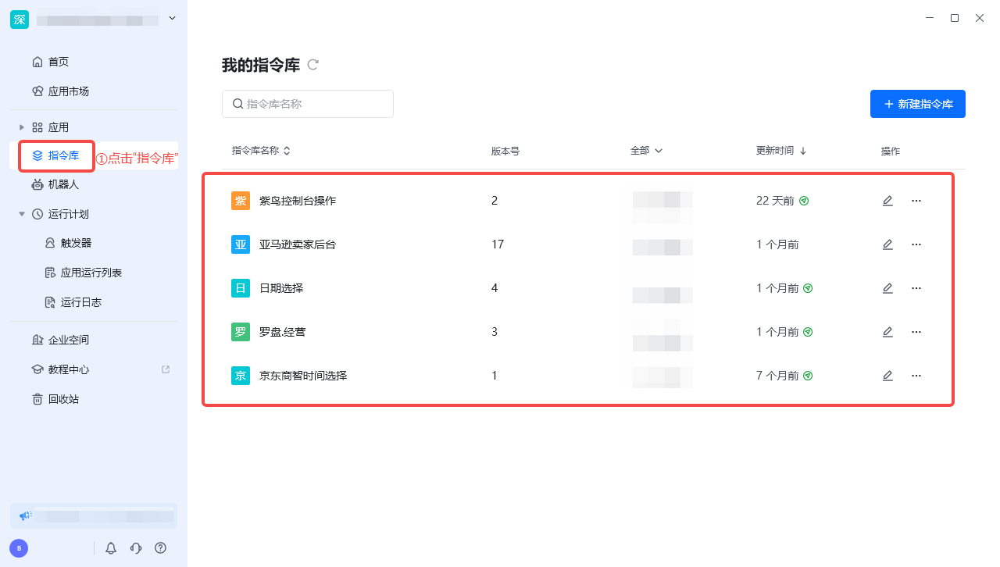

#### 3.3 输入变量和输出变量

- 输入变量

- 指令的输入参数

<table>
  <tbody>
    <tr>
      <td style={{ verticalAlign: 'top', textAlign: 'center' }}>
        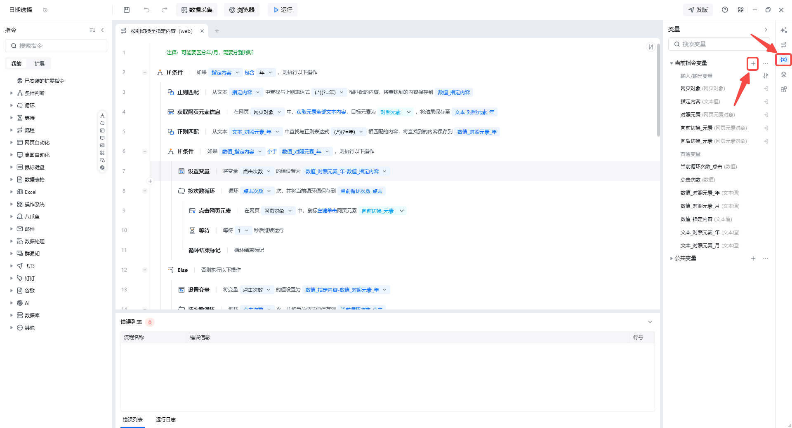
      </td>
      <td style={{ verticalAlign: 'top', textAlign: 'center' }}>
        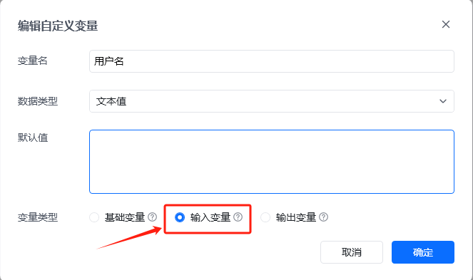
      </td>
    </tr>
  </tbody>
</table>

- 选择此类型，后续用户使用到此指令时，会提醒他输入相关数据
- 如果需要设置输入提示、占位符等，可点击指令后方的“编辑”按钮

<table>
  <tbody>
    <tr>
      <td style={{ verticalAlign: 'top', textAlign: 'center' }}>
        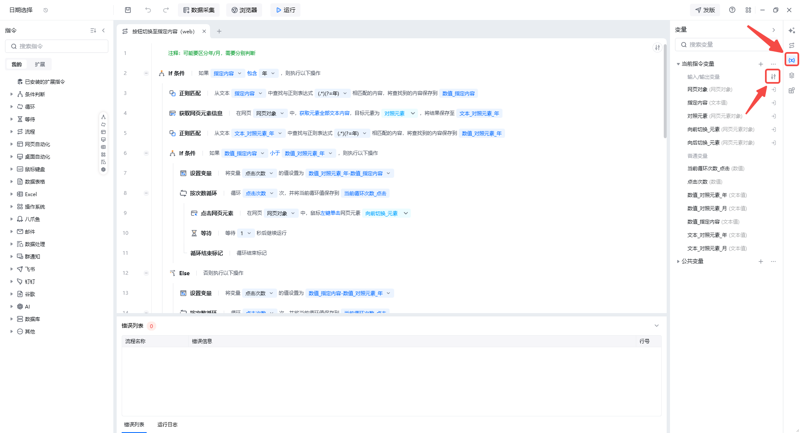
      </td>
      <td style={{ verticalAlign: 'top', textAlign: 'center' }}>
        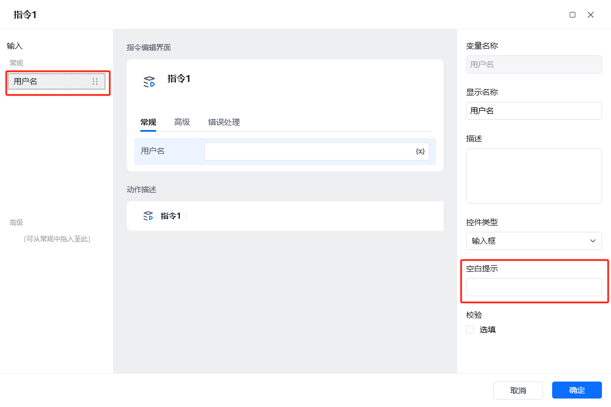
      </td>
    </tr>
  </tbody>
</table>

- 输出变量

- 指令的输出参数
- 这类变量会在指令运行结束后返回给用户

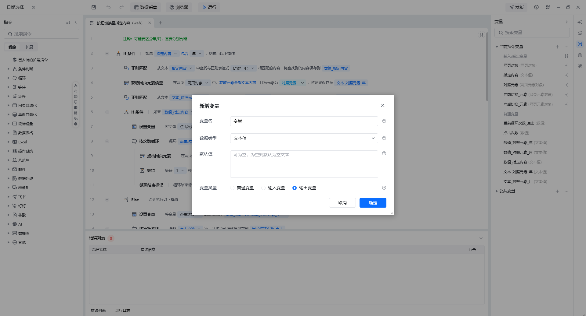

## 二、自定义指令

### 1. 使用全流程（流程图）

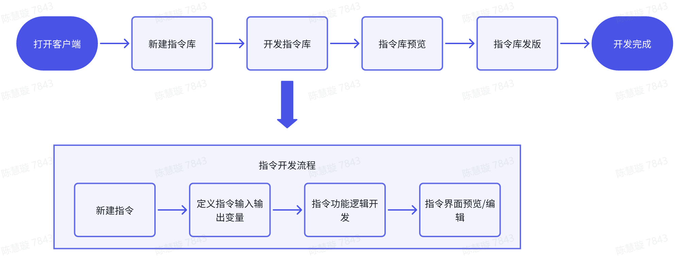

### 2. 具体案例

以开发“日期选择”指令库为案例进行说明，该指令库包含多种不同类型的日期选择框，例纯年月日、纯时分秒等。

#### 2.1 新建指令库

切换到“指令库”--->点击“新建指令库”

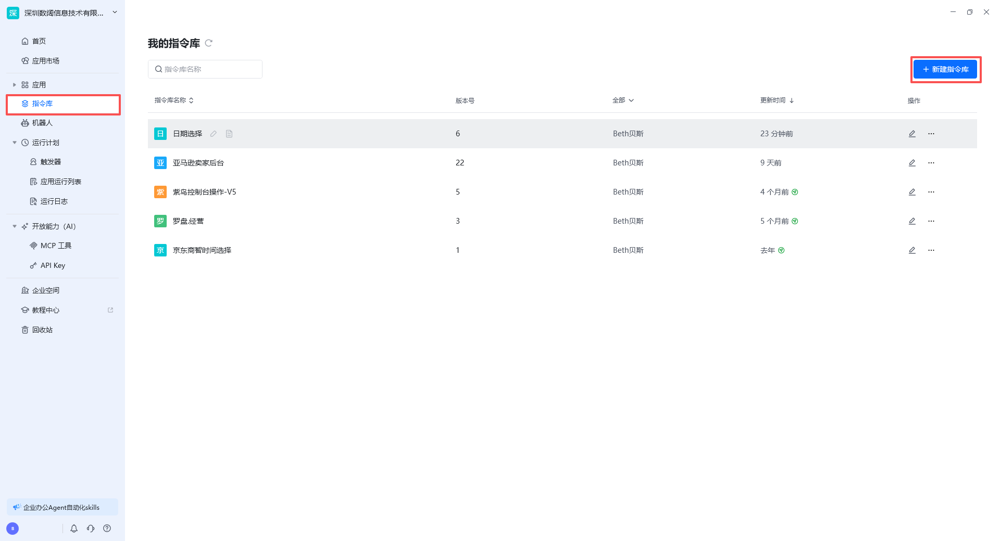

#### 2.2 开发指令库

以“日历日期选择器一（web）”指令为例，其他指令开发方法相同。日常处理网页自动化，日历日期选择框有多种样式，现在我们选择其中一种做演示。

- 新建自定义指令

点击“新增指令按钮”--->给指令重命名，命名为“日历日期选择器一（web）”

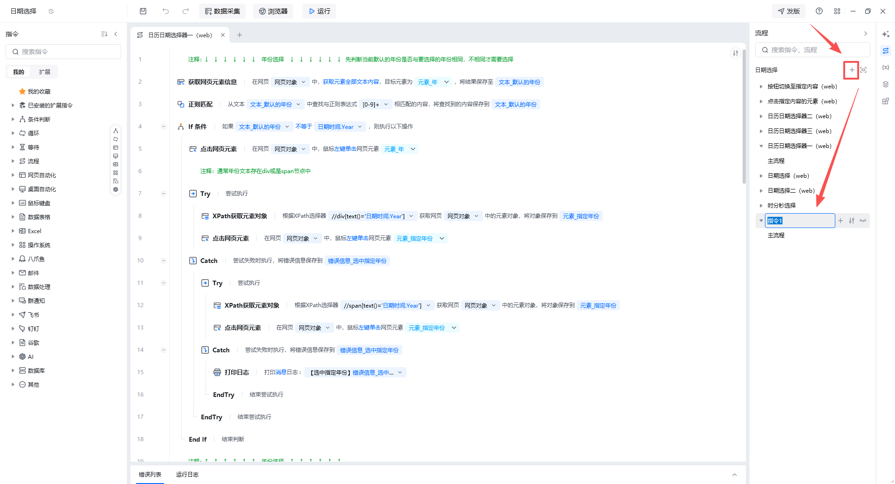

- 定义输入、输出变量

- 选择指定日期：需要输入网页对象、日期时间、元素_年、元素_月、年月日相似元素组

- 切换“变量”--->点击“新增自定义变量”按钮--->输入变量名、数据类型、默认值和变量类别

<table>
  <tbody>
    <tr>
      <td style={{ verticalAlign: 'top', textAlign: 'center' }}>
        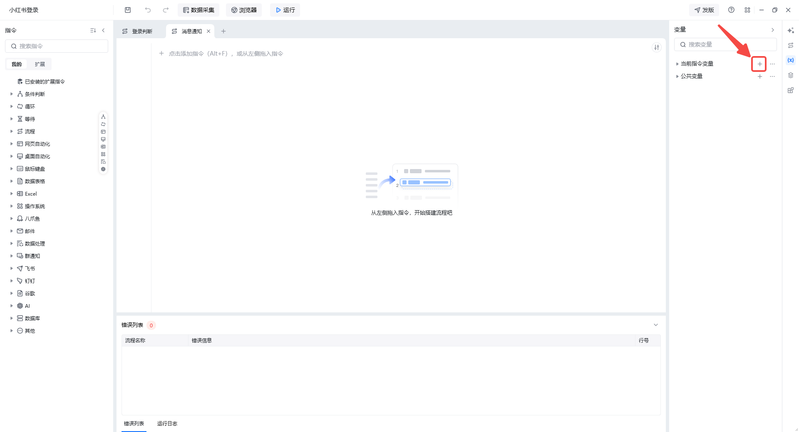
      </td>
      <td style={{ verticalAlign: 'top', textAlign: 'center' }}>
        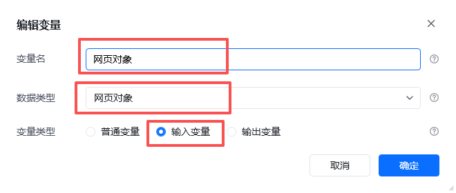
      </td>
    </tr>
  </tbody>
</table>

- 输入变量创建完成示例图

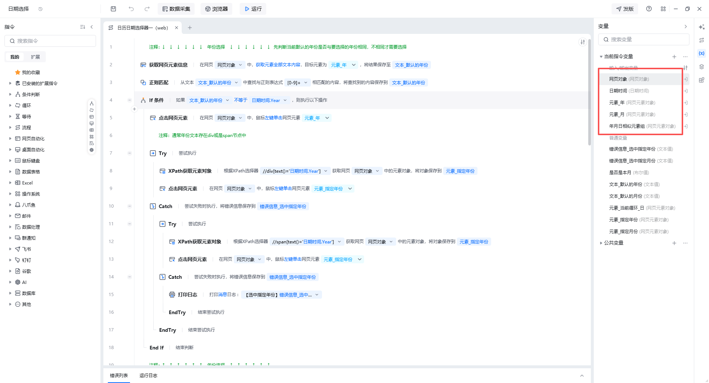

- 指令搭建

与常规流程开发逻辑一致，即之前怎么搭建主流程、子流程，现在用同样的方式搭建自定义指令即可

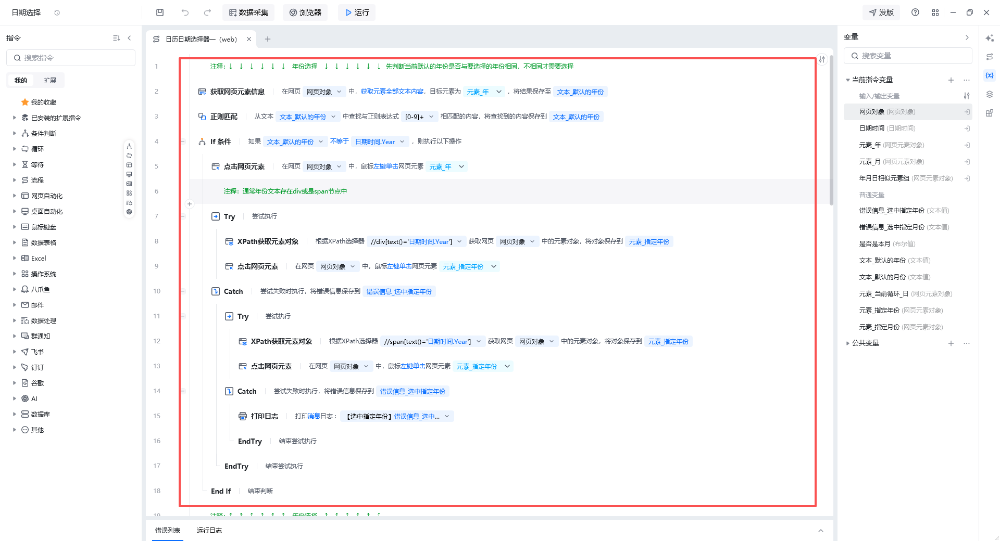

- 新建子流程

当单个自定义指令的实现逻辑较为复杂时，可以拆分成多个子流程进行处理，和写应用一样，子流程间变量共用；

当指令库中多个指令的实现逻辑之间有流程复用时，建议继续使用”调用隐藏指令“的方式；当单个指令的实现逻辑中有部分流程复用时，可以使用子流程

<table>
  <tbody>
    <tr>
      <td style={{ verticalAlign: 'top', textAlign: 'center' }}>
        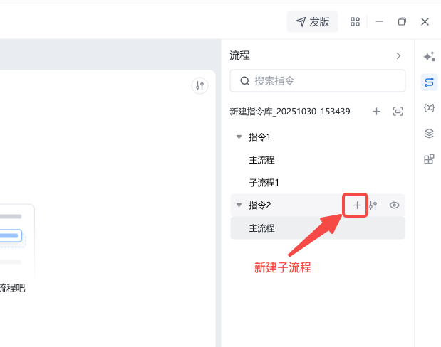
      </td>
      <td style={{ verticalAlign: 'top', textAlign: 'center' }}>
        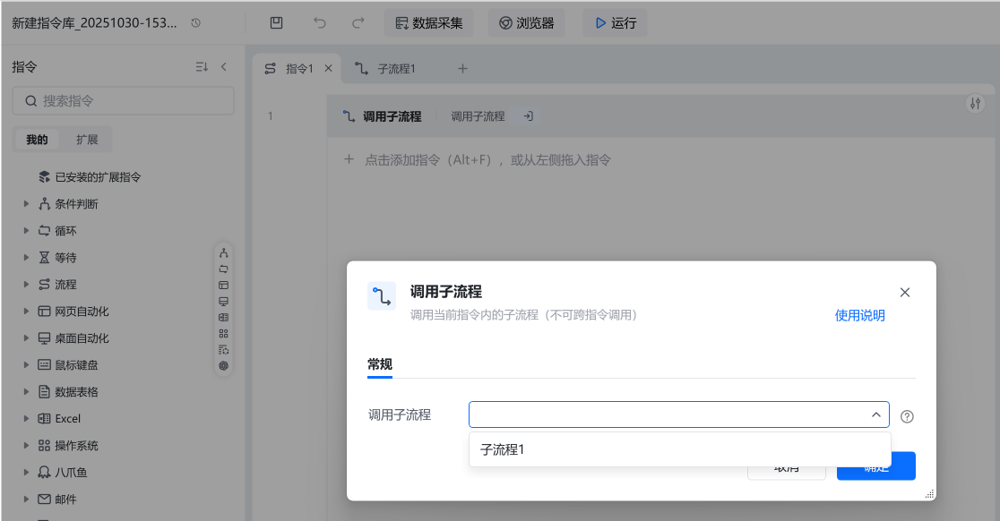
      </td>
    </tr>
  </tbody>
</table>

- 指令界面编辑、预览

- 自定义指令信息编辑

可以设置自定义指令展示的图标、名称、描述等信息，如下图

<table>
  <tbody>
    <tr>
      <td style={{ verticalAlign: 'top', textAlign: 'center' }}>
        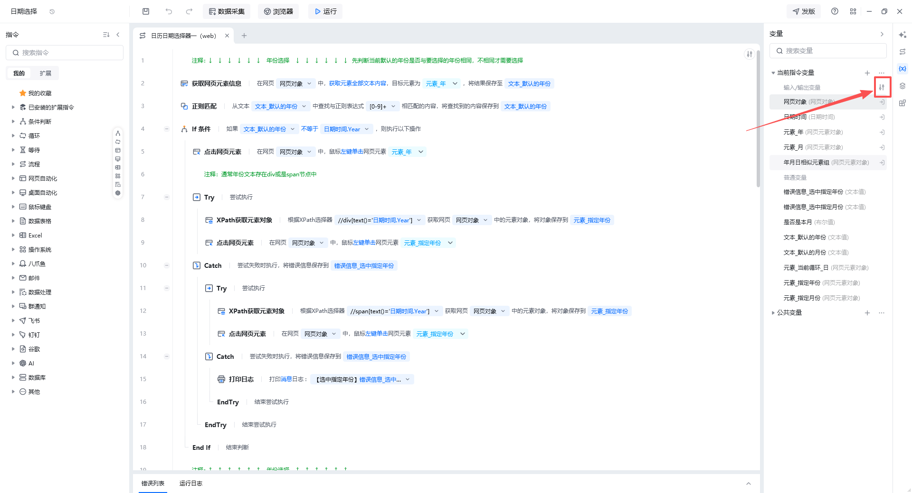
      </td>
      <td style={{ verticalAlign: 'top', textAlign: 'center' }}>
        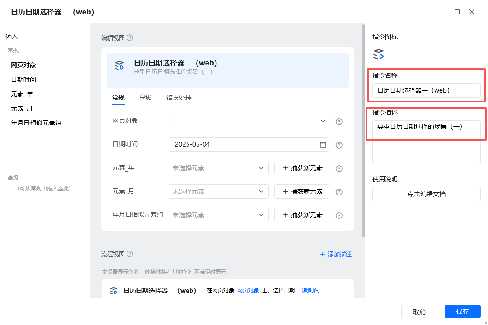
      </td>
    </tr>
  </tbody>
</table>

- 自定义指令变量信息编辑

可以设置指令的输入输出参数的展示样式、显示名称、参数描述、控件类型、校验等；也可以调整参数的显示顺序，常规、高级设置；可以编辑指令在画布中显示的内容，可以调用变量

<table>
  <tbody>
    <tr>
      <td style={{ verticalAlign: 'top', textAlign: 'center' }}>
        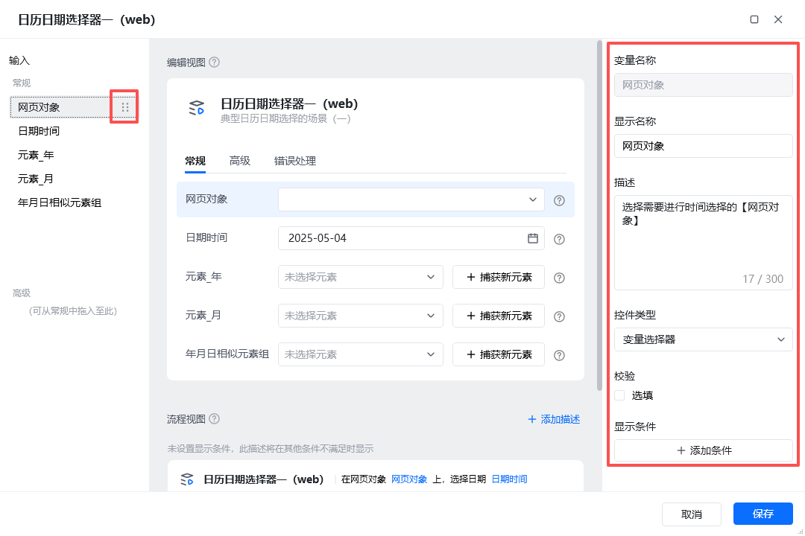
      </td>
      <td style={{ verticalAlign: 'top', textAlign: 'center' }}>
        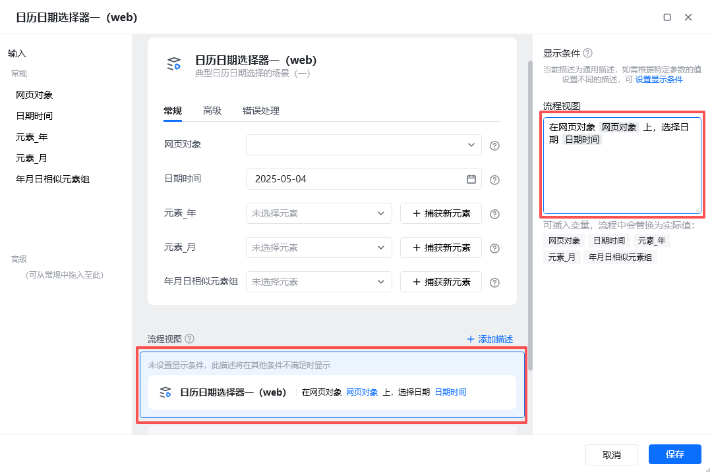
      </td>
    </tr>
  </tbody>
</table>

#### 2.3 自定义指令创建副本

用户开发完一个自定义指令后，需要再开发一个类似的指令。鼠标右键选中需要的指令，点击”创建副本“后，会出现同名指令的副本。以这种方式创建的自定义指令，“流程、元素、图片、变量、输入输出参数”设置会与之前的自定义指令完全相同。

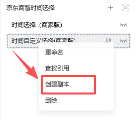

#### 2.4 自定义指令显示与隐藏

鼠标hover想要操作的指令上，即可看到显示/隐藏图标，点击即可设置显示与否

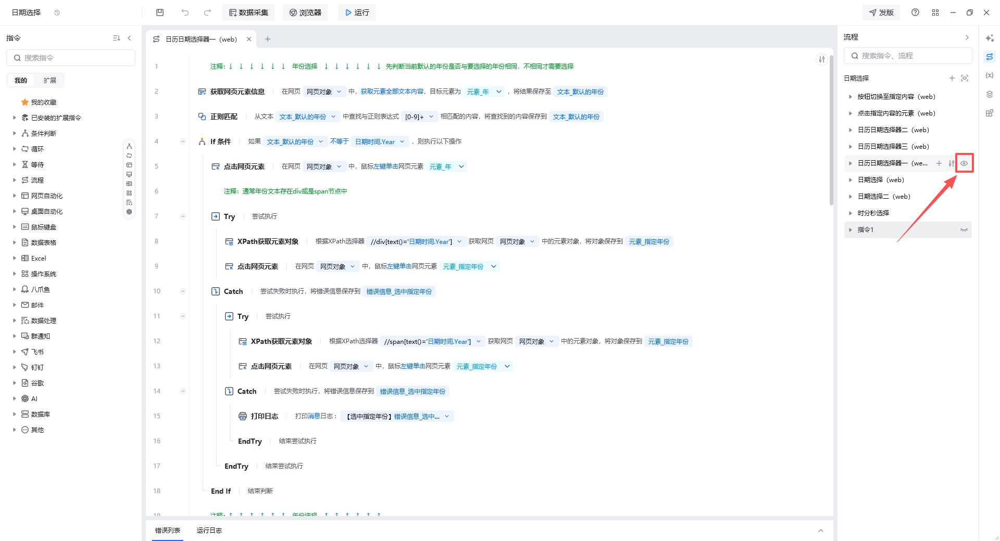

#### 2.5 指令库预览

指令库开发完成后，可以进行预览，预览的效果就是未来其用户使用时的效果

<table>
  <tbody>
    <tr>
      <td style={{ verticalAlign: 'top', textAlign: 'center' }}>
        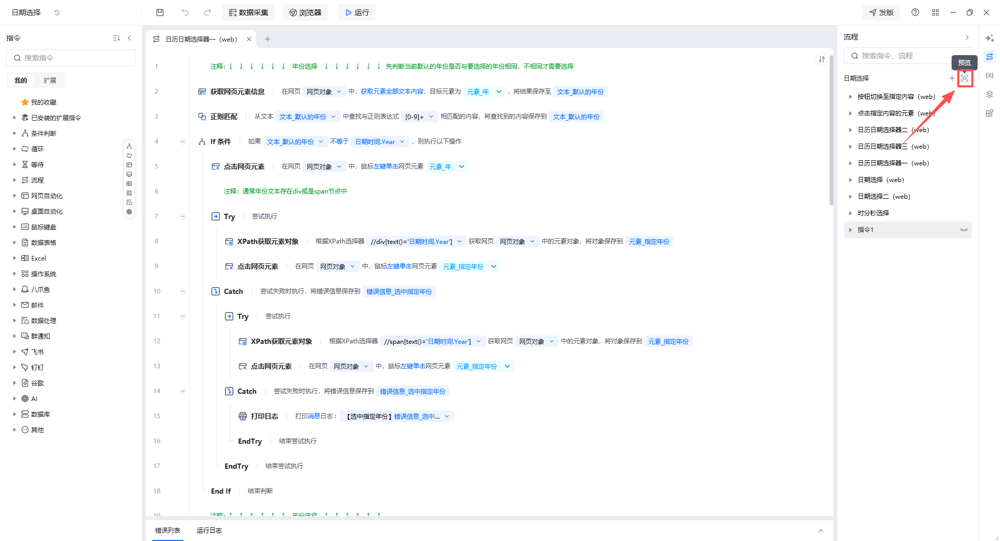
      </td>
      <td style={{ verticalAlign: 'top', textAlign: 'center' }}>
        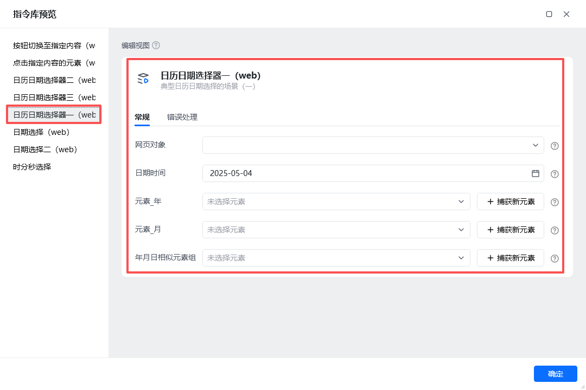
      </td>
    </tr>
  </tbody>
</table>

#### 2.6 指令库发版

指令库开发完成或编辑完成后，点击“发版”，发版后就可以在其他应用/指令库引用

<table>
  <tbody>
    <tr>
      <td style={{ verticalAlign: 'top', textAlign: 'center' }}>
        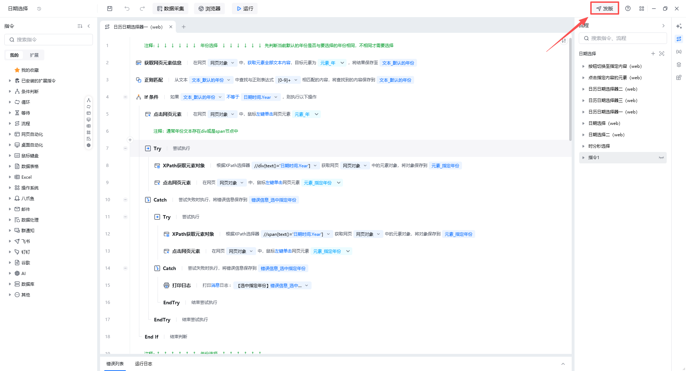
      </td>
      <td style={{ verticalAlign: 'top', textAlign: 'center' }}>
        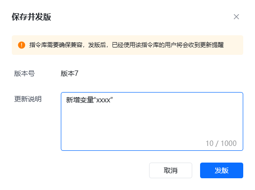
      </td>
    </tr>
  </tbody>
</table>

#### 2.7 拓展指令

在指令列表中点击“扩展”-->选择个人/企业开发的指令库--->即可看到自己开发的或企业开发的指令库

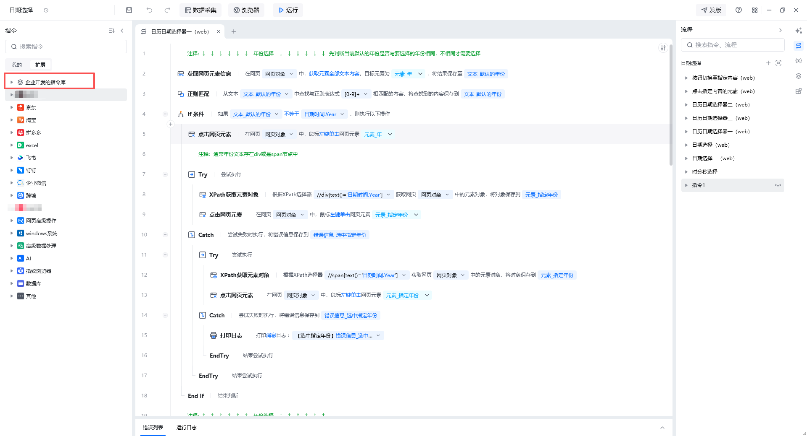

## 三、指令库管理

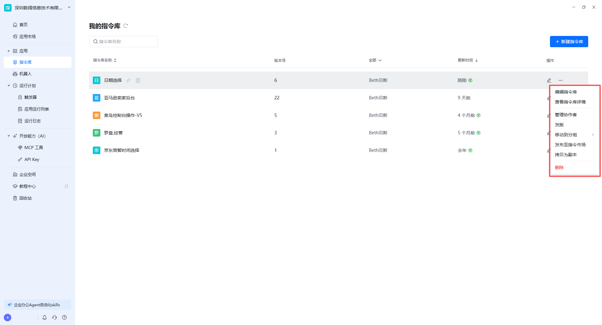

### 指令库管理界面

- 新建/编辑指令库
- 查看指令库详情：可看到指令库中包含哪些指令

- 拷贝为副本
- 删除：删除指令库后会进入回收站，可以在回收站找回

### 指令库分组

当指令库比较多时，可以对指令库进行分组存放

- 新建分组

<table>
  <tbody>
    <tr>
      <td style={{ verticalAlign: 'top', textAlign: 'center' }}>
        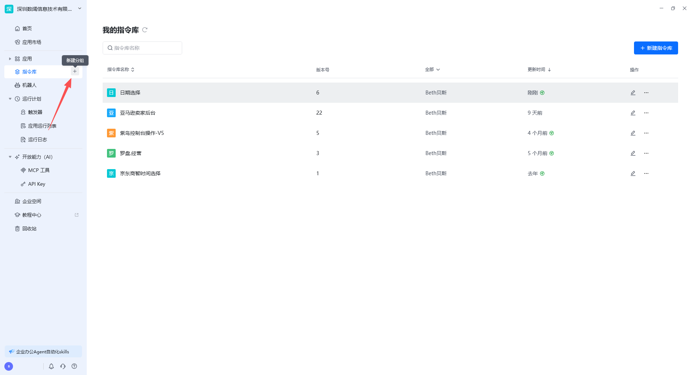
      </td>
      <td style={{ verticalAlign: 'top', textAlign: 'center' }}>
        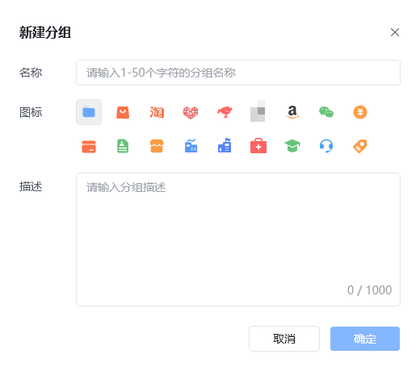
      </td>
    </tr>
  </tbody>
</table>

- 将指令库移动到分组

### 直接发版

v2.4以下版本需在指令库内部（即编辑页面）发版，v2.4及以上版本支持直接在指令库列表页发版

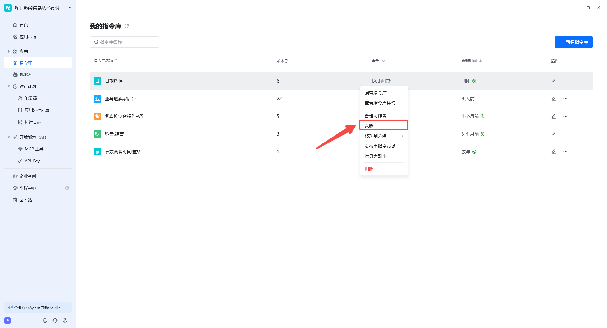

### 复制到企业

当从个人版升级到企业版时，可以将个人版开发的指令库一键迁移到企业版

## 四、指令管理

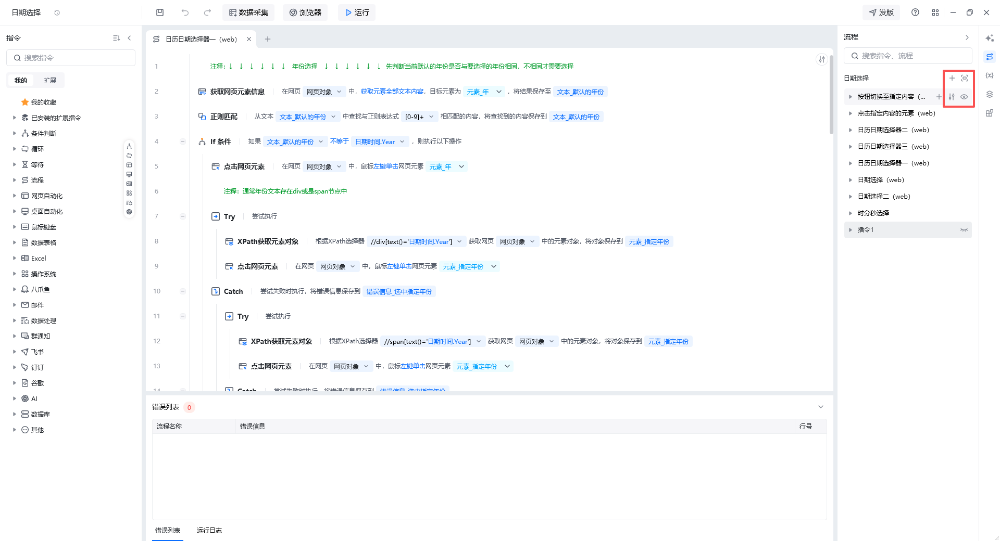

- ①新建自定义指令：和新建子流程交互一致
- ②指令库预览：可以查看当前指令库包含的指令及每个自定义指令的界面预览
- ③预览及编辑：可以编辑自定义指令的名称、描述、参数顺序、参数的名称、描述、控件设置等
- ④指令的显示设置：眼睛处于睁开的状态时，表示发版后其他应用/指令库可以使用该自定义指令；  闭上时，在其他应用或者指令库编辑的时候，看不到该自定义指令

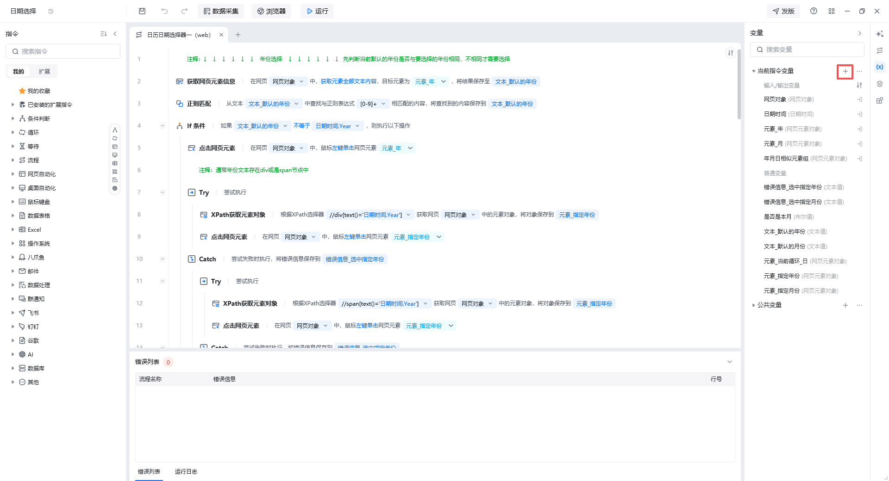

- ⑤变量的新增与引用关系查看，与流程一致

## 五、调用其他指令

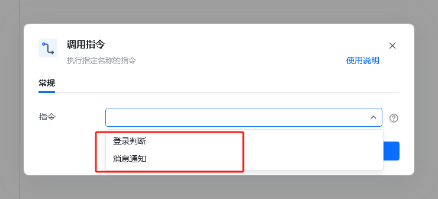

- 为提高流程的复用性，当指令库中多个自定义指令中部分流程片段可以复用，就可以将它单独拿出来，设置为隐藏的自定义指令，然后在其他指令中进行调用

## 六、拓展指令

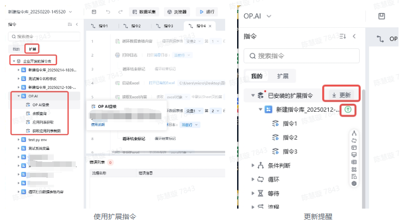

- 在应用和指令库中，都可以使用已封装好的指令库（不能自己调用自己）
- 自己发版的指令库和官方指令库都可以在此处进行查找和使用
- 找到目标指令直接拖入流程中即可
- 我的tab可查看当前应用/指令库用到的所有指令库，当指令库有更新时，会出现更新提醒，可以单个指令库更新、也可以进行批量更新

## 七、指令库加载

- 当应用打开/运行时，会自动安装需要的的指令库
- 当依赖个人开发的指令库的应用被分享时，接受应用的用户同时会获得指令库的使用权限，即在当前应用中可以使用该指令库，其他应用/指令库将无法获得该指令库
- 版本兼容规则：
  - 安装指令库只可安装最新版本，由于存在已安装未更新的用户，因此所有版本需要保留，不提供安装入口
  - 当已安装的指令库有依赖冲突时，遵循向上更新原则，即当依赖多个指令库的多个版本时，默认使用最新的那个版本

<Info>
  使用过程中遇到问题？前往 [八爪鱼RPA 开发者社区问答板块](https://rpa.bazhuayu.com/community/questions) 提问，获取官方与社区帮助。
</Info>
