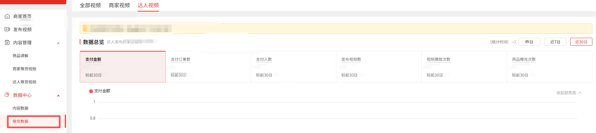
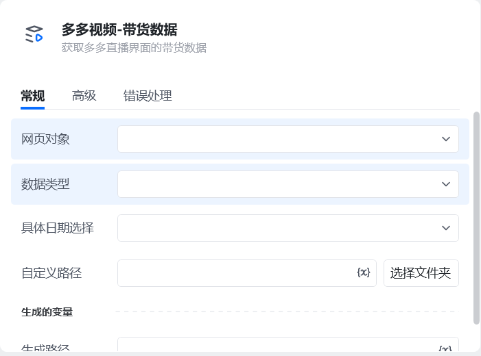
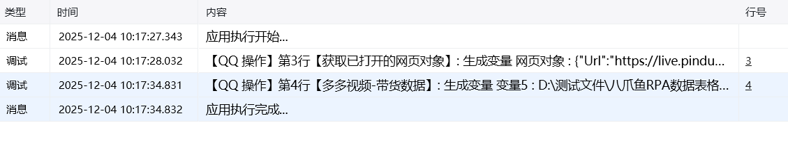

## 一、指令概述

用于从 “多多视频” 页面提取带货相关数据，支持按指定时间范围、数据类型筛选数据并保存到自定义路径，适用于多多视频带货数据的统计与分析场景。

## 二、调用参数配置标签页参数名称描述配置规则备注常规网页对象选择 “多多视频” 页面对应的网页对象下拉选择已定义的网页对象必填常规具体日期选择选择数据的时间范围单选框选项：- 昨日- 近 7 日- 近 30 日必填常规数据类型选择待提取的带货数据类型单选框选项：- 全部视频- 商家视频- 达人视频必填常规自定义路径数据文件的保存路径输入路径或点击 “选择文件夹” 按钮选取保存目录必填高级自定义文件名称数据文件的自定义名称输入文件名（如 “202508 达人视频带货数据”），不填则使用系统默认名称选填
## 三、使用示例

以提取 “近 7 日达人视频” 的带货数据为例：网页对象：选择 “多多视频页面”；具体日期选择：选择 “近 7 日”；数据类型：选择 “达人视频”；自定义路径：选择保存目录（如D:/多多视频数据）；自定义文件名称：输入 “近 7 日达人带货数据”；执行指令后，系统将提取对应数据并保存到指定路径。
## 四、运行效果

指令执行后，自动从 “多多视频” 页面获取指定时间范围、数据类型的带货数据，生成文件并保存到自定义路径，同时可通过 “生成的变量” 调用数据结果。

<Info>
  使用指令过程中遇到问题？前往 [八爪鱼RPA 开发者社区问答板块](https://rpa.bazhuayu.com/community/questions) 提问，获取官方与社区帮助。
</Info>
