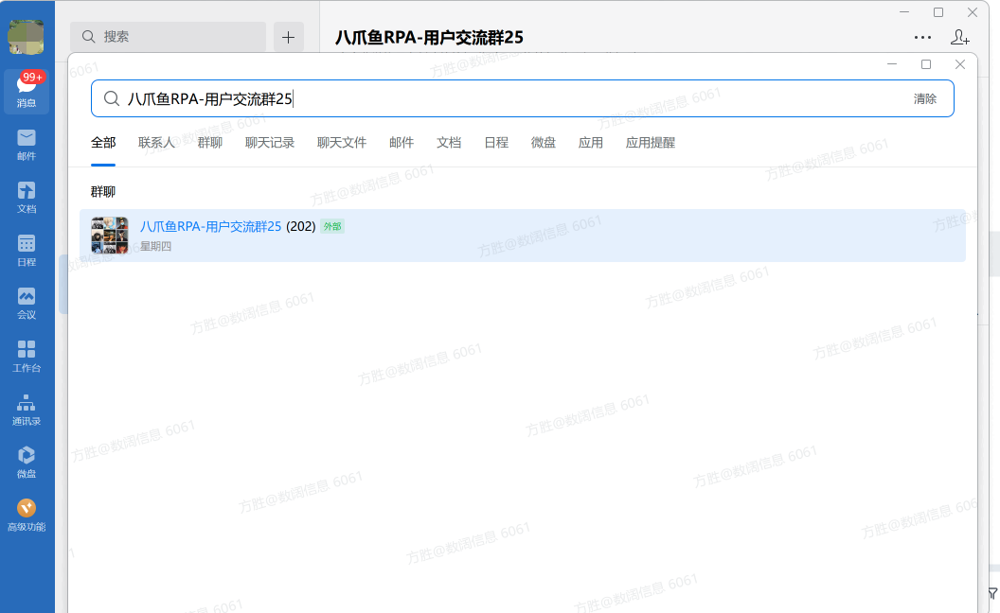

向指定联系人或群发送企业微信消息。

<strong>备注：</strong>实现的逻辑是在企业微信全局搜索界面，向搜索到的第一个个群聊或联系人发送消息，可能存在与目标群或联系人不匹配的情况，使用该指令前需要先确认。

<Info>
  使用指令过程中遇到问题？前往 [八爪鱼RPA 开发者社区问答板块](https://rpa.bazhuayu.com/community/questions) 提问，获取官方与社区帮助。
</Info>
