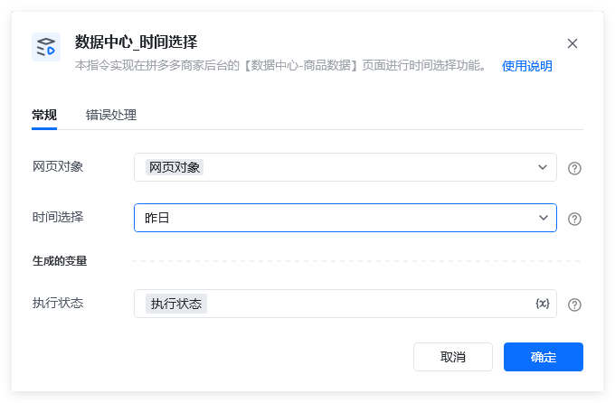
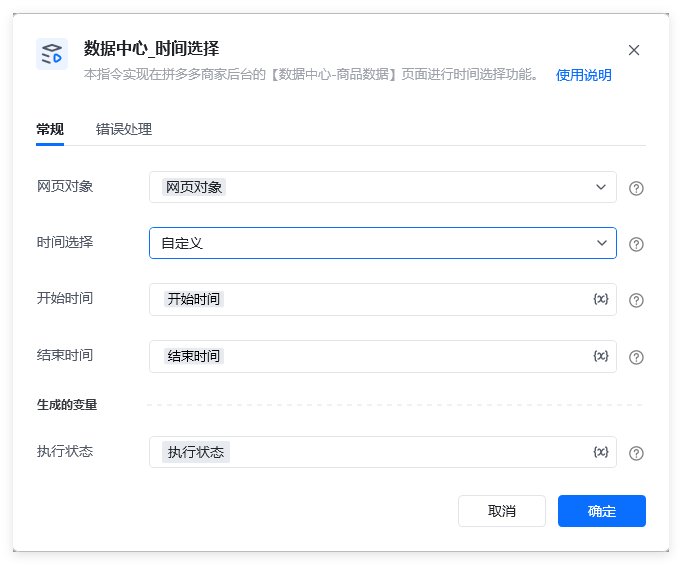
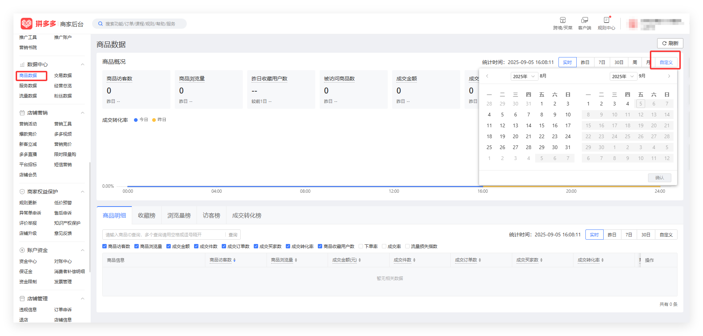
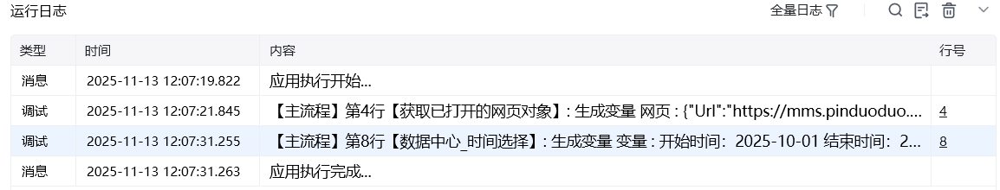

## 指令描述

本指令实现在拼多多商家后台的【数据中心-商品数据】页面进行时间选择功能。

拼多多商家后台的【数据中心】中的【商品数据】分页。

## 参数配置
### 指令输入

<strong>网页对象: </strong>网页对象，使用【打开网页】或者【获取已打开的网页对象】指令获取拼多多商家后台的【数据中心-商品数据】（ https://mms.pinduoduo.com/sycm/goods_effect?msfrom=mms_sidenav ）的网页对象。

<strong>时间选择：</strong>单选项，可选【实时】、【昨日】、【7日】、【30日】、【周】、【月】和【自定义】。备注：【时间选择】参数选择【自定义】时，才需要进一步具体设置【开始时间】和【结束时间】参数。

<strong>开始时间: </strong>字符串，格式如：2025-06-06

<strong>结束时间: </strong>字符串，格式如<strong>开始时间。</strong>备注：要求1：【开始时间】不能晚于【结束时间】；要求2：【开始时间】和【结束时间】不能晚于当前日期的前 1 天；要求3：【开始时间】和【结束时间】之间间隔，最长31天；要求4：时间格式必须符合 YYYY-MM-DD，且日期合法（比如 2025-02-31 就是非法的）；要求5：【开始时间】和【结束时间】不能早于当前日期的前150天。例如：当前日期为2025年9月5日，则【开始时间】最早只能设置为2025年4月9日。
### 指令输出

<strong>执行状态：</strong>指令执行结果，用于指示和判断指令执行结果，返回值如下。

<Info>
  使用指令过程中遇到问题？前往 [八爪鱼RPA 开发者社区问答板块](https://rpa.bazhuayu.com/community/questions) 提问，获取官方与社区帮助。
</Info>
