### 输入

<strong>apiKey：</strong>

用户自行创建的百度智能云文字识别应用 apiKey

<strong>secretKey：</strong>

用户自行创建的百度智能云文字识别应用 secertKey

<strong>校验码：</strong>

填写发票校验码后6位，增值税电子专票、普票、电子普票、卷票、区块链电子发票、通行费增值税电子普通发票此参数不可为空，其他类型发票可为空

<strong>发票代码：</strong>

全电发票（专用发票）、全电发票（普通发票）此参数可为空，其他类型发票均不可为空

<strong>开票日期：</strong>

填写开票日期。格式YYYYMMDD，例：20210101

<strong>发票号码：</strong>

填写发票号码

<strong>发票种类：</strong>

填写发票种类，根据发票类型下拉选择对应验真发票类型

<strong>发票金额：</strong>

填写发票金额。增值税专票、电子专票、区块链电子发票、机动车销售发票、货运专票填写不含税金额；二手车销售发票填写车价合计；全电发票（专用发票）、全电发票（普通发票）填写价税合计金额，其他类型发票可为空

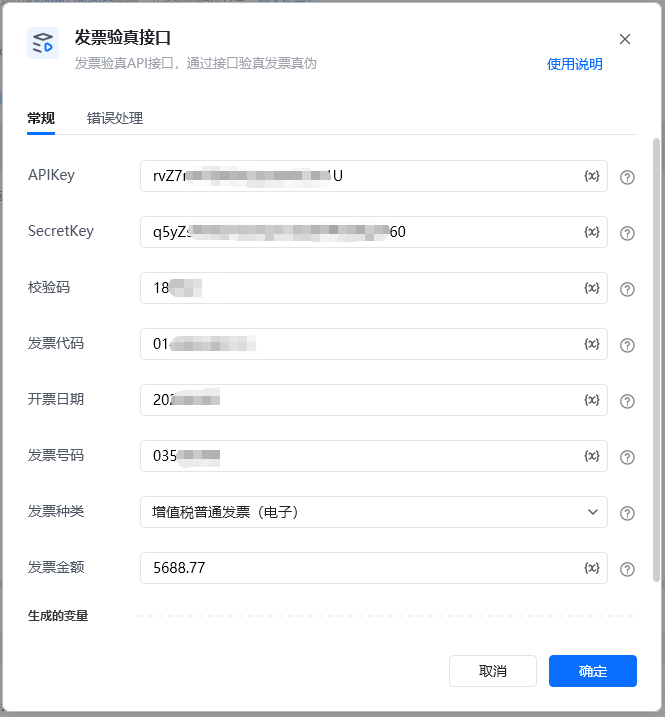

输出返回示例
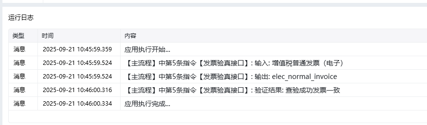

返回VerifyResult

查验成功返回“0001”，查验失败返回对应查验结果错误码，详见末尾表格
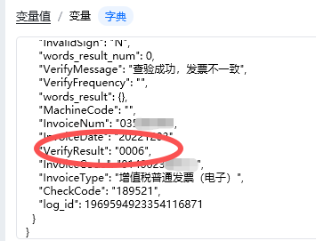

# 创建百度智能云应用API

<strong>1.登录百度智能云</strong>

百度智能云地址： https://console.bce.baidu.com/?fromai=1#/aip/overview[https://console.bce.baidu.com/?fromai=1#/aip/overview](https://console.bce.baidu.com/?fromai=1#/aip/overview)
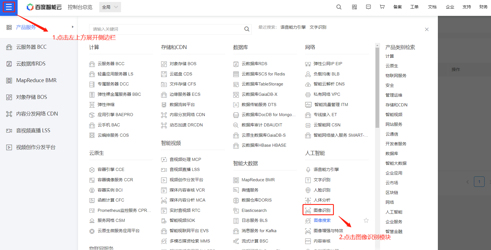
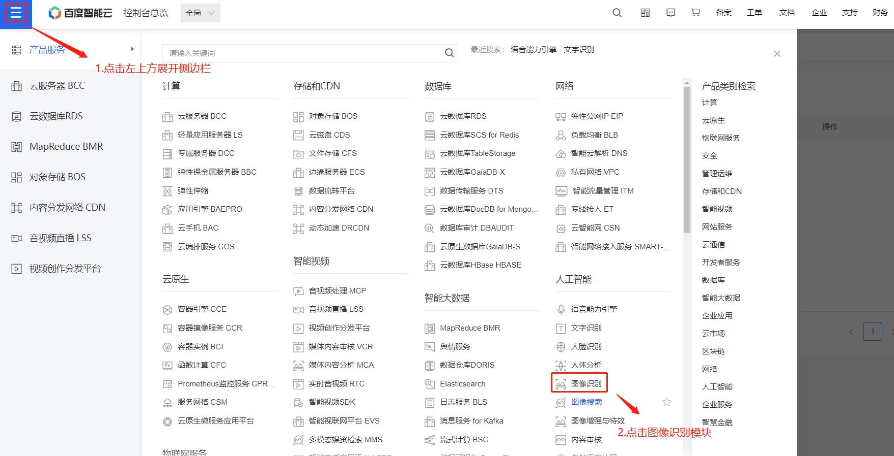

<strong>2.进入文字识别选项后，创建应用</strong>
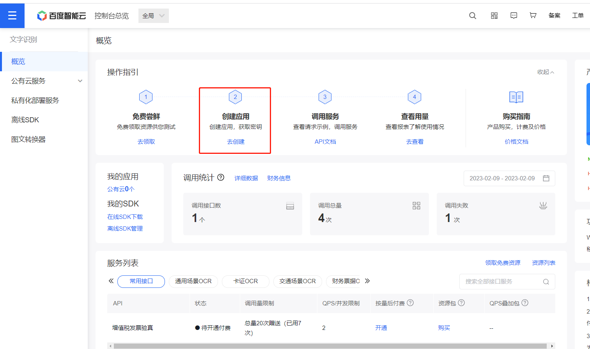
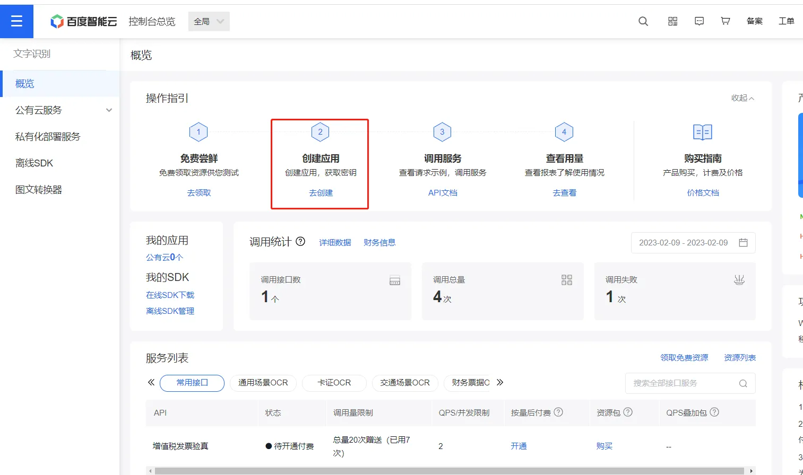

<strong>3.创建应用，点击文字识别</strong>
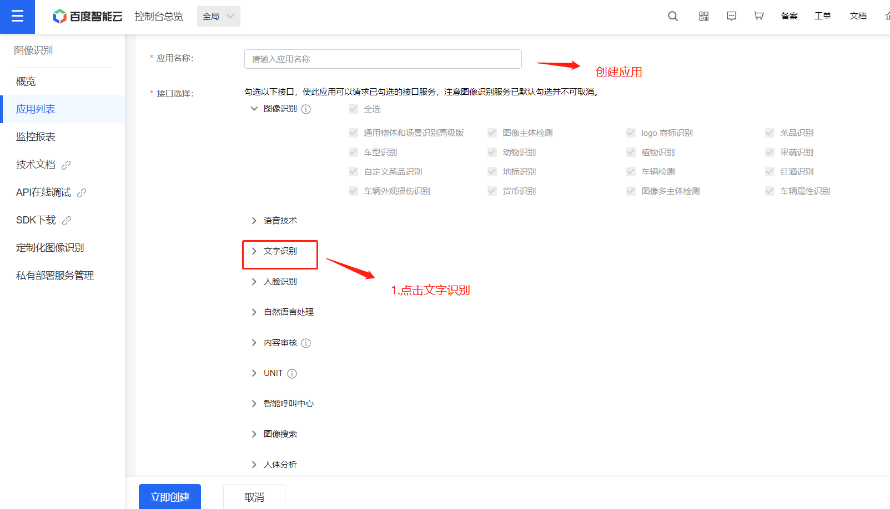

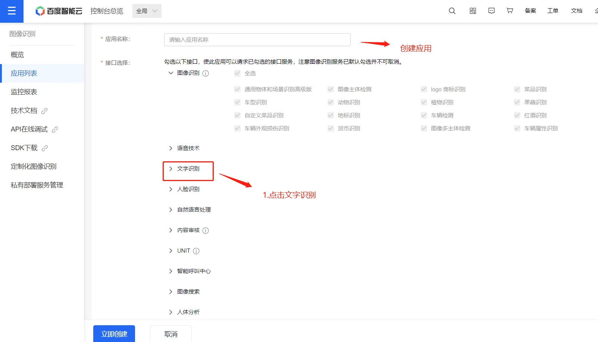

<strong>4.勾选发票验真</strong>
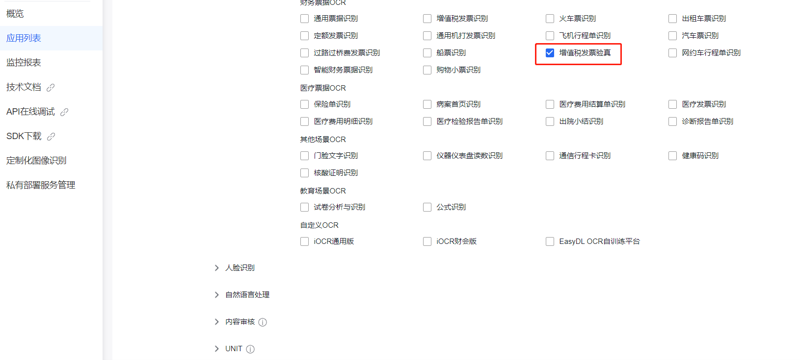

<strong>5.创建应用</strong>
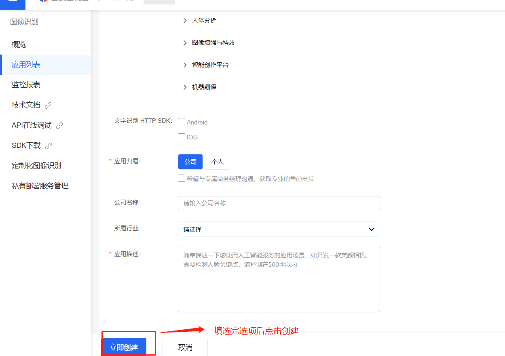
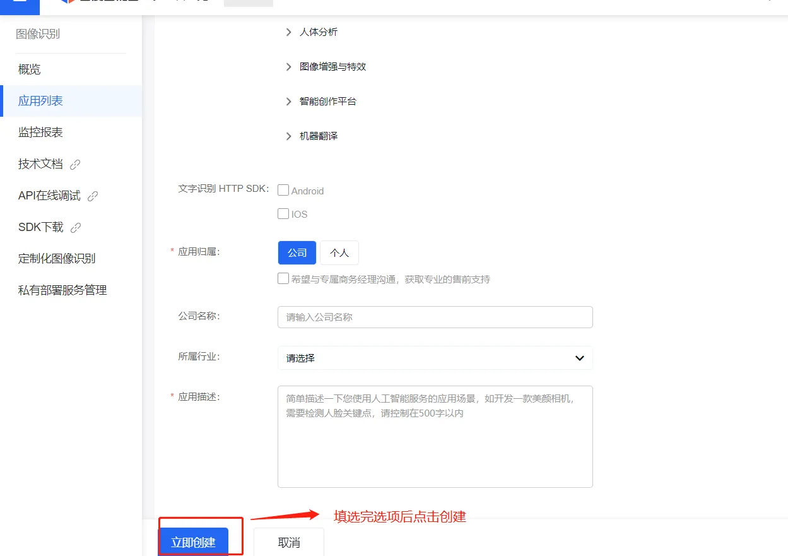

<strong>6.进入API应用管理</strong>
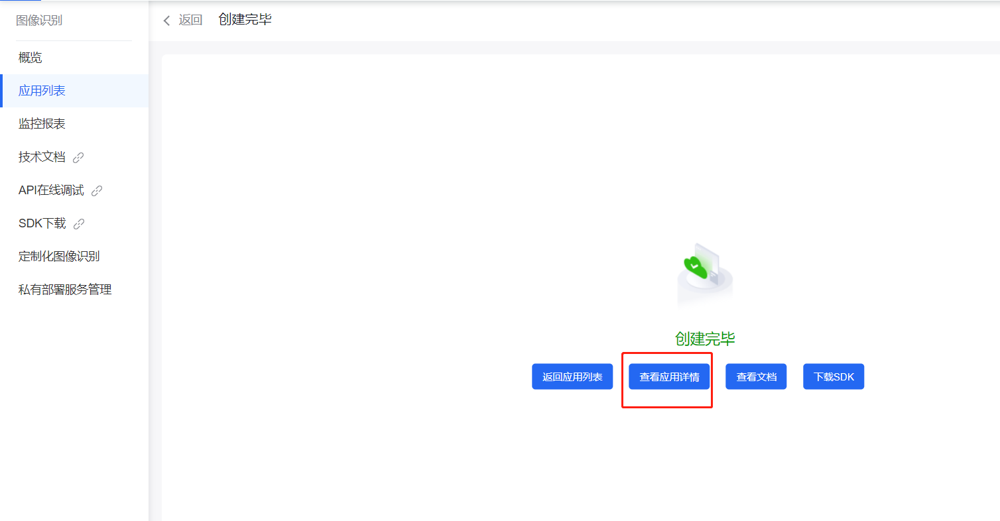

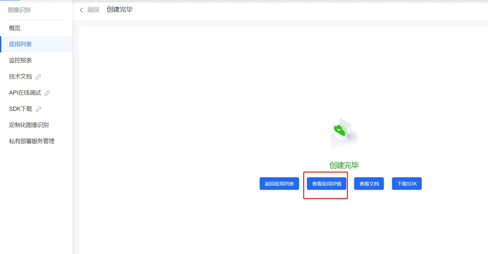

<strong>7. 获取创建好应用的AK和SK</strong>
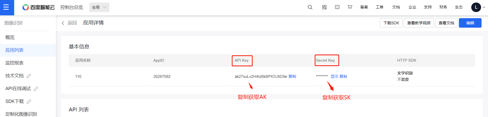
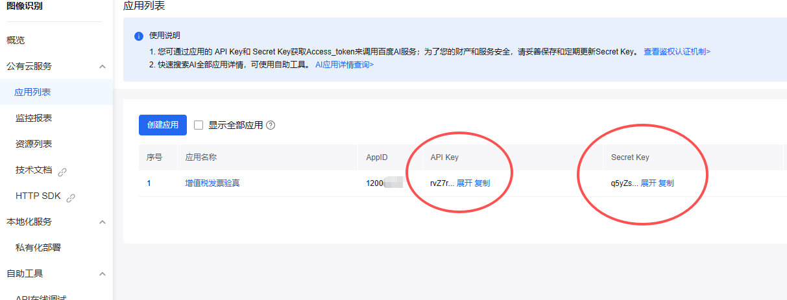

<strong>注：</strong>

如已有百度智能云应用apiKey，可忽略创建步骤，直接使用已生成创建的apiKey即可，由于接口调用的百度验真接口，该接口需要开通接口付费，具体收费政策请参阅百度智能云官网。

<strong>查验结果码释义表</strong>

查验结果（VerifyResult）查验结果信息（VerifyMessage）描述9999查验失败查验失败，业务出现异常，请提交工单咨询0002超过该张票当天查验次数此发票今日查询次数已达上限（5次），请次日查询0005请求不合法发票入参格式有误，请核对后再查询0006发票信息不一致发票信息有误，请核对后再查询0009发票不存在所查发票不存在1004已超过最大查验量已超过最大查验量，请提交工单咨询1005查询发票不规范信息有误，请核对后再查询1006查验异常发票信息有误，请核对后再查询1008字段不能为空发票请求参数不能为空1009参数长度不正确参数长度不符合规范，确认参数，再次查验1014日期当天的不能查验日期当天的不能查验，请隔天再查1015超过5年的不能查验超过5年的不能查验1020没有查验权限没有查验权限，请提交工单咨询1021网络超时税局维护升级，暂时无法查验，请提交工单咨询

## 返回说明

<strong>返回参数</strong>

字段是否必选类型说明log_id是uint64唯一的log id，用于问题定位words_result_num是uint32识别结果数，表示words_result的元素个数words_result是object{}识别结果VerifyResult是string查验结果。查验成功返回“0001”，查验失败返回对应查验结果错误码，详见末尾表格VerifyMessage是string查验结果信息。查验成功且发票为真返回“查验成功发票一致“，查验失败返回对应错误原因VerifyFrequency是string查验次数。为历史查验次数InvalidSign是string发票状态。Y：已作废；H：已冲红；N：未作废；BH：部分红冲；QH：全额红冲InvoiceType是string发票种类。即增值税专用发票、增值税电子专用发票、增值税普通发票、增值税普通发票（电子）、增值税普通发票（卷式）、通行费增值税电子普通发票、区块链电子发票、全电发票（专用发票）、全电发票（普通发票）、机动车销售发票、电子发票（机动车销售统一发票）、电子发票（纸质二手车销售统一发票）、二手车销售发票、电子发票（二手车销售统一发票）、货物运输业增值税专用发票、电子发票（航空运输电子客票行程单）、电子发票（铁路电子客票）、全电发票（含通行费标识）InvoiceCode是string发票代码InvoiceNum是string发票号码CheckCode是string校验码InvoiceDate是string开票日期MachineCode是string机器编号

<Info>
  使用指令过程中遇到问题？前往 [八爪鱼RPA 开发者社区问答板块](https://rpa.bazhuayu.com/community/questions) 提问，获取官方与社区帮助。
</Info>
