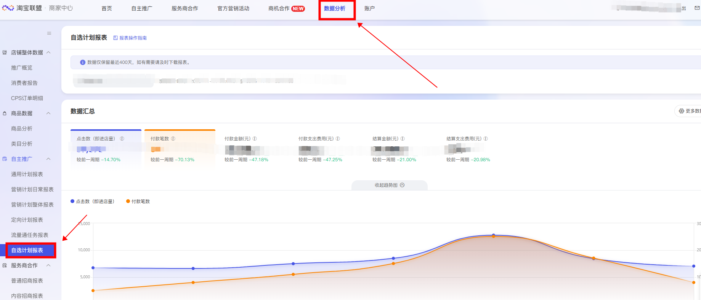
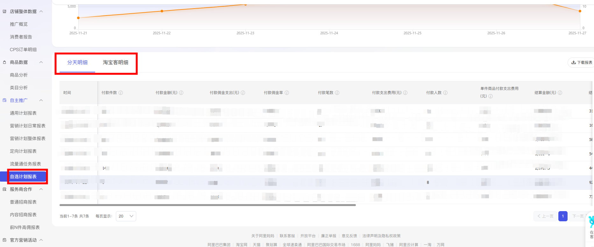
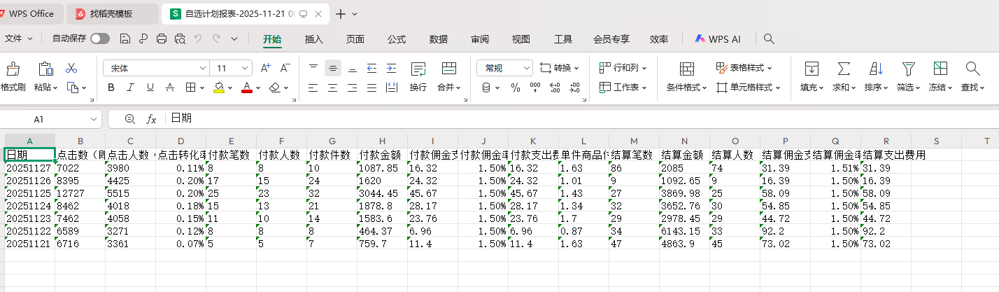

# 商家中心-数据分析-自选计划报表下载
# 描述

该指令实现了【商家中心】->【数据分析】->【自选计划报表】->【明细数据】的数据获取，并将数据写入到Excel文件保存到指定路径下；

# 配置说明
适用的浏览器类型Google Chrome浏览器

## 输入

网页对象：已打开的浏览器对象

日期类型：可选择想要取数的维度日期或者快捷日期

自定义 /  今日  / 昨日 /  过去7天  / 过去15天  / 过去30天  / 过去60天  / 过去90天

保存文件夹：请输入数据文件保存的文件夹路径

文件名称：自定义自己想要命名的文件名称

下载明细：选择想要下载的明细

分天明细 /  淘宝客明细
## 输出

输出文件路径：输出数据文件的路径

## 数据展示

<Info>
  使用指令过程中遇到问题？前往 [八爪鱼RPA 开发者社区问答板块](https://rpa.bazhuayu.com/community/questions) 提问，获取官方与社区帮助。
</Info>
