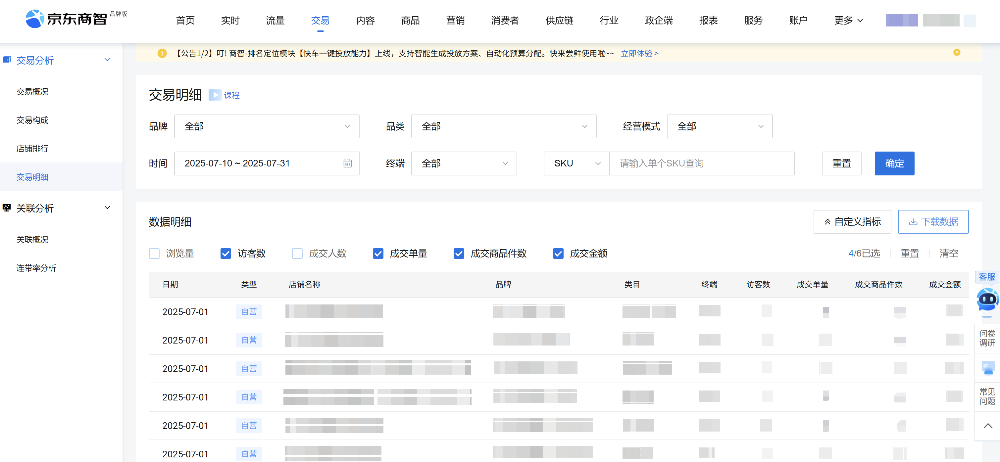
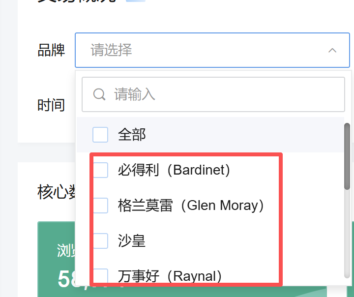
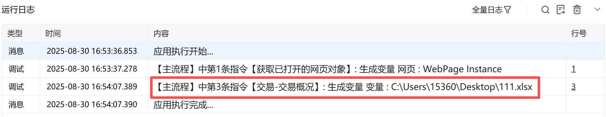
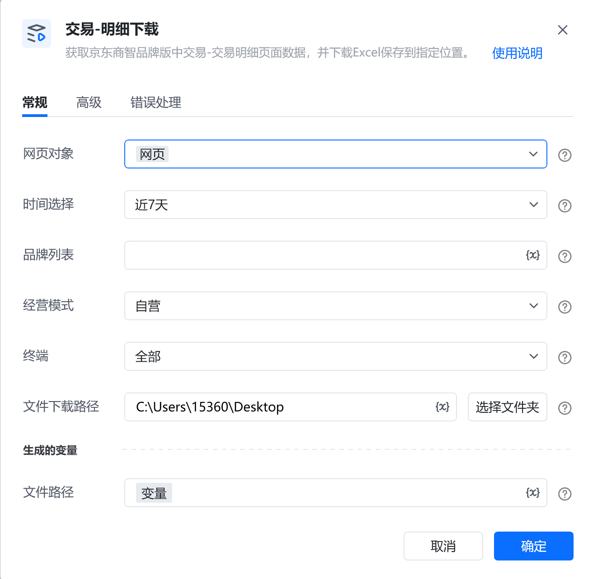
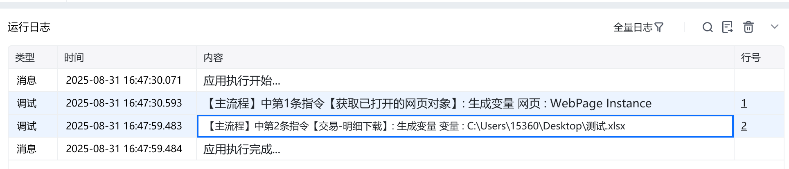
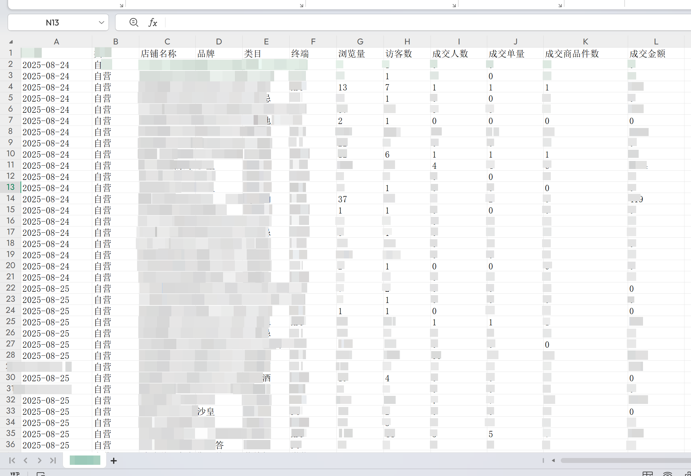

# 描述

获取京东商智品牌版中<strong>交易-交易明细</strong>页面数据，并下载Excel保存到指定位置。

# 配置说明
## 输入

<strong>网页对象:</strong>

任意一个已登录京东商智品牌版后台<strong>交易-交易明细</strong>的网页对象，必填项

<strong>时间查询方式:</strong>

下拉框，可选：昨天、 近7天、 近30天、按天、按周、按月、自定义，选填，若不填则使用平台默认时间

<strong>具体日期:</strong>

填写具体日期，格式：YYYY-MM-DD，例如：2025-08-01

<strong>自定义开始日期:</strong>

填写开始日期，格式：YYYY-MM-DD，例如：2025-08-01。由于平台限制，开始日期与结束日期跨度不可超过31天

<strong>自定义结束日期:</strong>

填写结束日期，格式：YYYY-MM-DD，例如：2025-08-01。由于平台限制，开始日期与结束日期跨度不可超过31天

<strong>品牌：</strong>

填写品牌名称。注意：品牌名称需要与网站显示的名称完全一致（包含符号的中英文状态、字母大小写等），否则可能导致无法选择。选填，若不填则默认全部

<strong>一级类目：</strong>

填写一级类目名称，填写后将出现二级类目输入框。注意：类目名称需要与网站显示的名称完全一致（包含符号的中英文状态、字母大小写等），否则可能导致无法选择。选填，若不填则默认一级全部。

<strong>二级类目：</strong>

填写二级类目名称，填写后将出现三级类目输入框。注意：类目名称需要与网站显示的名称完全一致（包含符号的中英文状态、字母大小写等），否则可能导致无法选择。选填，若不填则默认二级全部。

<strong>三级类目：</strong>

填写三级类目名称。注意：类目名称需要与网站显示的名称完全一致（包含符号的中英文状态、字母大小写等），否则可能导致无法选择。选填，若不填则默认三级全部。

<strong>经营模式：</strong>

下拉框，可选：全部、自营、POP，选填，若不填则使用平台默认值

<strong>终端：</strong>

下拉框，可选：全部、PC、无线整体、APP、手Q、微信、M端，选填，若不填则使用平台默认值

<strong>文件下载路径：</strong>

填写文件下载的路径，必填项

<strong>自定义文件名：</strong>

填写文件下载的名称，选填，若不填则使用平台默认文件名
## 输出

<strong>文件路径：</strong>

数据类型为文本，输出文件下载的路径

# 使用示例

# 运行结果

<Info>
  使用指令过程中遇到问题？前往 [八爪鱼RPA 开发者社区问答板块](https://rpa.bazhuayu.com/community/questions) 提问，获取官方与社区帮助。
</Info>
