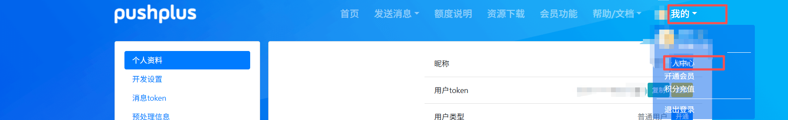
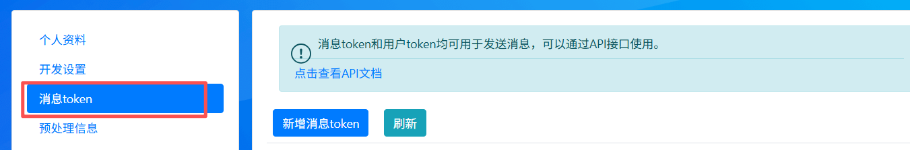
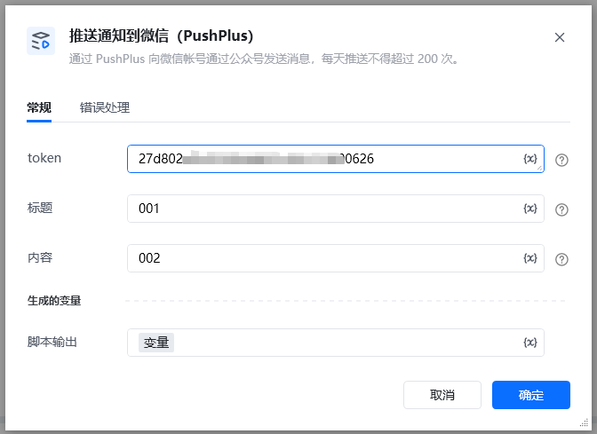
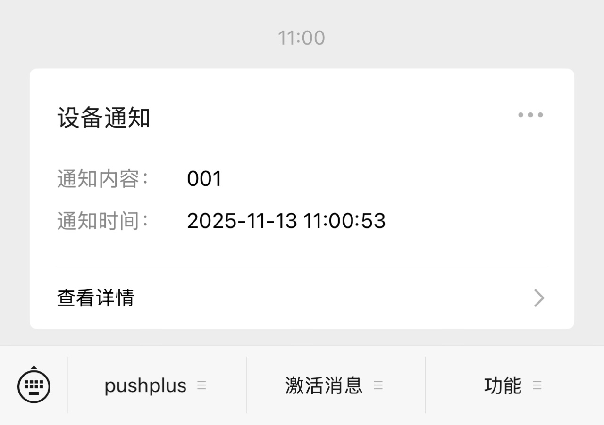

通过 PushPlus 向微信帐号通过公众号发送消息
### 配置项说明

需要先在官网用微信登录，然后在这里点击你的token下的一键复制，复制token。此token就是指令的第一个参数 token。

先到官网登录注册：PushPlus官网[PushPlus官网](https://www.pushplus.plus/) 然后去获取它token，第一次注册获取token需要交一块钱才能获取到。

<strong>注意：</strong>内容限制：标题不得超过 100 个字，内容不得超过 20000 个字，每天推送不得超过 200 次。
#### 输入

token:上面复制的token。

标题：通知标题。

内容：通知内容。

手机公众号收到效果

成功返回

\{

"code": 200,

"msg": "执行成功",

"data": "1b7f871ae1024b5aaf646c8c16dff600"

<Info>
  使用指令过程中遇到问题？前往 [八爪鱼RPA 开发者社区问答板块](https://rpa.bazhuayu.com/community/questions) 提问，获取官方与社区帮助。
</Info>
