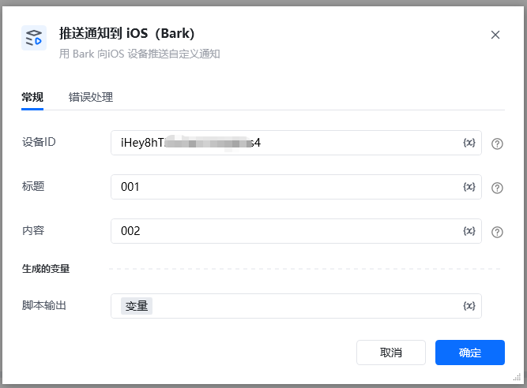
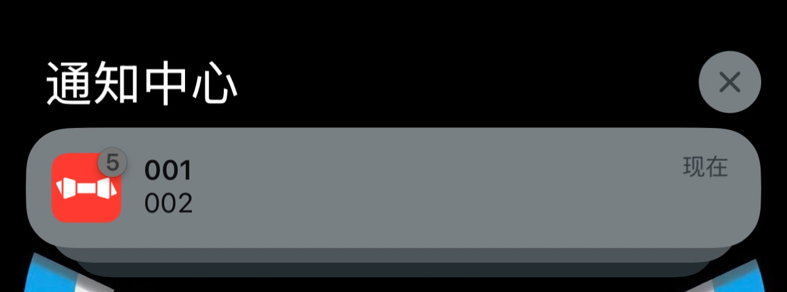

用 Bark 向iOS 设备推送自定义通知
### 配置项说明

使用前需要下载 Bark App，下载后在手机上点击注册设备。

左边服务器里面可以看到

然后按 这里 的说明复制URL，URL 组成中域名后面 key的部分就是指令的第一个参数 设备ID。

如 https://api.day.app/<strong>iHey8hT2ScGk5Y22Aj1234</strong>/Customed 中的

iHey8hT2ScGk5Y22Aj1234

#### 输入

设备ID：上述在App中复制的URL中的key部分。

标题：通知标题。

内容：通知内容。

手机端效果

运行成功返回内容

\{

"code": 200,

"message": "success",

"timestamp": 1763002774

<Info>
  使用指令过程中遇到问题？前往 [八爪鱼RPA 开发者社区问答板块](https://rpa.bazhuayu.com/community/questions) 提问，获取官方与社区帮助。
</Info>
