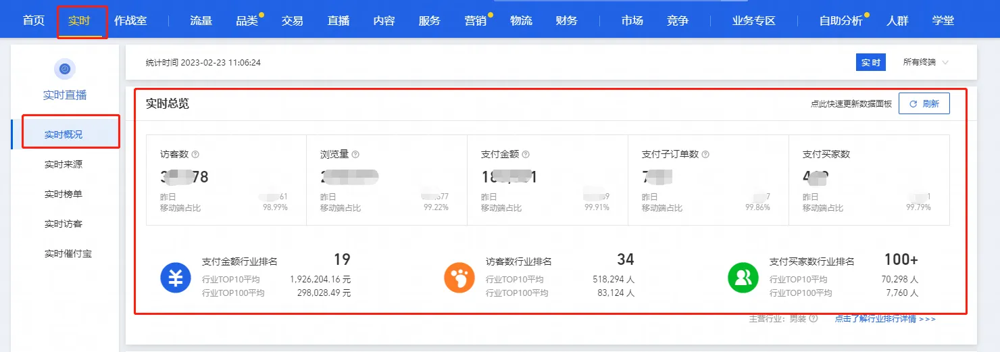
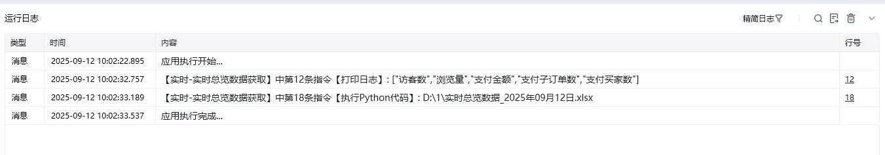
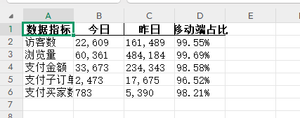

# 实时-实时总览数据获取
# 描述
该指令实现了【生意参谋】->【实时】->【实时概况】->【实时总览】部分的数据获取，并将数据写入到数据字典中

# 配置说明
适用的浏览器类型Google Chrome浏览器
## 输入

保存文件夹：请输入数据文件保存的文件夹路径

网页对象：已打开的浏览器对象

终端选择 : 数据终端类型的选择

所有终端 / 无线端 / PC端

## 输出

输出文件路径：输出数据文件的路径

结果数据字典：输出数据存放的字典

## 运行日志

## 数据展示

<Info>
  使用指令过程中遇到问题？前往 [八爪鱼RPA 开发者社区问答板块](https://rpa.bazhuayu.com/community/questions) 提问，获取官方与社区帮助。
</Info>
