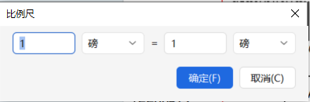
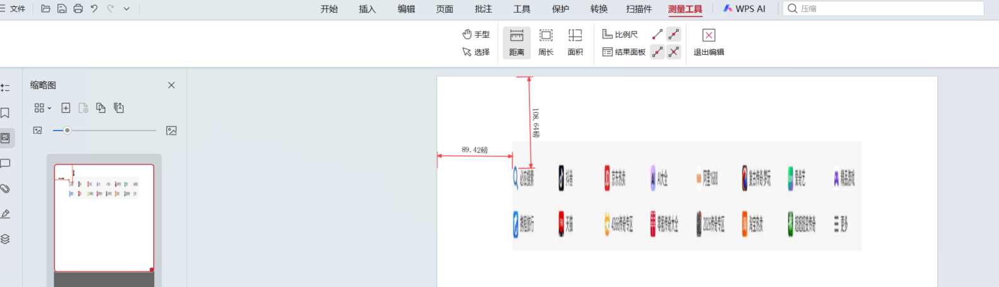
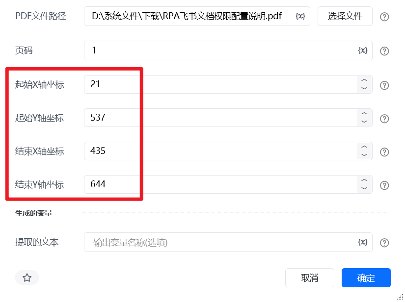

# 提取pdf区域XY轴坐标

我们需要获取目标文字区域的四个绝对坐标：x0 (左)、y0 (上)、x1 (右)、y1 (下)。

<strong>核心原则：</strong> PDF 的坐标原点 (0, 0) 永远位于页面的<strong>左上角</strong>。
第一步：环境配置与单位统一使用 PDF 阅读器（如 WPS）打开目标 PDF 文件。在菜单栏中找到并开启**“批注”和“测量工具”**功能。关键操作：点击“比例尺”设置，强制将测量单位更改为**“磅 (pt)”**。这一步是为了确保获取的数据能够直接用于代码计算，无需二次换算。

#### 第二步：明确基准点并测量距离

使用“距离”测量工具，分别以页面的<strong>最左侧边缘</strong>和<strong>最顶部边缘</strong>为基准，拉取测量线到目标文字的边缘：获取 x0（左边界）：从页面最左侧边缘，水平拉取到目标文字的左侧边缘。获取 x1（右边界）：从页面最左侧边缘，水平拉取到目标文字的右侧边缘。获取 y0（上边界）：从页面最顶部边缘，垂直拉取到目标文字的顶部边缘。获取 y1（下边界）：从页面最顶部边缘，垂直拉取到目标文字的底部边缘。

<em>操作提示：拉取完每一段距离后，点击右键完成测量结束本次测量，以便将获取到的距离数值固定并记录下来。</em>

<strong>不填坐标则默认提取一整页的文本</strong>

<Info>
  使用指令过程中遇到问题？前往 [八爪鱼RPA 开发者社区问答板块](https://rpa.bazhuayu.com/community/questions) 提问，获取官方与社区帮助。
</Info>
