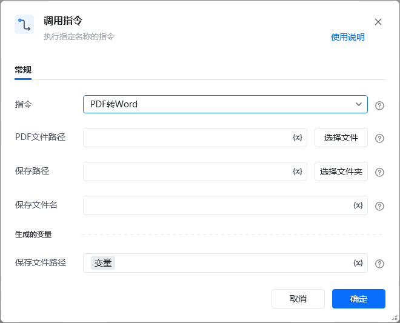

<strong>一、指令概述</strong>

该 RPA 指令用于<strong>将本地PDF文件转换为可编辑的Word文档</strong>，支持保留PDF中的文字、图片、表格等内容的排版结构，适用于PDF文档的二次编辑、格式调整等场景。

<strong>二、调用参数配置示意</strong>

参数名称示例/默认值说明指令PDF转Word固定选择“PDF转Word”，执行PDF文件到Word文档的格式转换操作。PDF文件路径（如“C:\Users\\Desktop\test\.pdf”）选择本地待处理的PDF文件路径，可点击“选择文件”按钮选取，支持变量。保存路径（如“C:\Users\\Desktop\test\\”）选择转换后Word文件的本地保存文件夹路径，可点击“选择文件夹”按钮选取，支持变量。保存文件名文档转换结果.docx输入转换后Word文件的名称（需包含.docx后缀），支持变量。生成的变量 - 保存文件路径wordSavePath（自定义变量名）存储转换后Word文件在本地的完整路径（如“C:\Users****\Desktop\test\文档转换结果.docx”），需配置为自定义变量，后续流程可直接调用。

<strong>三、使用示例（PDF合同转Word场景）</strong>

<strong>场景：将本地PDF格式的合同文件转换为Word文档，便于后续修改合同条款。</strong>

<strong>参数配置：</strong>

• 指令：PDF转Word

• PDF文件路径：C:\Users****\Desktop\test****_contract.pdf（通过“选择文件”选取）

• 保存路径：C:\Users****\Desktop\test\合同文档\（通过“选择文件夹”选取）

• 保存文件名：2025Q4合作合同.docx

• 保存文件路径：targetWordPath（自定义变量，存储完整路径）

<strong>执行流程：</strong>

调用该 RPA 指令后，RPA会自动执行以下步骤：

1. 校验PDF文件路径有效性（文件是否存在、是否为合法PDF格式）；

2. 自动解析PDF文件的内容结构（文字、图片、表格等）；

3. 将解析后的内容转换为Word文档格式，保留原始排版逻辑；

4. 按配置的“保存路径”和“文件名称”保存Word文件；

5. 将Word完整本地路径存入保存文件路径变量，便于后续文档编辑、分享等流程调用。

<strong>四、输出结果说明</strong>

1. <strong>内容结构</strong>：转换后的Word文档将保留PDF中的文字内容、图片位置、表格结构等基础排版，支持直接在Word中进行编辑、格式调整；

2. <strong>格式兼容</strong>：生成的Word文档为.docx格式，适配主流Word版本（如Microsoft Word 2016及以上、WPS文字等）；

3. <strong>特殊场景</strong>：若PDF文件内容为空，将生成空白Word文档，并在运行日志中提示“PDF文件无有效内容”。

<strong>五、注意事项</strong>

1. <strong>PDF文件有效性要求</strong>：

￮ 需确保“PDF文件路径”指向真实存在的文件，且文件未被其他程序占用（如已打开的PDF阅读器），否则会导致文件读取失败；

￮ 加密保护的PDF文件（需输入密码才能打开、复制内容）无法直接转换，需先解除加密限制；

￮ 损坏的PDF文件（无法正常打开或显示乱码）会导致转换失败，需先修复文件完整性。

2. <strong>格式保留限制（以下情况可能出现排版偏差）</strong>：

￮ 扫描件/图片型PDF：转换后内容会以图片形式嵌入Word，无法直接编辑文字；

￮ 复杂排版PDF：包含多层叠放元素、特殊艺术字体、自定义图形的PDF，转换后可能出现元素错位、字体替换的情况；

￮ 跨页元素：跨PDF页面的表格、图片，转换后可能被拆分到Word的不同页面，需手动调整；

￮ 特殊符号/公式：PDF中的少见符号、复杂公式，转换后可能出现显示异常或格式错乱。

3. <strong>保存路径与文件命名要求</strong>：

￮ “保存路径”需指向本地可写入的文件夹（避免系统盘保护路径，如“C:\Windows\”“C:\Program Files\”），否则会因权限不足导致文件保存失败；

￮ 若指定路径下已存在同名Word文件，将自动覆盖原文件（建议提前备份原有文件，或通过自定义唯一文件名避免覆盖）；

￮ 文件名不可包含非法字符（如/ \ : * ? " < > |），否则会导致保存失败。

4. <strong>其他使用限制</strong>：

￮ 超大PDF文件（页数超过200页或文件体积超过200MB）可能导致转换耗时较长，建议分批次处理；

￮ 非标准编码的PDF文件（如部分外文特殊编码），转换后可能出现文字乱码，建议提前确认文件编码兼容性。

<Info>
  使用指令过程中遇到问题？前往 [八爪鱼RPA 开发者社区问答板块](https://rpa.bazhuayu.com/community/questions) 提问，获取官方与社区帮助。
</Info>
