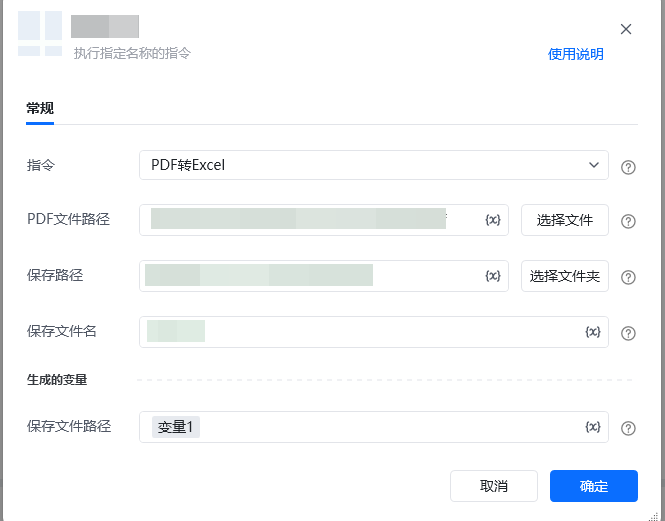

<strong>一、指令概述</strong>

该 RPA 指令用于<strong>提取本地PDF文件中的表格内容，转换为结构化Excel文件</strong>，提取的表格将按识别顺序拆分保存到Excel的不同Sheet中，支持表格数据的标准化导出与二次编辑，适用于PDF文档中表格数据的快速提取、整理场景。

<strong>二、调用参数配置示意</strong>

参数名称示例/默认值说明指令PDF表格提取转Excel固定选择“PDF表格提取转Excel”，执行PDF表格识别、提取及格式转换操作。PDF文件路径（如“C:\Users\\Desktop\test\.pdf”）选择本地待处理的PDF文件路径，可点击“选择文件”按钮选取，支持变量。Excel保存路径（如“C:\Users\\Desktop\test\\”）选择转换后Excel文件的本地保存文件夹路径，可点击“选择文件夹”按钮选取，支持变量。Excel文件名称表格数据导出.xlsx输入转换后Excel文件的名称（需包含.xlsx后缀），支持变量。生成的变量 - 完整保存路径excelSavePath（自定义变量名）存储转换后Excel文件在本地的完整路径（如“C:\Users****\Desktop\test\表格数据导出.xlsx”），需配置为自定义变量，后续流程可直接调用。

<strong>三、使用示例（PDF订购单表格提取场景）</strong>

<strong>场景：提取本地PDF订购单中的所有表格，转换为Excel文件并保存到指定目录，便于后续数据统计。</strong>

<strong>参数配置：</strong>

• 指令：PDF表格提取转Excel

• PDF文件路径：C:\Users****\Desktop\test****_miii95t0.pdf（通过“选择文件”选取）

• Excel保存路径：C:\Users****\Desktop\test****\（通过“选择文件夹”选取）

• Excel文件名称：订购单表格.xlsx

• 完整保存路径：targetExcelPath（自定义变量，存储完整路径）

<strong>执行流程：</strong>

调用该 RPA 指令后，RPA会自动执行以下步骤：

1. 校验PDF文件路径有效性（文件是否存在、是否为合法PDF格式）；

2. 自动遍历PDF所有页面，智能识别并提取其中的表格内容；

3. 将提取的表格按识别顺序拆分，分别保存到Excel的不同Sheet；

4. 按配置的“Excel保存路径”和“文件名称”保存Excel文件；

5. 将Excel完整本地路径存入完整保存路径变量，便于后续文件上传、数据同步等流程调用。

<strong>四、输出结果说明</strong>

1. <strong>文件结构</strong>：转换后的Excel文件包含多个Sheet，每个Sheet对应PDF中提取的一个表格，Sheet名称按提取顺序自动命名（Table_1、Table_2等），便于区分不同表格；

2. <strong>数据格式</strong>：提取的表格数据将保留原始行列结构，直接映射为Excel中的单元格数据，支持后续编辑、筛选、排序、计算等常规操作；

3. <strong>无表格场景</strong>：若PDF中未检测到可提取的表格，将生成空Excel文件（仅含默认Sheet），并在运行日志中提示“未检测到有效表格”。

<strong>五、注意事项</strong>

1. <strong>PDF文件有效性要求</strong>：

￮ 需确保“PDF文件路径”指向真实存在的文件，且文件未被其他程序占用（如已打开的PDF阅读器、压缩软件），否则会导致文件读取失败；

￮ 加密保护的PDF文件（需输入密码才能打开、复制内容）无法直接提取，需先解除加密限制；

￮ 损坏的PDF文件（无法正常打开或显示乱码）会导致提取失败，需先修复文件完整性。

2. <strong>表格可提取性限制（以下表格无法正常提取或提取效果极差）</strong>：

￮ 图片型表格：PDF为扫描件、截图生成的文件（表格以图片形式存在，非文本结构化数据），无法识别行列边界；

￮ 手写/模糊表格：表格内容为手写字体、打印模糊、字体扭曲或颜色过浅，导致无法精准识别文字及表格结构；

￮ 无边框表格：表格未设置边框线，仅靠空格、换行或缩进分隔行列，无法准确判定表格范围及单元格归属；

￮ 复杂合并单元格表格：表格包含大量跨行/跨列合并单元格，可能出现数据错位、缺失或重复提取的情况；

￮ 嵌套表格：表格内部包含子表格（多层嵌套结构），会被误识别为单一表格，导致数据层级混乱；

￮ 倾斜/变形表格：表格整体倾斜、行列对齐不规整，或存在文字溢出单元格的情况，影响数据提取准确性；

￮ 特殊格式表格：表格与文字、图片交叉排版，或表格内包含超链接、公式、特殊符号过多，可能导致提取异常。

3. <strong>保存路径与文件命名要求</strong>：

￮ “Excel保存路径”需指向本地可写入的文件夹（避免系统盘保护路径，如“C:\Windows\”“C:\Program Files\”），否则会因权限不足导致文件保存失败；

￮ 若指定路径下已存在同名Excel文件，将自动覆盖原文件（建议提前备份原有文件，或通过自定义唯一文件名避免覆盖）；

￮ 文件名不可包含非法字符（如/ \ : * ? " < > |），否则会导致保存失败。

4. <strong>其他使用限制</strong>：

￮ 表格跨页拆分时（同一表格内容分布在PDF多个页面），可能出现数据断裂，提取后需手动核对并合并；

￮ 非Unicode编码的特殊字符（如部分少见符号、生僻字）可能出现乱码，建议提前确认PDF文件编码兼容性；

￮ 超大PDF文件（页数超过100页或文件体积超过100MB）可能导致提取耗时较长，建议分批次处理。

<Info>
  使用指令过程中遇到问题？前往 [八爪鱼RPA 开发者社区问答板块](https://rpa.bazhuayu.com/community/questions) 提问，获取官方与社区帮助。
</Info>
