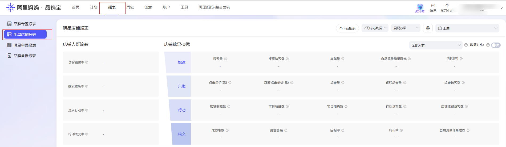
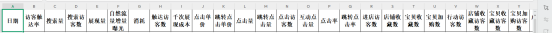
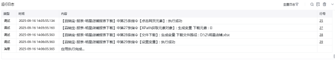

# <strong>品销宝-报表-明星店铺报表-下载明细</strong>
# <strong>一.功能描述</strong>

适用于品销宝-报表-明星店铺报表自定义下载

# <strong>二.使用参数说明</strong>
## <strong>1.输入参数</strong>

<strong>网页对象：</strong> 传入已打开的网页对象。

<strong>适用的浏览器类型:</strong> Google Chrome浏览器<strong>周期：</strong>（3/7/15/30天转化数据）

<strong>效果：</strong>（展现效果/点击效果）

<strong>日期类型：</strong> 下拉选择日期控件类型 支持：（今日/昨日/上周/本周/上月/本月/自定义）

<strong>开始日期：</strong> 选择自定义请补充一个具体日期，格式：yyyy-mm-dd；<strong>结束日期：</strong> 选择自定义请补充一个具体日期，格式：yyyy-mm-dd；

<strong>保存文件名：</strong>

输入保存文件的文件名。

<strong>保存文件夹：</strong>

输入保存文件的文件夹路径。
### <strong>高级</strong>
## <strong>无</strong>
## <strong>2.输出参数</strong>

<strong>下载文件路径：</strong>

输出下载后的文件绝对路径。
# <strong>三.结果样例展示</strong>

## <strong>运行结果：</strong>

<Info>
  使用指令过程中遇到问题？前往 [八爪鱼RPA 开发者社区问答板块](https://rpa.bazhuayu.com/community/questions) 提问，获取官方与社区帮助。
</Info>
